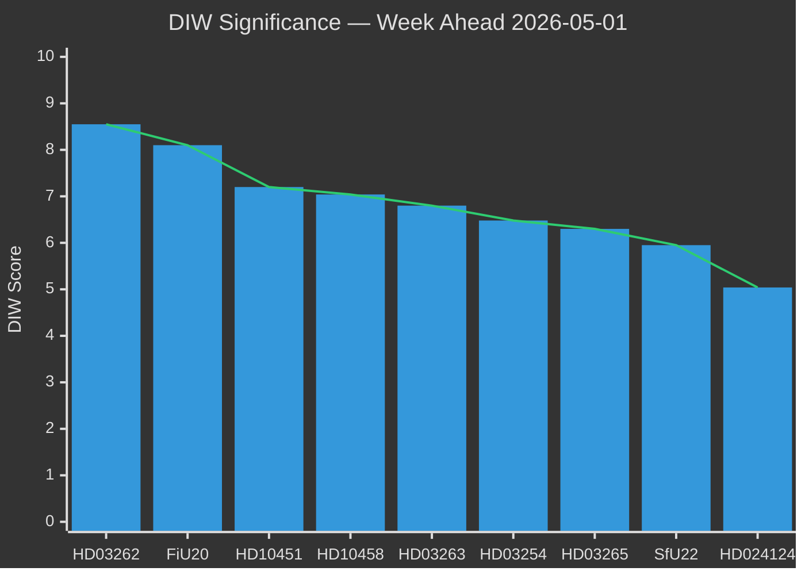
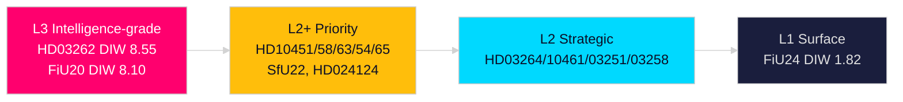

# Significance Scoring — Week Ahead 4–10 May 2026

**Author**: James Pether Sörling  
**Date**: 2026-05-01  
**Methodology**: DIW (Decisional Impact × Immediacy × Weighted stakeholder breadth)  

## DIW Scoring Framework

Each document scored on: **D** (Decisional impact 0–10) × **I** (Immediacy 0–1) × **W** (Weighted stakeholder breadth 0–1)

## Ranked Significance Table

| Rank | dok_id | Title (abbreviated) | D | I | W | DIW Total | Priority Tier |
|------|--------|---------------------|---|---|---|-----------|---------------|
| 1 | HD03262 (https://data.riksdagen.se/dokument/HD03262) | Permanent permit abolition | 9 | 1.0 | 0.95 | 8.55 | L3 Intelligence-grade |
| 2 | HC01FiU20 (https://data.riksdagen.se/dokument/HC01FiU20) | Economic framework ratified | 9 | 1.0 | 0.90 | 8.10 | L3 Intelligence-grade |
| 3 | HD10451 (https://data.riksdagen.se/dokument/HD10451) | Criminal economy 352 GSEK | 8 | 1.0 | 0.90 | 7.20 | L2+ Priority |
| 4 | HD10458 (https://data.riksdagen.se/dokument/HD10458) | Gang crime eradication pledge | 8 | 1.0 | 0.88 | 7.04 | L2+ Priority |
| 5 | HD03263 (https://data.riksdagen.se/dokument/HD03263) | Strengthened deportation | 8 | 1.0 | 0.85 | 6.80 | L2+ Priority |
| 6 | HD03254 (https://data.riksdagen.se/dokument/HD03254) | Military cooperation | 8 | 0.9 | 0.90 | 6.48 | L2+ Priority |
| 7 | HD03265 (https://data.riksdagen.se/dokument/HD03265) | Detention expansion | 7 | 1.0 | 0.90 | 6.30 | L2+ Priority |
| 8 | HC01SfU22 (https://data.riksdagen.se/dokument/HC01SfU22) | Detention security measures | 7 | 1.0 | 0.85 | 5.95 | L2+ Priority |
| 9 | HD024124 (https://data.riksdagen.se/dokument/HD024124) | Environmental authority (S motion) | 7 | 0.9 | 0.80 | 5.04 | L2+ Priority |
| 10 | HC01FiU33 (https://data.riksdagen.se/dokument/HC01FiU33) | APL defence capital 700 MSEK | 7 | 0.9 | 0.75 | 4.73 | L2+ Priority |
| 11 | HD03264 (https://data.riksdagen.se/dokument/HD03264) | Character vetting | 6 | 1.0 | 0.75 | 4.50 | L2 Strategic |
| 12 | HD10461 (https://data.riksdagen.se/dokument/HD10461) | ESA space funding decline | 6 | 0.8 | 0.70 | 3.36 | L2 Strategic |
| 13 | HD03251 (https://data.riksdagen.se/dokument/HD03251) | Addiction/mental health integration | 5 | 0.8 | 0.75 | 3.00 | L2 Strategic |
| 14 | HD03258 (https://data.riksdagen.se/dokument/HD03258) | Political transparency | 5 | 0.7 | 0.80 | 2.80 | L2 Strategic |
| 15 | HC01FiU24 (https://data.riksdagen.se/dokument/HC01FiU24) | Riksbank accountability | 4 | 0.7 | 0.65 | 1.82 | L1 Surface |

## Sensitivity Analysis

If **US tariff shock persists >12 months** (Scenario B): HC01FiU20 significance increases to rank 1 (D rises to 9.5) as the economic framework becomes a liability rather than a ratification.

If **Lagrådet issues blocking opinion on HD03262**: HD03262 significance temporarily decreases in legislative terms but increases in political terms — becomes the dominant electoral narrative.

## Cluster Analysis

**Migration Cluster** (HD03262/63/64/65): Aggregate DIW 26.15. No comparable cluster in Swedish legislative history since 2015/16:174 (2016 temporary restrictions, DIW estimated ~24 in comparable scoring).

**Economic Governance Cluster** (HC01FiU20/33/24): Aggregate DIW 14.65. Important but secondary to migration in electoral salience.

