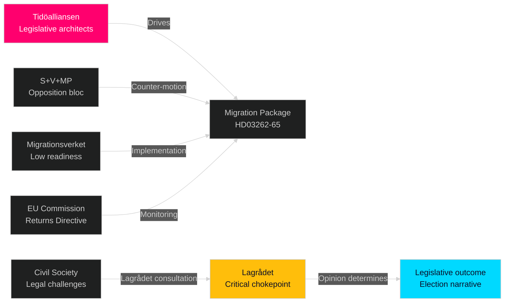

# Stakeholder Perspectives — Week Ahead 4–10 May 2026

**Author**: James Pether Sörling  
**Date**: 2026-05-01  
**Framework**: 6-Lens Stakeholder Matrix  

## Lens Framework

The six analytical lenses: (1) **Governing coalition** (M+KD+L+SD), (2) **Opposition bloc** (S+V+MP), (3) **Civil society/NGO**, (4) **Administrative/implementation** (Migrationsverket, Polismyndigheten, Försvarsmakten), (5) **International/supranational** (EU, UN, Nordic neighbours), (6) **Electorate segments**

## Lens 1: Governing Coalition (Tidöalliansen)

| Actor | Position | Incentive | Risk |
|-------|----------|-----------|------|
| Moderaterna (Ulf Kristersson) | Lead legislative architect. Migration package consolidates M's law-and-order brand. | 2026 election return to government as largest party | L and KD may demand implementation safeguards |
| Sverigedemokraterna (Jimmie Åkesson) | Primary driver of HD03262/65 content. Existential party identity bet. | Claim credit for abolishing permanent permits — core 2010-2026 demand | Lagrådet opinion converts SD's trophy into liability |
| Kristdemokraterna (Ebba Busch) | Defence (FiU33 APL) and family integrity concerns may moderate detention scope | Differentiate from M on "humane implementation" | Squeezed between SD hardline and L/civil society moderation |
| Liberalerna (Johan Pehrson) | Most exposed on migration (liberal migration history). Supports economic framework (FiU20) enthusiastically | Maintain economic policy ownership; distance from HD03264 character vetting | Risk of L voter defection to C if character vetting seen as disproportionate |
| Prime Minister Kristersson (PM) | Announcing migration package the week before May holiday is deliberate electoral calendar strategy | Control media narrative through May-June 2026 | ECHR challenge converts PM's strongest policy into constitutional crisis |

**Key quote to watch (Strömmer HD10458 interpellation)**: "Eradicate gang crime in 4 years" — if response lacks measurable milestones, media pivot to accountability deficit.

## Lens 2: Opposition Bloc (S+V+MP)

| Actor | Position | Strategy | Opportunity |
|-------|----------|----------|------------|
| Socialdemokraterna (Magdalena Andersson) | Oppose migration package on ECHR + implementation grounds, not electoral populism | Counter-motion before SfU report; position S as "responsible alternative" | Economic underperformance + ECHR vulnerability = S's two attack vectors |
| Vänsterpartiet (Nooshi Dadgostar) | Strongest opposition to detention expansion HD03265. Will demand Lagrådet opinion before committee vote | V/MP joint urgency motions on detention conditions | Human rights framing amplified by Amnesty/Human Rights Watch citation |
| Miljöpartiet (Per Bolund) | Climate/environment via HD024124 anchor motion. Will argue migration bandwidth crowds out green agenda | Environmental policy visibility window | HD024124 motion positions MP for post-election S+C+V+MP coalition |

## Lens 3: Civil Society / NGO

| Actor | Position | Influence Level |
|-------|----------|----------------|
| Migrationsrättslig byrå / UNHCR Sweden | ECHR Art. 5 + Art. 8 analysis on HD03262/65 — will submit Lagrådet consultation | HIGH (Lagrådet reads NGO legal submissions) |
| Rädda Barnen (Save the Children Sweden) | Children's rights violations in HD03262 (families without permanent permits) | MEDIUM (media amplification) |
| Amnesty International Sverige | Detention conditions HD03265 — will issue statement citing CPT standards | MEDIUM |
| Stockholms handelskammare (business) | HC01FiU20 economic framework: support cautiously; tariff uncertainty concern | MEDIUM |
| LO (labour union) | Concerned about unemployment trajectory (8.9%) + migration labour market effects | HIGH (HD03263 deportation may include work permit holders) |
| TCO/Saco (professional unions) | HD03264 character vetting may affect high-skill migration pipeline | MEDIUM |

## Lens 4: Administrative/Implementation Actors

| Agency | Position | Critical Concern | Readiness |
|--------|----------|-----------------|-----------|
| Migrationsverket | Must implement HD03262/63/64/65 simultaneously | IT systems "fragile" (Statskontoret 2023:4); HDR03263 deportation volume unbudgeted | LOW-MEDIUM |
| Polismyndigheten | Enforce deportation orders HD03263 + detain under HD03265 | Current enforcement backlog 2,000+ cases | LOW |
| Lagrådet | Mandatory consultee on HD03262, HD03265 | ECHR Art.5 + Art.8 analysis — opinions determinative | CRITICAL (outcome unknown) |
| Försvarsmakten | Implement HD03254 NATO cooperation, manage HC01FiU33 APL stockpile 700 MSEK | Procurement lead times 12-18 months | MEDIUM |
| Förvaltningsrätten (Admin courts) | Process appeals under revised migration law | Already backlogged 18+ months | LOW |

## Lens 5: International/Supranational

| Actor | Position | Mechanism |
|-------|----------|-----------|
| European Commission (DG HOME) | Monitoring HD03263 against EU Returns Directive (2008/115/EC) | Infringement proceeding possible if deportation standard diverges from Directive |
| ECHR/ECtHR | Potential applicants from rejected permanent permit holders (HD03262) | Individual case rulings — first cases ~2027-2028 |
| Nordic neighbours (Finland, Denmark, Norway) | Finnish DCA precedent directly maps to HD03254 support. Denmark 2019 B-status removal = closest migration analogue | Bilateral consultations on joint returns HD03263 |
| NATO (SACEUR) | HD03254 operational integration — Sweden fully NATO since March 2024 | HD03254 implementation within NATO joint planning |
| UN Special Rapporteur on migrants | HD03265 detention expansion may trigger UN SR communication | Non-binding but media-amplified; Lagrådet likely to cite SR position |

## Lens 6: Electorate Segments

| Segment | Primary Issue | Migration Package Effect | Economic Package Effect |
|---------|--------------|------------------------|------------------------|
| Rural Sweden (SD-dominant) | Migration, crime | POSITIVE — package delivers SD electoral promise | NEUTRAL |
| Metropolitan (Stockholm/Gothenburg) | Economy, housing | MIXED — migration concerns balanced by economic anxiety | NEGATIVE (lågkonjunktur) |
| Young professionals (L/M base) | Economy, liberal values | NEGATIVE on HD03264 character vetting | POSITIVE on FiU20 stability |
| Public sector workers (S base) | Welfare state, wages | NEGATIVE — migration package crowds out social investment | NEGATIVE (tariff shock) |
| Immigrant communities (multi-party) | Personal impact of HD03262/63 | VERY NEGATIVE | NEUTRAL |

