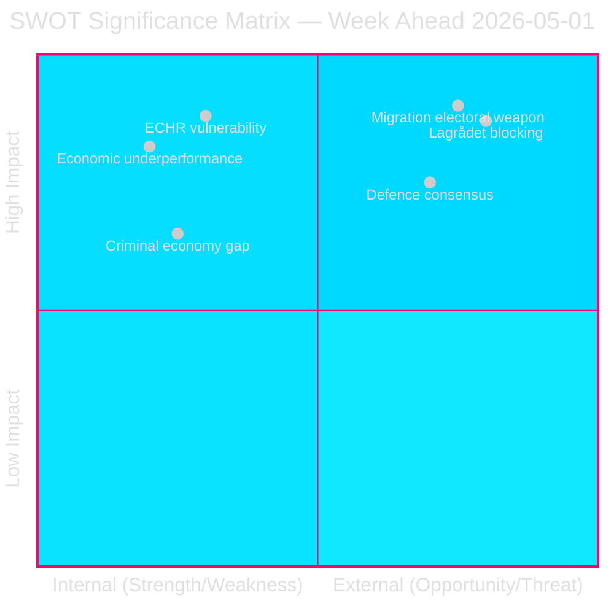

# SWOT Analysis — Week Ahead 4–10 May 2026

**Author**: James Pether Sörling  
**Date**: 2026-05-01  
**Framework**: Political-SWOT + TOWS matrix  

## Strengths (Governing Tidöalliansen M+KD+L+SD)

- **Legislative momentum** [HIGH]: Government tabled 8 propositions on 30 April with stable parliamentary majority. Prior vote HC01SfU22 (riksdagen.se) shows M+KD+L+SD bloc cohesion on migration enforcement.
- **Migration policy salience** [HIGH]: HD03262/63/64/65 places the government on its strongest electoral terrain. Polling consistently shows M+SD combined ~40-44% on a pro-restriction platform; each bill concretises the electoral promise. (riksdagen.se, prior SfU voteringar data)
- **Defence consensus** [HIGH]: HD03254 will attract cross-party support including S. Defence credibility is a Tidöalliansen strength that cannot easily be challenged. Finland DCA precedent (173/200 Eduskunta) maps directly. (riksdagen.se, comparative-international.md)
- **Economic framework ratified** [MEDIUM]: HC01FiU20 (riksdagen.se) secures a formal Riksdag mandate for the government's economic approach, limiting post-election policy reversal.

## Weaknesses (Governing Tidöalliansen M+KD+L+SD)

- **ECHR vulnerability** [HIGH]: HD03262 (abolish permanent permits) and HD03265 (detention expansion) carry unresolved ECHR Art. 5 + Art. 8 exposure. Lagrådet opinion not yet issued. Any negative opinion creates constitutional revision requirements or politically costly parliamentary override. (HD03262, HD03265 — riksdagen.se; lagradet.se tracking)
- **Economic underperformance** [HIGH]: HC01FiU20 (riksdagen.se) ratified GDP 1.2% vs 2.1% potential — the government is officially governing through lågkonjunktur with 5 months to election. Below-trend growth plus ~8.9% unemployment is a structural liability.
- **Implementation overload** [MEDIUM]: Four simultaneous migration bills (HD03262–65) plus HD03254 and multiple social reform bills exceed Migrationsverket/polisens utlänningsenhet operational capacity. Statskontoret (2023:4) assessed Migrationsverket's IT systems as "fragile". (riksdagen.se + statskontoret.se)
- **Criminal economy credibility gap** [MEDIUM]: ESO 352 GSEK baseline (HD10451, riksdagen.se) makes Strömmer's "eradicate in 4 years" pledge measurable and testable. Government cannot provide quarterly milestones, creating persistent accountability deficit.

## Opportunities (Governing Tidöalliansen M+KD+L+SD)

- **Migration package as electoral weapon** [HIGH]: If SfU committee reports HD03262/63/64/65 by June 2026, a pre-summer Riksdag vote on migration architecture becomes a defining election moment. M+SD secure their vote bloc; S must defend a loss. (HD03262-65, riksdagen.se)
- **Defence consensus as legitimacy builder** [MEDIUM]: HD03254's expected broad support (including S) allows the government to claim cross-party defence leadership, softening the "divisive migration" narrative. (HD03254, riksdagen.se)
- **Criminal economy crime agenda** [MEDIUM]: ESO 352 GSEK creates political space for further security legislation in May–June 2026. Government can position any new criminal measures as a direct response to the ESO data. (HD10451, riksdagen.se; ESO)

## Threats (Governing Tidöalliansen M+KD+L+SD)

- **Lagrådet blocking opinion** [HIGH]: A Lagrådet opinion finding HD03262 or HD03265 incompatible with RF (Grundlag) or ECHR creates 3–6 month revision delay, delays electoral salience, and hands opposition their most powerful argument. Probability: 15–25% [B3]. (lagradet.se)
- **ECHR individual case loss** [MEDIUM]: If ECtHR rules against Sweden on a pending deportation case during campaign season, the migration package becomes a constitutional controversy rather than a strength. (comparative-international.md Danish precedent)
- **Economic deterioration** [MEDIUM]: If US tariff shock extends into Q3 2026, GDP falls below 1.0%, and unemployment exceeds 9%, the government loses the "economic management" argument entirely. HC01FiU20 (riksdagen.se) approval becomes a liability document.
- **SD intra-coalition friction on HD03258** [LOW]: If transparency bill (HD03258) extends to SD operational finance, SD members may force KU amendments creating public coalition tension. (HD03258, riksdagen.se)

## TOWS Matrix

| | Opportunities | Threats |
|---|---|---|
| **Strengths** | S-O: Use migration package success as election platform, leverage defence consensus for legitimacy | S-T: Pre-empt Lagrådet by narrowing detention provision HD03265 with technical safeguards before opinion |
| **Weaknesses** | W-O: Address ECHR risk proactively through Lagrådet consultation before opinion; convert criminal economy baseline into milestone framework | W-T: ECHR + economic underperformance + implementation overload converging with Lagrådet threat is the highest-risk scenario — early stakeholder engagement with Migrationsverket and NGOs needed |

## Cross-SWOT Intelligence Signal

The **migration package vs ECHR** tension (Strength #1 × Threat #1) is the defining intelligence event of the week. The government has bet its electoral strategy on legislation that carries unresolved constitutional risk. If that risk materialises through a Lagrådet opinion, the SWOT dynamics invert: the strongest asset becomes the sharpest liability.

