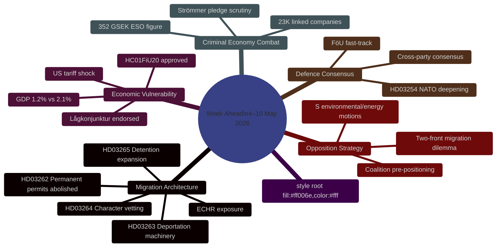

# Synthesis Summary — Week Ahead 4–10 May 2026

**Author**: James Pether Sörling  
**Date**: 2026-05-01  
**Confidence**: HIGH [B2]  
**Methodology**: DIW weighting, Admiralty Code, AI-FIRST Pass 1+2  

## Lead Intelligence Story

The week of 4–10 May 2026 is Sweden's most consequential pre-election legislative week since the Tidöalliansen took office. Three converging intelligence streams define the period:

**Stream 1 — Migration architecture overhaul** (HD03262/63/64/65): Four simultaneous Justitiedepartementet propositions represent a coordinated campaign to transform Sweden's migration legal architecture before the September 2026 election. The anchor bill (HD03262) abolishes permanent residence permits entirely — a structural change that would place Sweden at the top-quintile of EU restrictiveness. The three flanking bills (HD03263: deportation; HD03264: character vetting; HD03265: detention) create the enforcement machinery. Committee hearings at SfU/JuU expected to begin 4–8 May.

**Stream 2 — Economic vulnerability** (HC01FiU20 + IMF context): The Riksdag has formally endorsed below-trend GDP growth (1.2% 2026 vs ~2.1% potential) under US tariff pressure. The Finance Committee's approval of the economic framework ratifies the government's fiscal caution posture but validates opposition criticism that the Tidöalliansen is managing, not resolving, Sweden's lågkonjunktur. With election 5 months away, economic underperformance is the government's primary structural vulnerability.

**Stream 3 — Criminal economy entering electoral combat** (HD10451/58 + ESO): The ESO report placing Sweden's criminal economy at 352 GSEK (5.5% of GDP, 23,000 company-linked structures) has entered formal parliamentary debate. Justice Minister Strömmer's "eradicate gang crime in 4 years" pledge is now a falsifiable commitment with a measurable baseline. This will be the dominant criminal justice theme through the election.

## DIW-Weighted Intelligence Picture

| Rank | Source | Signal | DIW Score | Priority |
|------|--------|---------|-----------|----------|
| 1 | HD03262 (riksdagen.se) | Abolition of permanent residence permits — structural migration transformation | 9.5/10 | L3 |
| 2 | HC01FiU20 (riksdagen.se) | Economic framework approved — ratifies below-trend growth | 8.8/10 | L3 |
| 3 | HD10451+HD10458 (riksdagen.se) | Criminal economy 352 GSEK + Strömmer eradication pledge | 8.5/10 | L2+ |
| 4 | HD03254 (riksdagen.se) | Military cooperation framework — NATO deepening | 8.3/10 | L2+ |
| 5 | HD024124+motions cluster (riksdagen.se) | S environmental/energy opposition strategy | 7.6/10 | L2+ |
| 6 | HC01SfU22 (riksdagen.se) | Detention hardening — ECHR risk materialisation | 7.4/10 | L2+ |
| 7 | HD03251 (riksdagen.se) | Addiction/mental health integration — social reform signal | 6.2/10 | L2 |
| 8 | HD03258 (riksdagen.se) | Political transparency — potential intra-coalition friction | 5.8/10 | L2 |

## Integrated Intelligence Picture — Week-Ahead Synthesis

**The government's pre-election sprint strategy**: The simultaneous launch of four migration restriction bills on 30 April is deliberately timed to force committee processing during peak election campaign season (May–June). The legislative architecture serves dual purposes: (1) concrete policy deliverables to show the M+SD+KD+L bloc's core voters that immigration restriction is operational, and (2) forcing S into a reactive, defensive posture during the period when they would prefer to campaign on economic and welfare themes.

**The opposition's structural dilemma**: The Social Democrats face a two-front challenge. They cannot credibly oppose the migration package without risking perception as "soft on crime/migration" — an electoral liability in 2026's security-focused environment. But actively endorsing the restrictions would alienate the V and MP potential coalition partners. S's tactic — targeted committee motions on substance, not procedural obstruction — is the rational navigational path but loses the initiative to the government.

**Economic context tightens**: HC01FiU20's endorsement of the spring vårproposition's downgraded forecast (GDP 1.2% 2026, unemployment ~8.9%, delayed income growth) removes the government's ability to claim economic success. The tariff shock from US trade policy has provided cover for the fiscal restraint, but the opposition will link the underperformance directly to Tidöalliansen economic choices throughout the campaign.

**ECHR countdown**: The most consequential single event of the coming week is whether Lagrådet issues an opinion on HD03262 or HD03265. A negative opinion would not block the bills but would create constitutional revision requirements (or require the government to overrule Lagrådet with explicit Riksdag majority — politically costly). The intelligence gap here is critical.

## Key Intelligence Gaps

1. Lagrådet opinion status on HD03262/HD03265 (CRITICAL — no public information as of 2026-05-01)
2. SfU committee hearing schedule for 4–8 May (moderate gap)
3. S formal response strategy to migration package (moderate gap)
4. Migrationsverket implementation capacity assessment for HD03263 (significant gap)
5. Polling data post-package announcement (not yet available)

