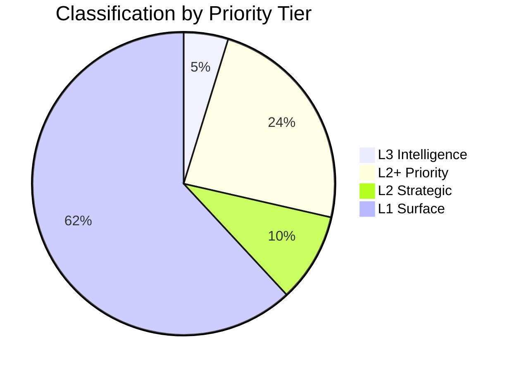

# Classification Results — Month Ahead 2026-05-03

**Method**: 7-dimension classification per `analysis/methodologies/political-classification-guide.md`

## Document Classifications

### HD03262 — Utmönstring av permanent uppehållstillstånd + EU asylpakt [L3]

| Dimension | Classification | Notes |
|-----------|---------------|-------|
| Policy domain | Migration/asylum | Core constitutional rights dimension |
| Political valence | Contentious | Left–right cleavage; EU law interface |
| Electoral relevance | HIGH (×1.5) | September 13 election; SD mobilization |
| Rights impact | CRITICAL | Permanent residence abolition → ECHR Art. 8 |
| Institutional scope | National + EU | Transposing EU migration/asylum pact |
| Urgency | HIGH | Riksdag consideration needed before election |
| Data sensitivity | LOW | Public legislation |

**Priority Tier**: L3 Intelligence-grade  
**Retention**: 2 years (electoral significance)  
**Access**: PUBLIC

### HD03263 — Stärkt återvändandeverksamhet [L2+]

| Dimension | Classification |
|-----------|---------------|
| Policy domain | Migration/law enforcement |
| Political valence | Contentious (deportation) |
| Electoral relevance | HIGH |
| Rights impact | HIGH (procedural rights in return procedures) |
| Institutional scope | National (Migrationsverket, Kriminalvård) |
| Urgency | HIGH |

### HD03264 — Skärpta krav på vandel [L2+]

| Dimension | Classification |
|-----------|---------------|
| Policy domain | Migration/criminal law interface |
| Political valence | Contentious |
| Electoral relevance | HIGH |
| Rights impact | HIGH (proportionality under ECHR Art. 8) |
| Institutional scope | National |

### HD03265 — Skärpta regler om uppsikt/förvar [L2+]

| Dimension | Classification |
|-----------|---------------|
| Policy domain | Migration/liberty deprivation |
| Political valence | Contentious |
| Electoral relevance | HIGH |
| Rights impact | CRITICAL (detention = deprivation of liberty) |
| Institutional scope | National (Migrationsverket) |

### HD03254 — Operativt militärt samarbete [L2+]

| Dimension | Classification |
|-----------|---------------|
| Policy domain | Defense/security |
| Political valence | Bipartisan support likely |
| Electoral relevance | MEDIUM (defense credentials) |
| Rights impact | LOW |
| Institutional scope | National + NATO/Nordic |

### HD03251 — Sammanhållen vård addiction/psykiatri [L2]

| Dimension | Classification |
|-----------|---------------|
| Policy domain | Healthcare |
| Political valence | Moderate — KD flagship |
| Electoral relevance | MEDIUM |
| Rights impact | MEDIUM (patient rights, regional autonomy) |
| Institutional scope | National + regional (Socialstyrelsen, Regions) |

### HD03258 — Ökad insyn i politiska processer [L2+]

| Dimension | Classification |
|-----------|---------------|
| Policy domain | Constitutional/transparency |
| Political valence | Contested (civil society funding) |
| Electoral relevance | HIGH (targeting opposition base) |
| Rights impact | MEDIUM (association freedom) |
| Institutional scope | National (KU) |

### Opposition Motions Cluster (HD11768–HD11778) [L1 Surface]

| Dimension | Classification |
|-----------|---------------|
| Policy domain | Social welfare, environment, housing |
| Political valence | Opposition pre-election |
| Electoral relevance | MEDIUM (S/MP base activation) |
| Rights impact | LOW–MEDIUM |
| Institutional scope | National |

## Priority Tier Summary

- **L3 Intelligence**: HD03262 (migration reform — unprecedented scope)
- **L2+ Priority**: HD03263, HD03264, HD03265, HD03254, HD03258
- **L2 Strategic**: HD03251, HD11772
- **L1 Surface**: All motions clusters, interpellations

