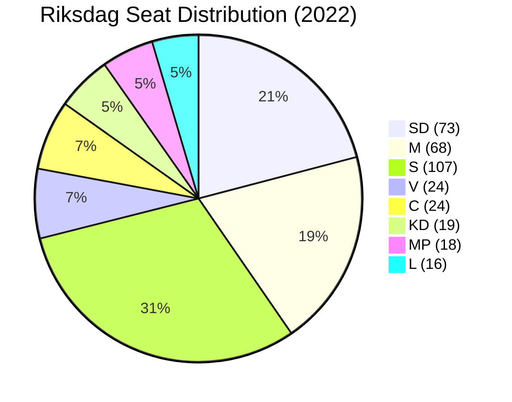

# Coalition Mathematics — Month Ahead 2026-05-03

**Method**: Sainte-Laguë seat calculation, pivotal vote analysis, blocking minority mathematics  
**Source**: 2022 election results (data.riksdagen.se); May 2026 projection estimates

## Current Seat Map

```
RIKSDAG (349 seats) — Majority threshold: 175
┌─────────────────────────────────────────────────────────┐
│ TIDÖ COALITION (176 seats)                              │
│  SD: 73  M: 68  KD: 19  L: 16                          │
│                                                         │
│ OPPOSITION (173 seats)                                  │
│  S: 107  V: 24  C: 24  MP: 18                          │
└─────────────────────────────────────────────────────────┘
Margin: +3 seats (coalition leads by 3)
```

## Pivotal Vote Analysis

### HD03262 — Permanent Permit Abolition (CRITICAL VOTE)

**Required**: 175 votes (simple majority)  
**Coalition total**: 176

| Defection scenario | Votes for | Result |
|-------------------|-----------|--------|
| No defections | 176 | PASSES |
| 1 L abstains | 175 | PASSES (minimum) |
| 2 L abstain | 174 | FAILS |
| 1 L + 1 KD abstain | 174 | FAILS |
| All L abstain | 160 | FAILS by 15 |
| 1 C crosses to support | 177 | Comfort margin |

**Pivotal party**: L — 1 abstention is tolerable; 2+ is fatal for the vote.

### HD03251 — Healthcare Integration

**Expected support**: M + SD + KD + L + C (likely) = ~200  
**Expected opposition**: S + V + MP = ~149  
**Result**: PASSES comfortably

### HD03254 — Military Cooperation

**Expected support**: M + SD + KD + L + S + C + (partial V) = ~280  
**Expected opposition**: MP + (V faction) = ~25  
**Result**: PASSES by large margin

### Confidence Vote Scenario

If opposition files misstroendevotum (confidence motion):  
- Opposition baseline: S+V+C+MP = 173  
- If L abstains: 173 vs 160 → motion fails (needs 175 to pass)  
- If L votes with opposition: 189 vs 144 → **GOVERNMENT FALLS**  
- If C abstains: 149 vs 176 → government survives easily

**Conclusion**: Government can only fall if L actively votes against in a confidence motion. L abstention is insufficient to topple government.

## Sainte-Laguë Divisor Analysis (2022 Outcome)

The Sainte-Laguë method allocates seats by dividing each party's vote total by odd divisors (1, 3, 5, 7...) and awarding seats to highest quotients.

**2022 results** (approximate constituency + adjustment seats):
- S: 30.66% → 107 seats (1 adjustment seat)
- SD: 20.54% → 73 seats (1 adjustment seat)  
- M: 19.10% → 68 seats (standard allocation)
- V: 6.75% → 24 seats
- C: 6.72% → 24 seats
- KD: 5.34% → 19 seats
- MP: 5.08% → 18 seats
- L: 4.72% → 16 seats

**Near-threshold parties** (2022): L (4.72%) — only 0.72% above 4% threshold; MP (5.08%) — only 1.08% above.

## 2026 Seat Projection Under Migration Package Scenario

**Assumptions**:  
- SD: +3% (migration delivery) → 23.5% → 82 seats  
- M: +1% (governance credibility) → 20.1% → 71 seats  
- L: -0.5% (ECHR anxiety) → 4.2% → 14 seats (still above threshold)  
- S: -1% (opposition without offensive narrative) → 29.7% → 104 seats  
- MP: -0.8% (below threshold risk) → 4.3% → 15 seats  

**Projected coalition 2026**: M(71)+SD(82)+KD(21)+L(14) = 188 → Expanded majority  
**Projected opposition 2026**: S(104)+V(26)+C(25)+MP(15) = 170 → Reduced  

**If MP falls below 4%**:  
MP's 15 seats are redistributed proportionally via Sainte-Laguë adjustment.  
Parties gaining: S(+2), SD(+2), M(+2), V(+1), C(+1) → Coalition gains 4, opposition net loses ~11.

## Blocking Minority Calculations

For issues requiring qualified majority (e.g., RF constitutional changes requiring 3/5 = 210 votes):  
- Current coalition: 176/349 — cannot achieve alone  
- Needs: C (24) + partial S/MP = ~210 threshold  
- Constitutional amendments blocked without broad cross-party consensus

For regular legislation (simple majority, 175/349):  
- Coalition controls with 176; no blocking minority risk unless ≥2 L defections


