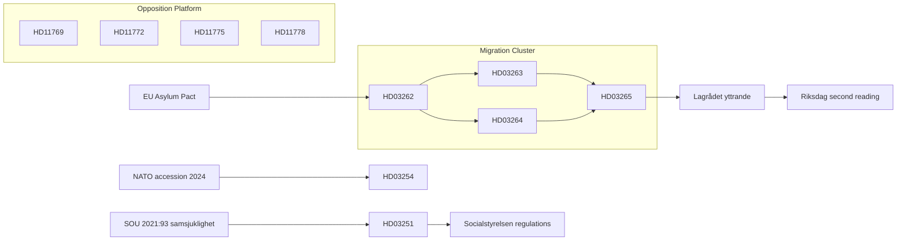

# Cross-Reference Map — Month Ahead 2026-05-03

**Purpose**: Map policy clusters, legislative chains, and inter-document dependencies

## Policy Cluster Map

### Cluster A: Migration Reform Package (HIGH PRIORITY)

```
HD03262 ──┐
HD03263 ──┼── JUSTITIEDEPARTEMENTET ──── EU Asylum & Migration Pact
HD03264 ──┤                              ECHR Art. 8
HD03265 ──┘
```

**Legislative chain**:  
`HD03262` (permanent permits abolished) → creates void that `HD03263` (return enforcement) and `HD03264` (character requirements) fill → `HD03265` (detention/supervision) as enforcement mechanism. Four propositions constitute a complete legislative re-architecture of Swedish migration law.

**Dependencies**:
- All four propositions require Lagrådet yttrande (ECHR/RF constitutional dimension)
- HD03263 depends on Migrationsverket capacity planning (external dependency)
- HD03262 must comply with EU Asylum Pact minimum standards (external legal dependency)

### Cluster B: Defense & Security

```
HD03254 ──── FÖRSVARSDEPARTEMENTET ──── NATO bilateral frameworks
                                         NORDEFCO / JEF
```

**Legislative chain**: Standalone proposition; builds on 2024 NATO accession and 2025 defense bill increases. No direct dependency on migration cluster.

**Cross-reference**: HD11772 (SD motion on Ukraine aid) is thematically linked — both address Sweden's security posture. However, HD11772 represents intra-coalition tension while HD03254 has bipartisan support.

### Cluster C: Healthcare Reform

```
HD03251 ──── SOCIALDEPARTEMENTET ──── Socialstyrelsen guidance
                                       21 Regions (implementation)
                                       Patientlag (Lag 2014:821)
```

**Legislative chain**: Builds on Regeringens prioriteringsutredning (2020) and samsjuklighetsutredningen (SOU 2021:93). HD03251 consolidates addiction and psychiatric care under unified integration framework.

**Dependencies**: Requires Socialstyrelsen to issue new regulations; Regions must develop local implementation plans.

### Cluster D: Transparency & Civil Society

```
HD03258 ──── JUSTITIEDEPARTEMENTET ──── Konstitutionsutskott (KU)
                                         Föreningsfrihet RF Ch. 2 §1
```

**Cross-reference**: Thematically connects to democratic governance concerns across opposition parties. S/V/MP/C will jointly frame HD03258 as constitutional overreach.

### Cluster E: Opposition Pre-Election Platform

```
HD11769–HD11778 ──── S motions cluster ──── Pre-election platform
HD11768           ──── MP animal welfare  ──── Symbolic legislation
HD11772           ──── SD Ukraine signal  ──── Intra-coalition tension
HD10460–HD10461   ──── Interpellations   ──── Accountability inquiries
```

## Legislative Chain Dependencies



## Thematic Cross-References

| Theme | Primary dok_id | Secondary dok_id | Connection |
|-------|---------------|-----------------|-----------|
| Human rights / ECHR | HD03262 | HD03263, HD03264, HD03265 | Shared constitutional risk |
| Electoral positioning | HD03262 | HD11769–HD11778 | Government vs opposition pre-election |
| Agency capacity | HD03263 | HD03251 (Regions) | Both require significant agency/regional resourcing |
| EU compatibility | HD03262 | HD03254 (NATO/EU) | Sweden's EU commitments compliance |
| Security expenditure | HD03254 | HD11772 | Sweden's defense posture coherence |

## Forward Linkages (Anticipated Derivative Documents)

- Utskottsbetänkande from SfU (Socialförsäkringsutskottet) on HD03262–HD03265 — expected June-July 2026
- Kammarvoteringen on migration package — expected September 2026 pre-election window
- Regeringens skrivelse on implementation (HD03263 Migrationsverket plan) — expected Q3 2026
- Socialstyrelsen föreskrifter under HD03251 — expected 12–18 months post-passage
