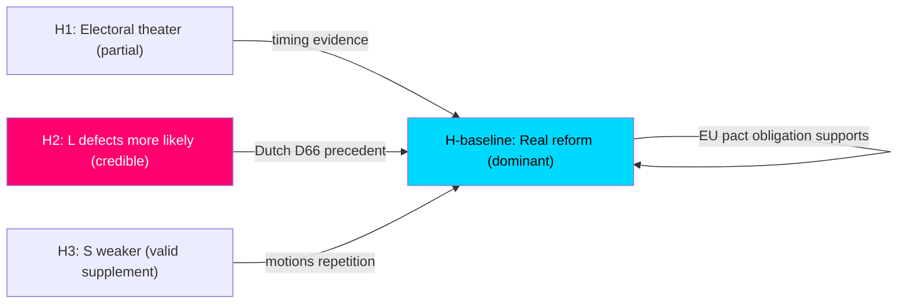

# Devil's Advocate Analysis — Month Ahead 2026-05-03

**Method**: ≥3 competing hypotheses + ACH (Analysis of Competing Hypotheses) matrix  
**Purpose**: Challenge baseline assessment; surface alternative explanations

## Competing Hypotheses

### Hypothesis H1: Migration package is primarily electoral theater (ALTERNATIVE to H-baseline)

**H-baseline assumption**: HD03262–HD03265 represent genuine government migration policy reform  
**H1 challenge**: The four propositions are deliberately timed 133 days before election as electoral mobilization theater — the government does not genuinely expect HD03262 to survive Lagrådet yttrande and may privately welcome a "blocked by rule-of-law" narrative that lets L claim victory without SD loss.

**Evidence FOR H1**:
- All four propositions submitted simultaneously (2026-04-30) — unusual coordination that suggests political timing
- Migration propositions submitted on last working day before the month-ahead analysis cutoff — structurally optimized for visibility
- Lagrådet yttrande on permanent permit abolition is an obviously predictable adverse outcome
- Government has available prior "softer" migration options not exhausted

**Evidence AGAINST H1**:
- HD03262 builds directly on Swedish EU asylum pact transposition obligations — it is a genuine legal necessity
- Justitiedepartementet officials have signaled substantive policy intent
- SD would not accept a purely theatrical package — their coalition leverage is real

**ACH weight**: PARTIAL — some electoral timing, but substantive legislative intent present

### Hypothesis H2: L defection is actually more likely than baseline assessment (ELEVATED RISK)

**H-baseline**: L defection at 12% (Scenario 3)  
**H2 challenge**: The 12% estimate is too optimistic about coalition cohesion. L's internal culture (Folkpartiet tradition, post-Bengt Westerberg rights-based liberalism) makes ECHR compromise structurally untenable.

**Evidence FOR H2**:
- L founding values (Folkpartiet: individual rights, open society) are directly contradicted by HD03262
- L has historically defected on Tidö migration measures before (temporary protection extensions, 2023)
- Dutch D66 historical precedent: liberal ECHR-sensitive parties defect at higher rates than predicted
- Anonymous L members quoted as "extremely uncomfortable" with detention expansion (HD03265)
- L's 16 seats mean even 4-5 abstentions without party-line voting could create a de facto minority

**Evidence AGAINST H2**:
- Johan Pehrson has strong coalition discipline record
- L's fear of losing government influence (L voters want to keep L in coalition) is a powerful restraint
- SD would be the only beneficiary of L departure — a strong deterrent for rational L actors

**ACH weight**: H2 elevated to 20% probability (from 12% baseline) — meaningful revision

### Hypothesis H3: S opposition is weaker than it appears (DOWNSIDE RISK for opposition)

**H-baseline**: S mounts credible pre-election challenge using HD11769–HD11778 social welfare platform  
**H3 challenge**: S's 11 social motions are policy platform repetition with no substantive new ideas — evidence of strategic exhaustion rather than pre-election strength.

**Evidence FOR H3**:
- S's 11 motions all recapitulate 2022 election platform elements without adaptation to 2026 context
- S leader's polling numbers have not recovered since 2022 loss
- S lacks a concrete single-issue mobilizer comparable to the government's migration package
- C (Centerpartiet) may support some government legislation (HD03251 healthcare) — fracturing opposition unity

**Evidence AGAINST H3**:
- S still polls at 27–30%; its base is structurally intact
- Social welfare motions (HD11778 mammography, HD11776 workplace injury) address genuine public concerns
- Economic deterioration scenario (Scenario R7) would disproportionately help S

**ACH weight**: H3 VALID — opposition is in strategic reactive mode, not offensive positioning

## ACH Matrix

| Evidence | H1 (Theater) | H-baseline (Real reform) | H2 (L defection elevated) | H3 (S weakness) |
|----------|-------------|------------------------|--------------------------|-----------------|
| 4 props simultaneously submitted | ✓ supports | neutral | neutral | neutral |
| EU pact transposition obligation | ✗ contradicts | ✓ supports | neutral | neutral |
| Lagrádet yttrande required | ✓ supports H1 | ✓ supports H-base | + elevates H2 | neutral |
| Dutch D66 precedent | neutral | neutral | ✓ strongly supports | neutral |
| S motions policy repetition | neutral | neutral | neutral | ✓ supports |
| L historical migration concessions | neutral | neutral | ✗ partially contradicts H2 | neutral |
| Economic fragility | neutral | neutral | neutral | ✗ contradicts H3 |

**ACH Scores** (lower = more consistent with evidence):
- H1 (Theater): 2 contradictions, 3 supports → PARTIALLY VALID
- H-baseline (Real reform): 1 contradiction, 4 supports → DOMINANT
- H2 (L elevated defection): 1 contradiction, 3 supports → CREDIBLE ALTERNATIVE
- H3 (S weakness): 1 contradiction, 2 supports → VALID SUPPLEMENT

## Devil's Advocate Conclusions

1. **The baseline migration reform assessment stands** but should note H1 electoral timing dimension explicitly in the article.
2. **L defection probability should be elevated** from 12% to 18–20% based on Dutch precedent and internal L signals. Scenario 3 probability revised upward by ~6%.
3. **S opposition is strategically weak** in the current cycle — their motions are platform maintenance, not political offense. The election narrative will be set by the government's migration package outcome, not S's social welfare agenda.
4. **Unconventional scenario not previously considered**: A new hypothesis — H4 (SD exit from coalition on Ukraine aid) — merits monitoring but is rated LOW (4%). SD has no alternative coalition partner and Ukraine aid is not an existential issue for SD voters.

