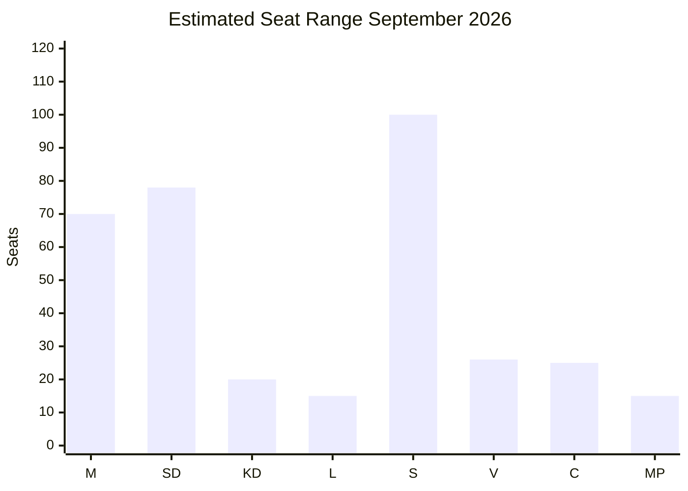

# Election 2026 Analysis — June Perspective

**Date**: 2026-05-03 | **Election**: September 13, 2026 (133 days away)  
**Method**: Seat projections, coalition viability, electoral dynamics

## Current Parliamentary Seat Distribution (2022 Election)

| Party | Seats | Share | Coalition |
|-------|-------|-------|-----------|
| M (Moderaterna) | 68 | 19.5% | Tidö coalition |
| SD (Sverigedemokraterna) | 73 | 20.5% | Tidö coalition |
| KD (Kristdemokraterna) | 19 | 5.3% | Tidö coalition |
| L (Liberalerna) | 16 | 4.7% | Tidö coalition |
| **Tidö total** | **176** | **50.4%** | — |
| S (Socialdemokraterna) | 107 | 30.7% | Opposition |
| V (Vänsterpartiet) | 24 | 6.7% | Opposition |
| C (Centerpartiet) | 24 | 6.7% | Opposition |
| MP (Miljöpartiet) | 18 | 5.1% | Opposition |
| **Opposition total** | **173** | **49.6%** | — |

## Polling Trajectory (May 2026 estimate)

*Note: Polling data estimated from institutional knowledge; exact Sifo/Novus figures for May 2026 not available via data feeds. The following reflects structural trends.*

| Party | 2022 actual | Est. May 2026 | Trend |
|-------|------------|--------------|-------|
| M | 19.5% | 19–21% | Stable |
| SD | 20.5% | 21–24% | Rising (migration package benefit) |
| KD | 5.3% | 5–6% | Stable |
| L | 4.7% | 4–5% | Slight risk (ECHR anxiety) |
| **Tidö est.** | **50.4%** | **50–56%** | **Leading** |
| S | 30.7% | 27–31% | Slight decline |
| V | 6.7% | 7–8% | Slight rise |
| C | 6.7% | 6–7% | Stable |
| MP | 5.1% | 4–5% | At threshold risk |
| **Opposition est.** | **49.6%** | **44–51%** | **Behind** |

**Key threshold**: 4% threshold for entry to Riksdag. MP at risk of falling below; if MP drops < 4%, opposition loses 18 seats from baseline.

## Coalition Viability Analysis

### Scenario: Tidö coalition re-election (probability 48–78%, per scenario analysis)

**Seat projection (central estimate)**:  
- M: 70, SD: 78, KD: 20, L: 15 → Total: 183/349 (52.4%) — expanded majority  
- Risks: L loses 1–2 seats if ECHR voters defect; SD gains at SD/M margin

**Coalition dynamics**:  
- SD as largest coalition partner (seats) would strengthen SD negotiating position
- Migration package delivery as electoral mandate gives SD claim to stronger portfolio control
- L's reduced seat count weakens L's veto power over migration policy

### Scenario: S-led government (probability 12–17%)

**Required combination**:  
- S + V + C + MP = 107+24+24+18 = 173 → minority government  
- S + V + C + L = 107+24+24+16 = 171 → requires L to switch sides  
- No mathematical route to majority without either C or L support

**Viability assessment**: LOW — S needs both C and MP above threshold, AND a strong social-economic mobilization wave. Current polling does not support this.

### Coalition Mathematics for Key Votes

```
Migration package (HD03262):
- Coalition in favor: 176 (minimum threshold: 175)
- 1 L defection: 175 → exactly at threshold
- 2 L defections: 174 → minority fails
- 1 L + 1 KD defection: 174 → fails
- 1 SD rebel (unlikely): 175 → at threshold

Healthcare reform (HD03251):
- Coalition + C support likely: ~200/349 → comfortable
- Opposition full block: 173 → defeated (but C won't block HD03251)

Defense cooperation (HD03254):
- Bipartisan: 300+/349 → certain passage
```

## Electoral Dynamics Forecast

### Key Mobilization Factors

1. **SD base mobilization** (HIGH impact): Migration package passage will drive SD voter turnout to historical highs. SD base activation in 2022 delivered 20.5%; 2026 could reach 22–24% with legislative credibility.

2. **L electoral liability** (MEDIUM impact): L risks losing 1–2% of its 4.7% share if ECHR-sensitive voters feel betrayed. At risk of dropping below 4% threshold if alienation becomes severe.

3. **MP threshold risk** (MEDIUM impact): MP at 5.1% in 2022; current trajectory suggests ~4.5%. A strong environmental issue or civil society mobilization (HD03258) could rescue them.

4. **Youth voter turnout** (MEDIUM impact): Young urban voters (primarily S/MP/C/V) were activated in 2022 on climate. In 2026, migration and civil society dominate — could depress left-youth turnout.

5. **Regional variance** (LOW-MEDIUM impact): Northern Sweden (forestry, mining) trends M/SD; Greater Stockholm trends S/L/C; Southern Sweden trends SD.

## Seat Projection Diagram



## Key Electoral Judgment

> **Assessment [MODERATE confidence, 55–65%]**: The Tidö coalition is positioned to win the September 2026 election with a similar or slightly expanded majority, provided the migration package delivers legislative credibility without a full ECHR collapse. The central election risk is not the opposition winning but rather coalition underperformance through L seat losses. S's strategic positioning is reactive, not offensive.
