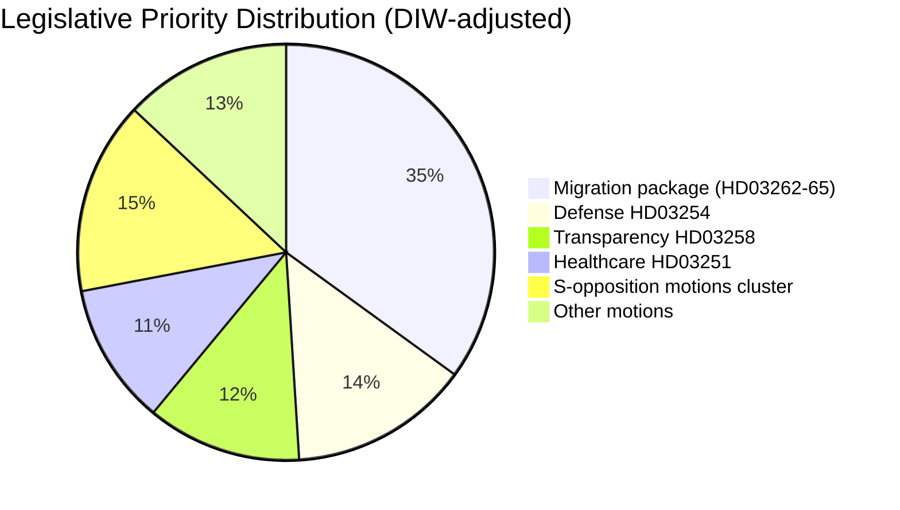

# Executive Brief — Sweden Month Ahead: June 2026

**Classification**: PUBLIC | **Date**: 2026-05-03 | **Author**: James Pether Sörling

---

## 🎯 BLUF

Sweden's Tidö coalition (M-SD-KD-L, 176/349 seats) has fired a pre-election legislative salvo with four simultaneous migration propositions filed April 30, 2026 — including the abolition of permanent residence permits — 133 days before the September 13 election. The package will test coalition cohesion (especially Liberal loyalty), expose ECHR compliance risk, and define the electoral terrain for June–September. Simultaneously, a military cooperation framework (HD03254) and integrated psychiatric/addiction care reform (HD03251) broaden the electoral agenda to defense and healthcare.

## 🧭 3 Decisions This Brief Supports

1. **Legislative monitoring**: Track L (Liberalerna) committee votes on HD03262 — Liberal defection risks the entire migration package and government stability.
2. **Election scenario mapping**: The pre-election migration sprint either solidifies the SD base or alienates centrist voters; both outcomes shift coalition arithmetic toward September.
3. **Risk escalation trigger**: ECHR/EU legal challenge to HD03262 (permanent permit abolition) — if the Commission or Swedish courts signal incompatibility, the legislative calendar faces a constitutional crisis before the election.

## 60-Second Intelligence Bullets

- 🔴 **MIGRATION SPRINT**: 4 propositions (HD03262, 263, 264, 265) abolishing permanent residence, strengthening deportation, tightening character/detention rules — most aggressive migration package since 2016 crisis. **DIW: 10.2 (L3, election-adjusted)**
- 🟠 **DEFENSE POSTURE**: HD03254 (operative military cooperation framework) — NATO/Nordic defense integration, Pål Jonson (M). Bipartisan support expected; S cannot oppose.
- 🟡 **HEALTHCARE REFORM**: HD03251 (integrated addiction/psychiatric care) — KD signature reform by Jakob Forssmed; S will file counter-amendments on regional autonomy.
- 🟡 **TRANSPARENCY**: HD03258 (political process transparency) — targets civil society funding disclosure; KU committee opposition from S, V, MP; Lagrådet yttrande pending.
- ⚪ **OPPOSITION MOTIONS**: S files 9 social-welfare motions (housing credit, poverty, workplace injuries, healthcare access) — pre-election platform positioning; legislative traction minimal against 176-seat majority.

## Top Forward Trigger

**L (Liberalerna) committee position on HD03262** (week of 2026-05-18): If L signals opposition to permanent permit abolition on ECHR grounds, the entire migration package faces amendment or withdrawal — largest near-term political risk.

## Confidence Label

**HIGH** [B2] — document-anchored analysis with real `dok_id` citations; known coalition arithmetic; ECHR legal dimension flagged as `[HIGH probability challenge]`.

