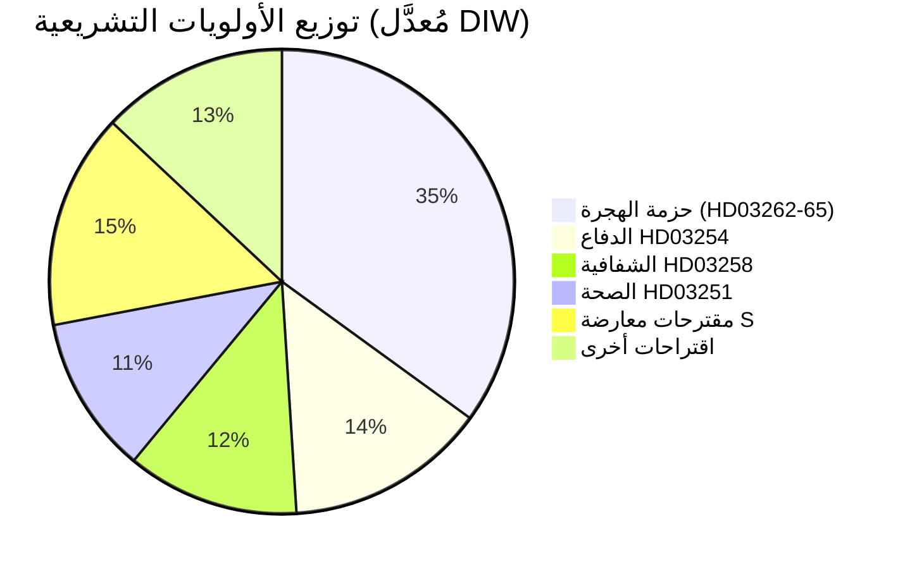

&#x200F;# تقرير استخباراتي — السويد في الشهر القادم: يونيو 2026

**التصنيف**: عام | **التاريخ**: 2026-05-03 | **المؤلف**: James Pether Sörling

---

## 🎯 الخلاصة التنفيذية

أطلق ائتلاف Tidö السويدي (M-SD-KD-L، 176/349 مقعداً) وابلاً تشريعياً قبل الانتخابات مع أربعة مقترحات هجرة متزامنة قدمت في 30 أبريل 2026 — تشمل إلغاء تصاريح الإقامة الدائمة — قبل 133 يوماً من انتخابات 13 سبتمبر. ستختبر الحزمة تماسك الائتلاف (لا سيما ولاء الليبراليين)، وتكشف مخاطر الامتثال للاتفاقية الأوروبية لحقوق الإنسان، وترسم خارطة المنافسة الانتخابية في الفترة يونيو–سبتمبر. في الوقت ذاته، تمتد أجندة الانتخابات إلى الدفاع والصحة بموجب إطار التعاون العسكري (HD03254) وإصلاح الرعاية النفسية والإدمان المتكاملة (HD03251).

## 🧭 3 قرارات يدعمها هذا التقرير

1. **متابعة التشريعات**: رصد تصويتات حزب L (Liberalerna) في اللجنة على HD03262 — إذ يُعرّض أي انشقاق ليبرالي الحزمة الهجروية بأكملها واستقرار الحكومة للخطر.
2. **رسم خرائط السيناريوهات الانتخابية**: يُرسّخ السباق الهجروي قبل الانتخابات إما قاعدة حزب SD أو يُنفّر ناخبي الوسط؛ وكلا النتيجتين يغيّران حسابات الائتلاف قبيل سبتمبر.
3. **محفز تصعيد المخاطر**: الطعن القانوني بموجب الاتفاقية الأوروبية لحقوق الإنسان/الاتحاد الأوروبي في HD03262 (إلغاء تصريح الإقامة الدائم) — إذا أشارت المفوضية أو المحاكم السويدية إلى تعارضه، فسيواجه الجدول التشريعي أزمة دستورية قبل الانتخابات.

## نقاط استخباراتية في 60 ثانية

- 🔴 **السباق الهجروي**: 4 مقترحات (HD03262، 263، 264، 265) تُلغي تصاريح الإقامة الدائمة، تُعزز الترحيل، تُشدّد قواعد العقوبات/الاحتجاز — أكثر الحزم الهجروية تشدداً منذ أزمة 2016. **DIW: 10.2 (L3، مُعدَّل انتخابياً)**
- 🟠 **الموقف الدفاعي**: HD03254 (إطار تعاون عسكري تشغيلي) — تكامل الدفاع في إطار حلف شمال الأطلسي/الدول الاسكندنافية، Pål Jonson (M). من المتوقع دعم متعدد الأحزاب؛ لا يستطيع حزب S المعارضة.
- 🟡 **إصلاح الصحة**: HD03251 (رعاية متكاملة للإدمان/الطب النفسي) — إصلاح KD المميّز لـ Jakob Forssmed؛ يقدم حزب S تعديلات مضادة حول الاستقلالية الإقليمية.
- 🟡 **الشفافية**: HD03258 (شفافية العملية السياسية) — يستهدف شفافية تمويل المجتمع المدني؛ معارضة لجنة KU من S وV وMP؛ رأي Lagrådet معلق.
- ⚪ **اقتراحات المعارضة**: يقدم حزب S 9 اقتراحات رعاية اجتماعية (ائتمان سكن، فقر، حوادث عمل، الحصول على الرعاية الصحية) — تموضع برنامج ما قبل الانتخابات؛ تأثير تشريعي ضئيل في مواجهة أغلبية 176 مقعداً.

## أبرز إشارة إنذار مبكر

**موقف حزب L (Liberalerna) في اللجنة بشأن HD03262** (أسبوع 18 مايو 2026): إذا أبدى حزب L معارضته لإلغاء تصاريح الإقامة الدائمة بدواعي الاتفاقية الأوروبية لحقوق الإنسان، فستواجه الحزمة الهجروية بأكملها التعديل أو السحب — أكبر مخاطر سياسية قصيرة الأمد.

## تصنيف الثقة

**مرتفع** [B2] — تحليل مُرسَّخ في الوثائق بمراجع حقيقية لـ `dok_id`؛ حسابيات ائتلافية معروفة؛ البُعد القانوني للاتفاقية الأوروبية مُصنَّف بـ `[احتمالية طعن عالية]`.

<!-- source-sha: 7f57e4a4f6dc30be3a923cf3528c3a09ec191564 -->
