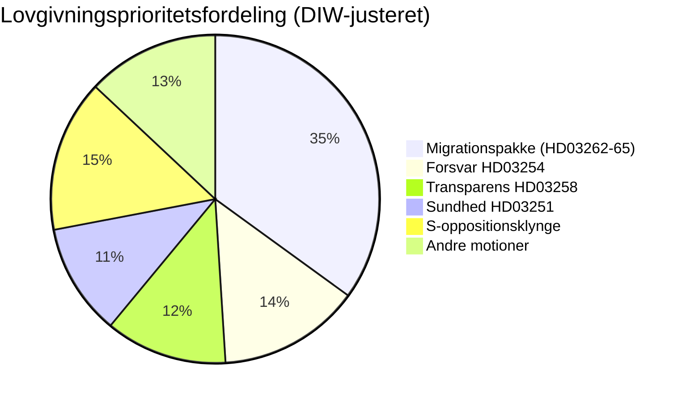

# Efterretningsbriefing — Sverige måneden forude: juni 2026

**Klassifikation**: OFFENTLIG | **Dato**: 2026-05-03 | **Forfatter**: James Pether Sörling

---

## 🎯 BLUF

Sveriges Tidö-koalition (M-SD-KD-L, 176/349 pladser) affyrede en forvalgsstrategi med fire simultane migrationsforslagslove indgivet den 30. april 2026 — herunder afskaffelse af permanente opholdstilladelser — 133 dage inden valget den 13. september. Pakken vil afprøve koalitionens sammenhæng (særligt Liberal loyalitet), eksponere EMRK-overholdelses risiko og definere valgterrænet for juni–september. Simultaneously udvider en militær samarbejdsramme (HD03254) og en integreret psykiatri-/misbrugsvårdsreform (HD03251) valgdagsordenen til forsvar og sundhed.

## 🧭 3 beslutninger som dette brief understøtter

1. **Lovgivningsovervågning**: Følg L's (Liberalernes) udvalgsstemmer om HD03262 — Liberal afhopper risikerer hele migrationspakken og regeringsstabiliteten.
2. **Valgscenariekortlægning**: Den forvalgsmigrationssprint konsoliderer enten SD-basen eller fremmedgør centristiske vælgere; begge udfald ændrer koalitionsaritmetikken mod september.
3. **Risikoeskaleringsudløser**: EMRK/EU-retlig udfordring af HD03262 (afskaffelse af permanent tilladelse) — hvis Kommissionen eller svenske domstole signalerer inkompatibilitet, møder lovgivningskalenderen en forfatningskrise inden valget.

## 60-sekunders efterretningspunkter

- 🔴 **MIGRATIONSSPRINT**: 4 forslag (HD03262, 263, 264, 265) afskaffer permanente opholdstilladelser, styrker udvisning, stramner straffe-/detentionsregler — den mest aggressive migrationspakke siden 2016-krisen. **DIW: 10.2 (L3, valgkorrigeret)**
- 🟠 **FORSVARSPOSITUR**: HD03254 (operativ militær samarbejdsramme) — NATO/Nordisk forsvarsintegration, Pål Jonson (M). Tværpartistøtte forventes; S kan ikke modsætte sig.
- 🟡 **SUNDHEDSREFORM**: HD03251 (integreret afhængigheds-/psykiatribehandling) — KD's signaturreform af Jakob Forssmed; S indgiver modændringsforslag om regional autonomi.
- 🟡 **TRANSPARENS**: HD03258 (transparens i den politiske proces) — retter sig mod finansieringstransparens for civilsamfund; KU-udvalgsopposition fra S, V, MP; Lagrådets yttrande afventes.
- ⚪ **OPPOSITIONSMOTIONER**: S indgiver 9 socialvelfærdsmotioner (boligkredit, fattigdom, arbejdsskader, sundhedsadgang) — forvalgspolitisk positionering; lovgivningstroværdighed minimal mod 176-pladsmajoriteten.

## Top fremadrettet signal

**L's (Liberalernes) udvalgsposition om HD03262** (ugen den 18. maj 2026): Hvis L signalerer modstand mod afskaffelse af permanente tilladelser på EMRK-grunde, møder hele migrationspakken ændring eller tilbagetrækning — den største kortsigtede politiske risiko.

## Konfidensmærkning

**HØJ** [B2] — dokumentforankret analyse med rigtige `dok_id`-citater; kendt koalitionsaritmetik; EMRK-retlig dimension markeret som `[HØJ sandsynlighed udfordring]`.

<!-- source-sha: 7f57e4a4f6dc30be3a923cf3528c3a09ec191564 -->
