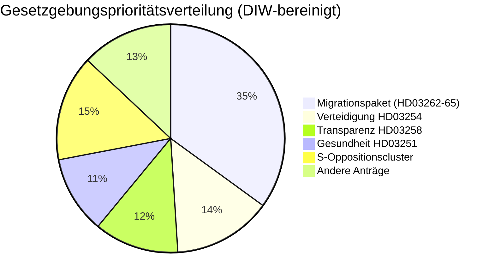

# Nachrichtenbriefing — Schweden im kommenden Monat: Juni 2026

**Klassifizierung**: ÖFFENTLICH | **Datum**: 2026-05-03 | **Autor**: James Pether Sörling

---

## 🎯 BLUF

Schwedens Tidö-Koalition (M-SD-KD-L, 176/349 Sitze) feuerte eine Vorwahl-Gesetzgebungssalve mit vier gleichzeitigen Migrationsvorschlägen ab, eingereicht am 30. April 2026 — einschließlich der Abschaffung von Daueraufenthaltsgenehmigungen — 133 Tage vor der Wahl am 13. September. Das Paket wird die Koalitionskohäsion testen (besonders Liberal-Loyalität), EMRK-Konformitätsrisiken offenlegen und das Wahlterrain für Juni–September definieren. Gleichzeitig erweitert ein militärisches Kooperationsrahmen (HD03254) und eine integrierte Psychiatrie-/Suchtbehandlungsreform (HD03251) die Wahltagsordnung auf Verteidigung und Gesundheit.

## 🧭 3 Entscheidungen, die dieses Brief unterstützt

1. **Gesetzgebungsmonitoring**: Verfolgen Sie L's (Liberalernas) Ausschussabstimmungen zu HD03262 — Liberal-Überläufer riskiert das gesamte Migrationspaket und die Regierungsstabilität.
2. **Wahlszenario-Kartierung**: Der Vorwahl-Migrationssprint konsolidiert entweder die SD-Basis oder entfremdet zentristische Wähler; beide Ergebnisse verschieben die Koalitionsarithmetik in Richtung September.
3. **Risikoeskalations-Auslöser**: EMRK/EU-rechtliche Herausforderung von HD03262 (Abschaffung der Dauererlaubnis) — wenn die Kommission oder schwedische Gerichte Inkompatibilität signalisieren, begegnet der Gesetzgebungskalender vor der Wahl einer Verfassungskrise.

## 60-Sekunden-Nachrichtenpunkte

- 🔴 **MIGRATIONSSPRINT**: 4 Vorschläge (HD03262, 263, 264, 265) schaffen Daueraufenthaltsgenehmigungen ab, stärken Abschiebung, verschärfen Straf-/Inhaftierungsregeln — das aggressivste Migrationspaket seit der Krise 2016. **DIW: 10.2 (L3, wahlbereinigt)**
- 🟠 **VERTEIDIGUNGSPOSTUR**: HD03254 (operativer militärischer Kooperationsrahmen) — NATO/Nordische Verteidigungsintegration, Pål Jonson (M). Überparteiliche Unterstützung erwartet; S kann sich nicht widersetzen.
- 🟡 **GESUNDHEITSREFORM**: HD03251 (integrierte Sucht-/Psychiatriebehandlung) — KD-Signaturreform von Jakob Forssmed; S reicht Gegenänderungen zur regionalen Autonomie ein.
- 🟡 **TRANSPARENZ**: HD03258 (Transparenz im politischen Prozess) — zielt auf Transparenz bei der Finanzierung der Zivilgesellschaft; KU-Ausschussopposition von S, V, MP; Lagrådet-Stellungnahme ausstehend.
- ⚪ **OPPOSITIONSANTRÄGE**: S reicht 9 Sozialwohlfahrtsanträge ein (Wohnraumkredit, Armut, Arbeitsunfälle, Gesundheitsversorgung) — Vorwahl-Plattformpositionierung; gesetzgeberische Schlagkraft minimal gegen die 176-Sitze-Mehrheit.

## Wichtigster Vorwärtssignal

**L's (Liberalernas) Ausschussposition zu HD03262** (Woche des 18. Mai 2026): Wenn L Widerstand gegen die Abschaffung von Dauererlaubnissen auf EMRK-Grundlage signalisiert, begegnet das gesamte Migrationspaket Änderungen oder Rücknahme — das größte kurzfristige politische Risiko.

## Konfidenzetikett

**HOCH** [B2] — dokumentengestützte Analyse mit echten `dok_id`-Zitaten; bekannte Koalitionsarithmetik; EMRK-rechtliche Dimension als `[HOHE Wahrscheinlichkeit Herausforderung]` markiert.

<!-- source-sha: 7f57e4a4f6dc30be3a923cf3528c3a09ec191564 -->
