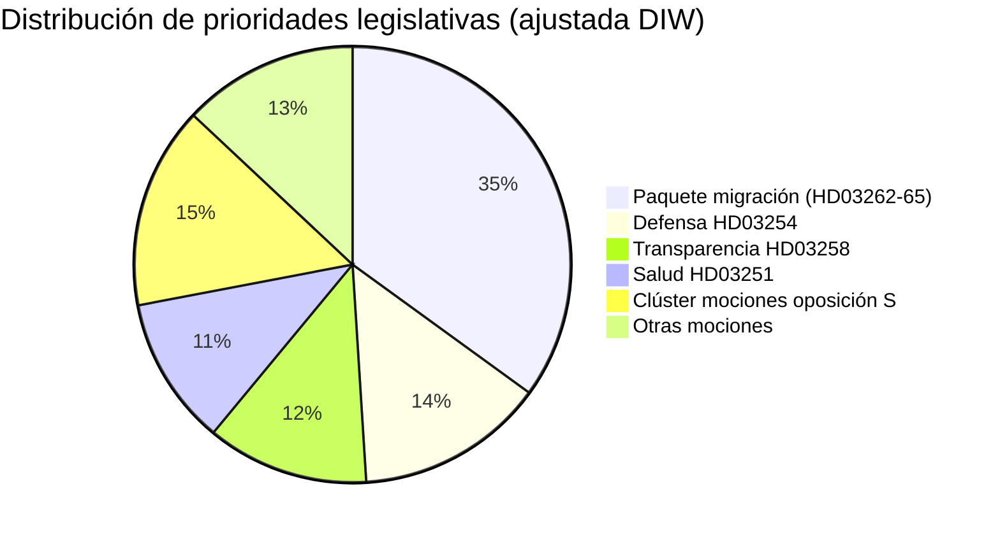

# Informe de inteligencia — Suecia el mes próximo: junio 2026

**Clasificación**: PÚBLICO | **Fecha**: 2026-05-03 | **Autor**: James Pether Sörling

---

## 🎯 BLUF

La coalición Tidö sueca (M-SD-KD-L, 176/349 escaños) disparó una salva legislativa preelectoral con cuatro propuestas de migración simultáneas presentadas el 30 de abril de 2026 — incluida la abolición de los permisos de residencia permanentes — 133 días antes de las elecciones del 13 de septiembre. El paquete pondrá a prueba la cohesión de la coalición (especialmente la lealtad liberal), expondrá el riesgo de cumplimiento del CEDH y definirá el terreno electoral de junio a septiembre. Simultáneamente, un marco de cooperación militar (HD03254) y una reforma integrada de atención psiquiátrica/adicciones (HD03251) amplían la agenda electoral a defensa y salud.

## 🧭 3 decisiones que apoya este informe

1. **Seguimiento legislativo**: Rastrear los votos de L (Liberalerna) en el comité sobre HD03262 — la deserción liberal pone en riesgo todo el paquete migratorio y la estabilidad gubernamental.
2. **Mapeo de escenarios electorales**: El sprint migratorio preelectoral consolidará bien la base de SD o alienará a los votantes centristas; ambos resultados desplazan la aritmética de la coalición de cara a septiembre.
3. **Detonante de escalada de riesgo**: Impugnación jurídica CEDH/UE de HD03262 (abolición del permiso permanente) — si la Comisión o los tribunales suecos señalan incompatibilidad, el calendario legislativo enfrenta una crisis constitucional antes de las elecciones.

## Puntos de inteligencia en 60 segundos

- 🔴 **SPRINT MIGRATORIO**: 4 propuestas (HD03262, 263, 264, 265) abolirán permisos permanentes, reforzarán la deportación, endurecerán normas de sanción/detención — el paquete migratorio más agresivo desde la crisis de 2016. **DIW: 10.2 (L3, ajustado elección)**
- 🟠 **POSTURA DEFENSIVA**: HD03254 (marco de cooperación militar operativo) — integración de defensa NATO/Nórdica, Pål Jonson (M). Se espera apoyo multipartidista; S no puede oponerse.
- 🟡 **REFORMA SANITARIA**: HD03251 (atención integrada adicciones/psiquiatría) — reforma insignia de KD por Jakob Forssmed; S presenta contramiendas sobre autonomía regional.
- 🟡 **TRANSPARENCIA**: HD03258 (transparencia del proceso político) — apunta a la transparencia en la financiación de la sociedad civil; oposición del comité KU de S, V, MP; dictamen Lagrådet pendiente.
- ⚪ **MOCIONES DE OPOSICIÓN**: S presenta 9 mociones de bienestar social (crédito vivienda, pobreza, accidentes laborales, acceso a la salud) — posicionamiento de plataforma preelectoral; tracción legislativa mínima frente a la mayoría de 176 escaños.

## Principal señal de alerta temprana

**Posición de L (Liberalerna) en el comité sobre HD03262** (semana del 18 de mayo de 2026): Si L señala oposición a la abolición de permisos permanentes por razones CEDH, todo el paquete migratorio enfrenta enmiendas o retirada — el mayor riesgo político a corto plazo.

## Etiqueta de confianza

**ALTO** [B2] — análisis anclado en documentos con citas reales de `dok_id`; aritmética de coalición conocida; dimensión jurídica CEDH marcada como `[ALTA probabilidad de impugnación]`.

<!-- source-sha: 7f57e4a4f6dc30be3a923cf3528c3a09ec191564 -->
