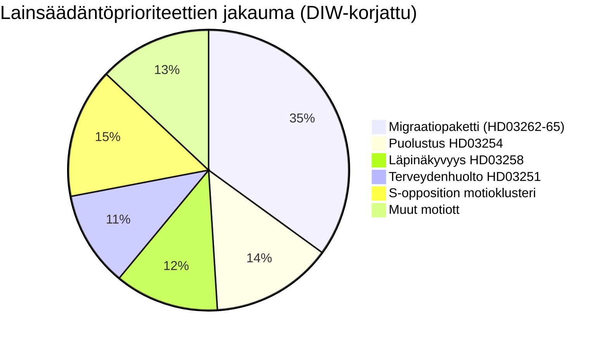

# Tiedustelutiedote — Ruotsi kuukausi eteenpäin: kesäkuu 2026

**Luokitus**: JULKINEN | **Päivämäärä**: 2026-05-03 | **Tekijä**: James Pether Sörling

---

## 🎯 BLUF

Ruotsin Tidö-koalitio (M-SD-KD-L, 176/349 paikkaa) ampui ennakkovaalilainansäädäntösalvan neljällä samanaikaisella migraatioproposisiolla, jotka jätettiin 30. huhtikuuta 2026 — mukaan lukien pysyvien oleskelulupien lakkauttaminen — 133 päivää ennen 13. syyskuuta pidettäviä vaaleja. Paketti testaa koalition yhtenäisyyttä (erityisesti Liberaalien lojaaliutta), altistaa ECHR-noudattamisriskin ja määrittelee vaaliterränin kesä–syyskuulle. Samanaikaisesti sotilaallinen yhteistyökehys (HD03254) ja integroitu psykiatria-/päihdehoidon uudistus (HD03251) laajentavat vaaliagendan puolustukseen ja terveydenhuoltoon.

## 🧭 3 päätöstä, joita tämä tiedote tukee

1. **Lainsäädännön seuranta**: Seuraa L:n (Liberaalien) valiokuntaäänestyksiä HD03262:sta — Liberaalien irtiotto riskeeraa koko migraatiopaketin ja hallituksen vakauden.
2. **Vaaliskenaarioiden kartoitus**: Ennakkovaalimigratiosprint joko vahvistaa SD:n kannatuspohjaa tai vieraannuttaa keskiryhmän äänestäjiä; molemmat lopputulokset siirtävät koalitioaritmetiikkaa kohti syyskuuta.
3. **Riskin eskalointilaukaisija**: ECHR/EU-oikeudellinen haaste HD03262:lle (pysyvän luvan lakkauttaminen) — jos komissio tai ruotsalaiset tuomioistuimet antavat yhteensopimattomuuden signaalin, lainsäädäntökalenteri kohtaa perustuslaillisen kriisin ennen vaaleja.

## 60 sekunnin tiedusteluteesit

- 🔴 **MIGRAATIOSPRINT**: 4 ehdotusta (HD03262, 263, 264, 265) lakkauttavat pysyvät oleskeluluvat, vahvistavat karkottamista, tiukentavat rangaistus-/säilöönottosääntöjä — aggressiivisin maahanmuuttopaketti vuoden 2016 kriisin jälkeen. **DIW: 10.2 (L3, vaalikorjattu)**
- 🟠 **PUOLUSTUSPOSTURA**: HD03254 (operatiivinen sotilaallinen yhteistyökehys) — NATO/Pohjoismainen puolustusintegraatio, Pål Jonson (M). Puolueiden välinen tuki odotetaan; S ei voi vastustaa.
- 🟡 **TERVEYDENHUOLTOUUDISTUS**: HD03251 (integroitu päihde-/psykiatrihoito) — KD:n merkkiuudistus Jakob Forssmadin johdolla; S jättää vastamuutosesityksiä alueellisesta autonomiasta.
- 🟡 **LÄPINÄKYVYYS**: HD03258 (poliittisen prosessin läpinäkyvyys) — kohdistuu kansalaisyhteiskunnan rahoituksen läpinäkyvyyteen; KU-valiokunnan oppositio S:ltä, V:ltä, MP:ltä; Lagrådets yttrande odotettavissa.
- ⚪ **OPPOSITIOMOTIOT**: S jättää 9 sosiaalista hyvinvointia koskevaa motiota (asuntoluotto, köyhyys, työtapaturmat, terveydenhuollon saatavuus) — ennakkovaalin alustapositionointi; lainsäädännöllinen painoarvo minimaalinen 176-paikan enemmistöä vastaan.

## Tärkein eteenpäinsuuntautuva signaali

**L:n (Liberaalien) valiokuntakanta HD03262:sta** (viikko 18. toukokuuta 2026): Jos L ilmaisee vastustuksensa pysyvien lupien lakkauttamiseen ECHR-perusteella, koko migraatiopaketti kohtaa muuttamisen tai peruuttamisen — merkittävin lähiaikainen poliittinen riski.

## Luottamustaso

**KORKEA** [B2] — dokumenttipohjainen analyysi todellisilla `dok_id`-viittauksilla; tunnettu koalitioaritmetiikka; ECHR-oikeudellinen ulottuvuus merkitty `[KORKEA todennäköisyys haaste]`.

<!-- source-sha: 7f57e4a4f6dc30be3a923cf3528c3a09ec191564 -->
