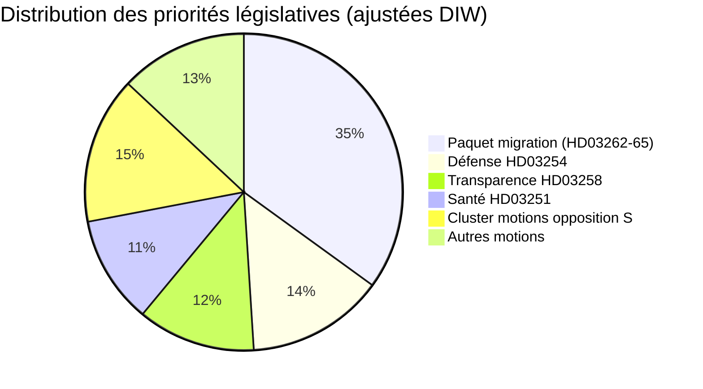

# Note de renseignement — Suède dans le mois à venir : juin 2026

**Classification** : PUBLIC | **Date** : 2026-05-03 | **Auteur** : James Pether Sörling

---

## 🎯 BLUF

La coalition Tidö suédoise (M-SD-KD-L, 176/349 sièges) a tiré une salve législative préélectorale avec quatre propositions de migration simultanées déposées le 30 avril 2026 — dont l'abolition des titres de séjour permanents — 133 jours avant l'élection du 13 septembre. Le paquet mettra à l'épreuve la cohésion de la coalition (notamment la loyauté libérale), exposera le risque de conformité CEDH et définira le terrain électoral pour juin–septembre. Parallèlement, un cadre de coopération militaire (HD03254) et une réforme intégrée des soins psychiatriques/de dépendance (HD03251) élargissent l'agenda électoral à la défense et à la santé.

## 🧭 3 décisions que ce brief soutient

1. **Surveillance législative** : Suivre les votes de L (Liberalerna) en comité sur HD03262 — une défection libérale risque d'emporter tout le paquet migratoire et la stabilité gouvernementale.
2. **Cartographie des scénarios électoraux** : Le sprint migratoire préélectoral consolide soit la base SD, soit aliène les électeurs centristes ; les deux issues modifient l'arithmétique de coalition avant septembre.
3. **Déclencheur d'escalade des risques** : Contestation juridique CEDH/UE de HD03262 (abolition du titre permanent) — si la Commission ou les tribunaux suédois signalent une incompatibilité, le calendrier législatif affronte une crise constitutionnelle avant l'élection.

## Points de renseignement en 60 secondes

- 🔴 **SPRINT MIGRATOIRE** : 4 propositions (HD03262, 263, 264, 265) abolissent les titres permanents, renforcent l'expulsion, resserrent les règles de sanction/détention — le paquet migratoire le plus agressif depuis la crise de 2016. **DIW : 10.2 (L3, ajusté élection)**
- 🟠 **POSTURE DÉFENSIVE** : HD03254 (cadre de coopération militaire opérationnel) — intégration défense NATO/nordique, Pål Jonson (M). Soutien multipartite attendu ; S ne peut s'y opposer.
- 🟡 **RÉFORME SANTÉ** : HD03251 (soins intégrés addiction/psychiatrie) — réforme signature KD de Jakob Forssmed ; S dépose des contre-amendements sur l'autonomie régionale.
- 🟡 **TRANSPARENCE** : HD03258 (transparence du processus politique) — vise la transparence du financement de la société civile ; opposition du comité KU de S, V, MP ; avis Lagrådet en attente.
- ⚪ **MOTIONS OPPOSITION** : S dépose 9 motions de bien-être social (crédit logement, pauvreté, accidents du travail, accès aux soins) — positionnement de plateforme préélectorale ; portée législative minimale contre la majorité de 176 sièges.

## Meilleur signal d'alerte précoce

**Position de L (Liberalerna) en comité sur HD03262** (semaine du 18 mai 2026) : Si L signale son opposition à l'abolition des titres permanents pour des raisons CEDH, l'ensemble du paquet migratoire est confronté à un amendement ou un retrait — le plus grand risque politique à court terme.

## Label de confiance

**ÉLEVÉ** [B2] — analyse ancrée dans les documents avec de vraies citations `dok_id` ; arithmétique de coalition connue ; dimension juridique CEDH signalée comme `[HAUTE probabilité de contestation]`.

<!-- source-sha: 7f57e4a4f6dc30be3a923cf3528c3a09ec191564 -->
