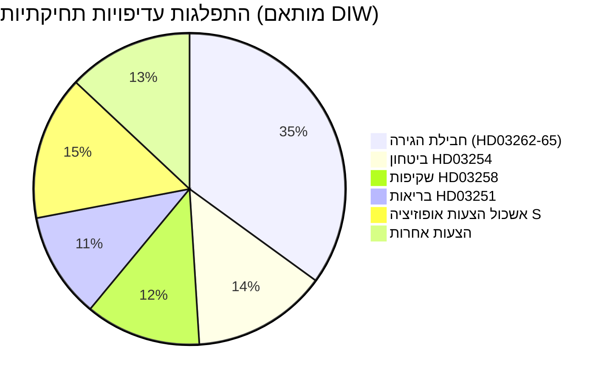

&#x200F;# דוח מודיעיני — שוודיה בחודש הקרוב: יוני 2026

**סיווג**: ציבורי | **תאריך**: 2026-05-03 | **מחבר**: James Pether Sörling

---

## 🎯 תמצית מנהלים

קואליציית Tidö השוודית (M-SD-KD-L, 176/349 מנדטים) פתחה במתקפה תחיקתית טרום-בחירות עם ארבעה הצעות הגירה סימולטניות שהוגשו ב-30 באפריל 2026 — כולל ביטול היתרי שהייה קבועים — 133 ימים לפני הבחירות ב-13 בספטמבר. החבילה תבחן את הלכידות הקואליציונית (בעיקר נאמנות הליברלים), תחשוף סיכון עמידה באמנה האירופית לזכויות אדם ותגדיר את שדה הקרב הבחירותי לתקופה יוני–ספטמבר. בו זמנית, מסגרת שיתוף פעולה צבאי (HD03254) ורפורמה משולבת בבריאות הנפש/התמכרויות (HD03251) מרחיבות את סדר יום הבחירות לביטחון ובריאות.

## 🧭 3 החלטות שדוח זה תומך בהן

1. **מעקב תחיקתי**: מעקב אחר הצבעות L (Liberalerna) בוועדה על HD03262 — עריקה ליברלית מסכנת את כל חבילת ההגירה ויציבות הממשלה.
2. **מיפוי תרחישים בחירותיים**: ספרינט ההגירה הטרום-בחירותי מגבש את בסיס SD או מרחיק בוחרים מרכזיים; שתי התוצאות משנות את חשבון הקואליציה לקראת ספטמבר.
3. **טריגר הסלמת סיכון**: ערעור משפטי ECHR/EU על HD03262 (ביטול היתר קבוע) — אם הנציבות או בתי המשפט השוודיים יסמנו אי-תאימות, לוח הזמנים התחיקתי יתמודד עם משבר חוקתי לפני הבחירות.

## נקודות מודיעיניות ב-60 שניות

- 🔴 **ספרינט הגירה**: 4 הצעות (HD03262, 263, 264, 265) יבטלו היתרים קבועים, יחזקו גירוש, יחמירו כללי עונשין/מעצר — חבילת ההגירה האגרסיבית ביותר מאז משבר 2016. **DIW: 10.2 (L3, מותאם בחירות)**
- 🟠 **עמדה ביטחונית**: HD03254 (מסגרת שיתוף פעולה צבאי מבצעי) — שילוב ביטחון נאט"ו/נורדי, Pål Jonson (M). צפוי תמיכה רב-מפלגתית; S אינה יכולה להתנגד.
- 🟡 **רפורמת בריאות**: HD03251 (טיפול משולב בהתמכרויות/פסיכיאטריה) — רפורמת דגל KD של Jakob Forssmed; S מגישה תיקונים נגדיים על אוטונומיה אזורית.
- 🟡 **שקיפות**: HD03258 (שקיפות התהליך הפוליטי) — מכוון לשקיפות מימון החברה האזרחית; התנגדות ועדת KU מ-S, V, MP; חוות דעת Lagrådet ממתינה.
- ⚪ **הצעות אופוזיציה**: S מגישה 9 הצעות רווחה חברתית (אשראי דיור, עוני, תאונות עבודה, גישה לבריאות) — מיצוב פלטפורמה טרום-בחירות; השפעה תחיקתית מינימלית מול רוב 176 מנדטים.

## האות מוביל העיקרי

**עמדת L (Liberalerna) בוועדה על HD03262** (שבוע 18 במאי 2026): אם L תסמן התנגדות לביטול היתרים הקבועים מטעמי ECHR, כל חבילת ההגירה תתמודד עם תיקון או נסיגה — הסיכון הפוליטי הגדול ביותר לטווח הקצר.

## תווית אמינות

**גבוה** [B2] — ניתוח מעוגן במסמכים עם ציטוטי `dok_id` אמיתיים; אריתמטיקה קואליציונית ידועה; ממד ECHR משפטי מסומן כ-`[סבירות גבוהה לערעור]`.

<!-- source-sha: 7f57e4a4f6dc30be3a923cf3528c3a09ec191564 -->
