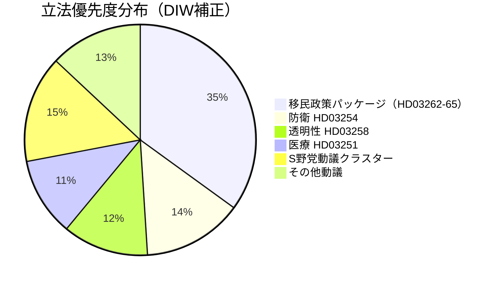

# インテリジェンスブリーフィング — スウェーデン来月の展望：2026年6月

**分類**：公開 | **日付**：2026-05-03 | **著者**：James Pether Sörling

---

## 🎯 BLUF（要旨）

スウェーデンのTidö連立政権（M-SD-KD-L、176/349議席）は、9月13日の選挙まで133日という時点で、2026年4月30日に永住許可廃止を含む4件の移民政策提案を同時に提出するという選挙前の立法攻勢を開始した。この政策パッケージは連立の結束（特に自由党の忠誠心）を試し、欧州人権条約（ECHR）の遵守リスクを露呈させ、6月から9月にかけての選挙戦の地盤を形成することになる。同時に、軍事協力枠組み（HD03254）と統合的な精神科・依存症ケア改革（HD03251）が選挙アジェンダを安全保障・医療分野にまで拡大させている。

## 🧭 本ブリーフィングが支援する3つの意思決定

1. **立法監視**：HD03262に関する委員会でのL党（Liberalerna）の投票を追跡 — 自由党の離反は移民政策パッケージ全体と政権の安定を危機にさらす。
2. **選挙シナリオのマッピング**：選挙前の移民攻勢は、SD基盤の強化か中道有権者の離反かいずれかにつながり、どちらの結果も9月に向けた連立の議席計算に影響する。
3. **リスク拡大のトリガー**：HD03262（永住許可廃止）に対するECHR/EU法的異議申し立て — 欧州委員会またはスウェーデン裁判所が適合性の問題を指摘した場合、選挙前に立法スケジュールが憲法上の危機に直面する。

## 60秒インテリジェンスポイント

- 🔴 **移民攻勢**：4件の提案（HD03262、263、264、265）により永住許可廃止、強制送還強化、制裁・拘留規定の厳格化 — 2016年の難民危機以来最も攻撃的な移民政策パッケージ。**DIW：10.2（L3、選挙補正）**
- 🟠 **防衛体制**：HD03254（実用的軍事協力枠組み）— NATO・北欧防衛統合、Pål Jonson（M）。超党派的支持が見込まれ、S党は反対できない。
- 🟡 **医療改革**：HD03251（依存症・精神科統合ケア）— Jakob Forssmead（KD）の看板政策；S党が地域自治に関する対抗修正案を提出。
- 🟡 **透明性**：HD03258（政治プロセスの透明性）— 市民社会資金の透明性を目的；S・V・MPのKU委員会が反対；Lagrådet意見待ち。
- ⚪ **野党動議**：S党が住宅ローン控除、貧困、労働災害、医療アクセスに関する9件の社会福祉動議を提出 — 176議席の多数派に対する立法影響は最小限。

## 主要な早期警戒シグナル

**HD03262に関するL党（Liberalerna）の委員会での立場**（2026年5月18日週）：L党がECHR上の理由から永住許可廃止に反対するシグナルを発した場合、移民政策パッケージ全体が修正または撤回に直面 — 最大の短期政治リスク。

## 信頼性ラベル

**高** [B2] — 実際の`dok_id`引用を含む文書根拠のある分析；既知の連立議席計算；ECHR法的側面は`[高確率の異議申し立て]`として注記。

<!-- source-sha: 7f57e4a4f6dc30be3a923cf3528c3a09ec191564 -->
