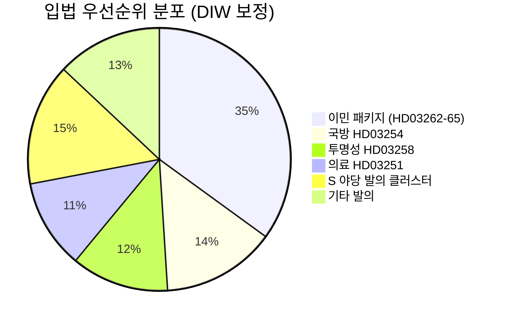

# 정보 브리핑 — 스웨덴 다음 달 전망: 2026년 6월

**분류**: 공개 | **날짜**: 2026-05-03 | **저자**: James Pether Sörling

---

## 🎯 BLUF(핵심 요약)

스웨덴 Tidö 연립정부(M-SD-KD-L, 176/349석)는 9월 13일 선거까지 133일을 남겨두고, 2026년 4월 30일에 영주권 폐지를 포함한 4건의 이민정책 법안을 동시에 제출하는 선거 전 입법 공세를 펼쳤다. 이 정책 패키지는 연립 결속력(특히 자유당의 충성도)을 시험하고, 유럽인권협약(ECHR) 준수 리스크를 노출시키며, 6월부터 9월까지의 선거 지형을 결정할 것이다. 동시에 군사협력 프레임워크(HD03254)와 정신건강·중독치료 통합 개혁(HD03251)이 선거 의제를 안보·의료 영역으로 확장하고 있다.

## 🧭 이 브리핑이 지원하는 3가지 의사결정

1. **입법 모니터링**: HD03262에 관한 위원회에서 L당(Liberalerna)의 투표 추적 — 자유당 이탈은 전체 이민 패키지와 정부 안정을 위협한다.
2. **선거 시나리오 매핑**: 선거 전 이민 공세는 SD 기반 결집 또는 중도 유권자 이탈로 귀결되며, 두 결과 모두 9월에 앞서 연립 의석 계산에 영향을 미친다.
3. **리스크 확대 트리거**: HD03262(영주권 폐지)에 대한 ECHR/EU 법적 이의제기 — 유럽위원회 또는 스웨덴 법원이 불합치를 지적할 경우, 선거 전에 입법 일정이 헌법적 위기에 직면한다.

## 60초 인텔리전스 포인트

- 🔴 **이민 공세**: 4건의 법안(HD03262, 263, 264, 265)으로 영주권 폐지, 추방 강화, 제재·구금 규정 강화 — 2016년 난민 위기 이래 가장 강경한 이민 패키지. **DIW: 10.2 (L3, 선거 보정)**
- 🟠 **국방 자세**: HD03254(실용적 군사협력 프레임워크) — NATO·북유럽 국방 통합, Pål Jonson(M). 초당적 지지 예상; S당은 반대할 수 없다.
- 🟡 **의료 개혁**: HD03251(중독·정신과 통합 치료) — Jakob Forssmed(KD)의 대표 정책; S당이 지역 자율성에 관한 수정안 제출.
- 🟡 **투명성**: HD03258(정치 과정 투명성) — 시민사회 자금 조달 투명성 목적; S·V·MP의 KU 위원회 반대; Lagrådet 의견 대기.
- ⚪ **야당 발의**: S당이 주택 대출, 빈곤, 산업재해, 의료 접근에 관한 9건의 사회복지 발의 제출 — 176석 다수파에 대한 입법 영향 최소화.

## 주요 조기경보 신호

**HD03262에 관한 L당(Liberalerna)의 위원회 입장**(2026년 5월 18일 주): L당이 ECHR을 이유로 영주권 폐지에 반대 신호를 보낼 경우, 전체 이민 패키지가 수정 또는 철회에 직면 — 최대 단기 정치 리스크.

## 신뢰도 레이블

**높음** [B2] — 실제 `dok_id` 인용이 포함된 문서 기반 분석; 알려진 연립 의석 계산; ECHR 법적 측면은 `[이의제기 높은 가능성]`으로 표기.

<!-- source-sha: 7f57e4a4f6dc30be3a923cf3528c3a09ec191564 -->
