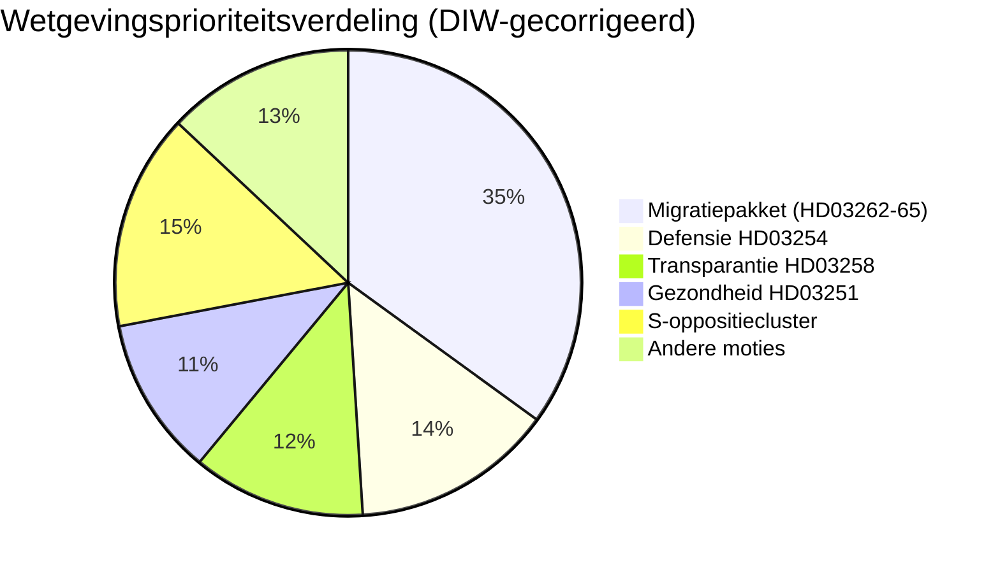

# Inlichtingenbriefing — Zweden de komende maand: juni 2026

**Classificering**: OPENBAAR | **Datum**: 2026-05-03 | **Auteur**: James Pether Sörling

---

## 🎯 BLUF

Zweden's Tidö-coalitie (M-SD-KD-L, 176/349 zetels) loste een voorverkiezingsvolley af met vier gelijktijdige migratievoorstellen ingediend op 30 april 2026 — inclusief de afschaffing van permanente verblijfsvergunningen — 133 dagen voor de verkiezingen op 13 september. Het pakket zal de cohesie van de coalitie testen (met name de liberale loyaliteit), EVRM-nalevingsrisico blootleggen en het verkiezingsterrein definiëren voor juni–september. Tegelijkertijd breidt een militair samenwerkingskader (HD03254) en een geïntegreerde psychiatrie-/verslavingszorgreform (HD03251) de verkiezingsdagorde uit naar defensie en gezondheid.

## 🧭 3 beslissingen die dit brief ondersteunt

1. **Wetgevingsmonitoring**: Volg L's (Liberalernas) commissiestemmen over HD03262 — een liberale overloper riskeer het hele migratiepakket en de regeringsstabiliteit.
2. **Verkiezingsscenarioskaart**: De voorverkiezingsmigratiesprint consolideert ofwel de SD-basis of vervreemd centristische kiezers; beide uitkomsten verschuiven de coalitie-arithmetiek richting september.
3. **Risicoescalatie-trigger**: EVRM/EU-rechtelijke aanvechting van HD03262 (afschaffing permanent verblijf) — als de Commissie of Zweedse rechtbanken incompatibiliteit signaleren, staat de wetgevingskalender voor de verkiezingen voor een constitutionele crisis.

## 60-seconden inlichtingenpunten

- 🔴 **MIGRATIESPRINT**: 4 voorstellen (HD03262, 263, 264, 265) schaffen permanente verblijfsvergunningen af, versterken uitzetting, verscherpen straf-/detentieregels — het meest agressieve migratiepakket sinds de crisis van 2016. **DIW: 10.2 (L3, verkiezingsgecorrigeerd)**
- 🟠 **DEFENSIEHOUDING**: HD03254 (operationeel militair samenwerkingskader) — NAVO/Noordse defensie-integratie, Pål Jonson (M). Partijoverstijgende steun verwacht; S kan zich niet verzetten.
- 🟡 **GEZONDHEIDSHERVORMING**: HD03251 (geïntegreerde verslavings-/psychiatrische zorg) — KD-handtekeninghervorming van Jakob Forssmed; S dient tegenamendamenten in over regionale autonomie.
- 🟡 **TRANSPARANTIE**: HD03258 (transparantie in het politieke proces) — richt zich op transparantie in de financiering van het maatschappelijk middenveld; KU-commissieopositie van S, V, MP; Lagrådet-advies in afwachting.
- ⚪ **OPPOSITIEMOTIES**: S dient 9 sociale welvaartsmoties in (woningkrediet, armoede, arbeidsongevallen, toegang tot gezondheidszorg) — voorverkiezingsplatformpositionering; wetgevende impact minimaal tegen de 176-zetelmeerderheid.

## Top voorwaarts signaal

**L's (Liberalernas) commissiepositie over HD03262** (week van 18 mei 2026): Als L weerstand signaleert tegen afschaffing van permanente vergunningen op EVRM-gronden, begegent het hele migratiepakket aanpassing of intrekking — het grootste kortetermijn politieke risico.

## Vertrouwenslabel

**HOOG** [B2] — documentverankerde analyse met echte `dok_id`-citaten; bekende coalitie-arithmetiek; EVRM-juridische dimensie gemarkeerd als `[HOGE waarschijnlijkheid uitdaging]`.

<!-- source-sha: 7f57e4a4f6dc30be3a923cf3528c3a09ec191564 -->
