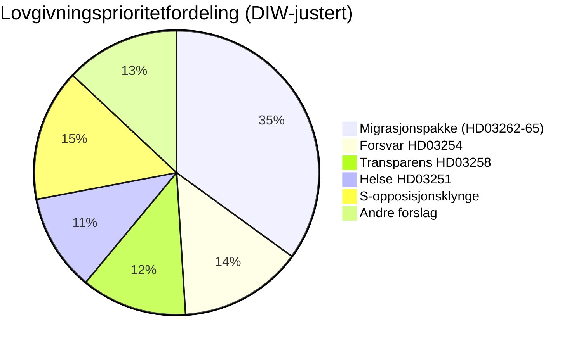

# Etterretningsbriefing — Sverige måneden fremover: juni 2026

**Klassifisering**: OFFENTLIG | **Dato**: 2026-05-03 | **Forfatter**: James Pether Sörling

---

## 🎯 BLUF

Sveriges Tidö-koalisjon (M-SD-KD-L, 176/349 seter) avfyrte en forvalgsstrategi med fire simultane migrasjonsproposisjoner innlevert 30. april 2026 — inkludert avskaffelse av permanente oppholdstillatelser — 133 dager før valget 13. september. Pakken vil teste koalisjonens samhold (særlig Liberal lojalitet), eksponere EMK-overholdelses risiko og definere valterreng for juni–september. Simultaneously utvider en militær samarbeidsramme (HD03254) og en integrert psykiatri-/rusomsorgsreform (HD03251) valgdagsordenen til forsvar og helse.

## 🧭 3 beslutninger dette briefet støtter

1. **Lovgivningsovervåking**: Følg Ls (Liberalernes) utvalgstemmer om HD03262 — Liberal avhopper risikerer hele migrasjonspakken og regjeringens stabilitet.
2. **Valgscenariekartlegging**: Forvalgsmigrasjonssprinten konsoliderer enten SD-basen eller fremmedgjør sentristiske velgere; begge utfall forskyver koalisjonsaritmetikken mot september.
3. **Risikoeskaleringsutløser**: EMK/EU-rettslig utfordring av HD03262 (avskaffelse av permanent tillatelse) — hvis Kommisjonen eller svenske domstoler signaliserer inkompatibilitet, møter lovgivningskalenderen en konstitusjonell krise før valget.

## 60-sekunders etterretningspunkter

- 🔴 **MIGRASJONSPRINT**: 4 proposisjoner (HD03262, 263, 264, 265) avskaffer permanente oppholdstillatelser, styrker utvisning, strammer straffe-/detenasjonsregler — den mest aggressive migrasjonspakken siden 2016-krisen. **DIW: 10.2 (L3, valgjustert)**
- 🟠 **FORSVARSPOSITUR**: HD03254 (operativ militær samarbeidsramme) — NATO/Nordisk forsvarsintegrasjon, Pål Jonson (M). Tverrpartistøtte forventes; S kan ikke motsette seg.
- 🟡 **HELSEREFORM**: HD03251 (integrert rus-/psykiatribehandling) — KDs signaturreform av Jakob Forssmed; S sender inn motamendments om regional autonomi.
- 🟡 **TRANSPARENS**: HD03258 (transparens i politisk prosess) — retter seg mot sivilt samfunns finansieringstransparens; KU-utvalgsopposisjon fra S, V, MP; Lagrådets yttrande avventes.
- ⚪ **OPPOSISJONSMOTIVASJONER**: S legger inn 9 sosialvelferdsforslag (boligkreditt, fattigdom, arbeidsskader, helsetilgang) — forvalgspolitisk posisjonering; lovgivningstroværdighet minimal mot 176-seters flertall.

## Toppfremovertrigger

**Ls (Liberalernes) utvalgsposisjon om HD03262** (uken 18. mai 2026): Hvis L signaliserer motstand mot avskaffelse av permanente tillatelser på EMK-grunnlag, møter hele migrasjonspakken endring eller tilbaketrekning — den største kortsiktige politiske risikoen.

## Konfidensmerknad

**HØY** [B2] — dokumentforankret analyse med ekte `dok_id`-sitater; kjent koalisjonsaritmetikk; EMK-rettslig dimensjon flagget som `[HØY sannsynlighet utfordring]`.

<!-- source-sha: 7f57e4a4f6dc30be3a923cf3528c3a09ec191564 -->
