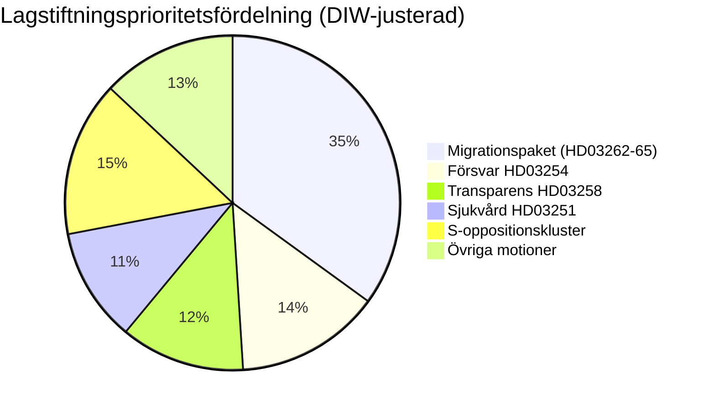

# Underrättelsebriefing — Sverige månaden framåt: juni 2026

**Klassificering**: OFFENTLIG | **Datum**: 2026-05-03 | **Författare**: James Pether Sörling

---

## 🎯 BLUF

Sveriges Tidökoalition (M-SD-KD-L, 176/349 platser) avfyrade en förvalslagstiftningssalva med fyra simultana migrationsmotioner inlämnade den 30 april 2026 — inklusive avskaffande av permanenta uppehållstillstånd — 133 dagar före valet den 13 september. Paketet kommer att testa koalitionskohesionen (särskilt Liberal lojalitet), exponera ECHR-efterlevnadsrisk och definiera den valrörelseterräng som gäller juni–september. Simultant vidgar ett militärt samarbetsramverk (HD03254) och en integrerad psykiatri-/beroendevårdsreform (HD03251) valrörelseagendan till försvar och hälso- och sjukvård.

## 🧭 3 beslut som denna briefing stödjer

1. **Lagstiftningsuppföljning**: Spåra L:s (Liberalernas) utskottsröster om HD03262 — Liberal defektering riskerar hela migrationspaketet och regeringsstabiliteten.
2. **Valscenariokartläggning**: Den förvalsmigrationsspriten konsoliderar antingen SD-basen eller alienerar centristiska väljare; båda utfallen förskjuter koalitionsaritmetiken inför september.
3. **Riskeskaleringsutlösare**: ECHR/EU-rättslig utmaning mot HD03262 (avskaffande av permanent tillstånd) — om kommissionen eller svenska domstolar signalerar inkompatibilitet, möter lagstiftningskalendern en konstitutionell kris före valet.

## 60-sekunders underrättelsepunkter

- 🔴 **MIGRATIONSSPRINT**: 4 propositioner (HD03262, 263, 264, 265) avskaffar permanenta uppehållstillstånd, förstärker utvisning, skärper straff-/häktningsregler — det mest aggressiva migrationspaketet sedan 2016 års kris. **DIW: 10.2 (L3, valkorrigerat)**
- 🟠 **FÖRSVARSPOSITION**: HD03254 (operativt militärt samarbetsramverk) — NATO/nordisk försvarsintegration, Pål Jonson (M). Tvärpartistöd förväntas; S kan inte motsätta sig.
- 🟡 **SJUKVÅRDSREFORM**: HD03251 (integrerad beroende/psykiatrivård) — KD:s signaturreform av Jakob Forssmed; S lämnar in motändringar om regional autonomi.
- 🟡 **TRANSPARENS**: HD03258 (transparens i den politiska processen) — riktar sig mot civilsamhällets finansieringstransparens; KU-utskottets opposition från S, V, MP; Lagrådets yttrande inväntat.
- ⚪ **OPPOSITIONSMOTIONER**: S lämnar in 9 socialvälmåendesmotioner (bostadskredit, fattigdom, arbetsplatsolyckor, hälso- och sjukvårdstillgång) — förvalsplattformspositionering; lagstiftningstrovärdighet minimal mot 176-platsmajoriteten.

## Främsta framåtsignal

**L:s (Liberalernas) utskottsposition om HD03262** (veckan den 18 maj 2026): Om L signalerar motstånd mot avskaffande av permanenta tillstånd på ECHR-grunder, möter hela migrationspaketet ändringar eller återkallande — den största kortsiktiga politiska risken.

## Konfidensetikett

**HÖG** [B2] — dokumentförankrad analys med verkliga `dok_id`-citat; känd koalitionsaritmetik; ECHR-rättslig dimension flaggad som `[HÖG sannolikhet utmaning]`.

<!-- source-sha: 7f57e4a4f6dc30be3a923cf3528c3a09ec191564 -->
