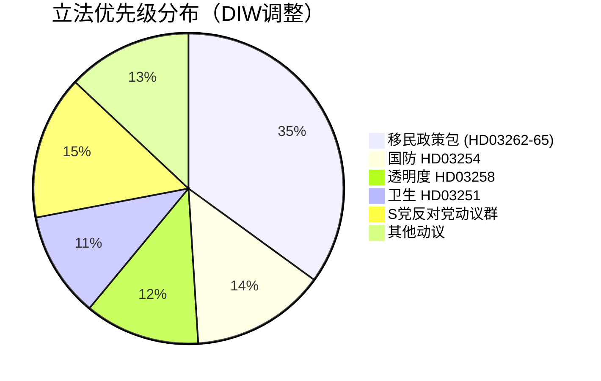

# 情报简报 — 瑞典未来一个月展望：2026年6月

**分类**：公开 | **日期**：2026-05-03 | **作者**：James Pether Sörling

---

## 🎯 核心摘要（BLUF）

瑞典Tidö联合政府（M-SD-KD-L，176/349席）在距9月13日大选还有133天时，于2026年4月30日同时提交了包括废除永久居留许可在内的4项移民政策提案，发动了选前立法攻势。这一政策包将考验联合政府的凝聚力（尤其是自由党的忠诚度），暴露欧洲人权公约（ECHR）合规风险，并为6月至9月的竞选格局奠定基础。与此同时，军事合作框架（HD03254）和精神科/成瘾综合治疗改革（HD03251）将选举议程延伸至国防与卫生领域。

## 🧭 本简报支持的3项决策

1. **立法监控**：追踪L党（Liberalerna）在委员会中就HD03262的投票——自由党若叛离将危及整个移民政策包及政府稳定。
2. **选举情景映射**：选前移民攻势或将巩固SD基本盘，或将疏远中间选民；两种结果都将改变9月前的联合席位计算。
3. **风险升级触发因素**：对HD03262（废除永久许可）提起ECHR/EU法律挑战——若欧盟委员会或瑞典法院认定不符合，选举前立法日程将面临宪法危机。

## 60秒情报要点

- 🔴 **移民攻势**：4项提案（HD03262、263、264、265）废除永久居留许可，强化驱逐，收紧制裁/拘留规定——自2016年难民危机以来最强硬的移民政策包。**DIW：10.2（L3，选举调整）**
- 🟠 **防务姿态**：HD03254（实用军事合作框架）——北约/北欧防务一体化，Pål Jonson（M）。预计获跨党派支持；S党无力反对。
- 🟡 **卫生改革**：HD03251（成瘾/精神科综合治疗）——KD党Jakob Forssmed的标志性改革；S党就地区自治提交反修正案。
- 🟡 **透明度**：HD03258（政治进程透明度）——旨在提高公民社会资金透明度；S、V、MP的KU委员会反对；Lagrådet意见待定。
- ⚪ **反对党动议**：S党提交9项社会福利动议（住房信贷、贫困、工伤、医疗获取）——选前纲领定位；在176席多数面前立法影响微乎其微。

## 主要预警信号

**L党（Liberalerna）在委员会中就HD03262的立场**（2026年5月18日当周）：若L党以ECHR理由反对废除永久许可，整个移民政策包将面临修改或撤回——最大的短期政治风险。

## 置信度标签

**高** [B2] — 基于文件的分析，附真实`dok_id`引用；联合席位计算已知；ECHR法律层面标注为`[挑战可能性高]`。

<!-- source-sha: 7f57e4a4f6dc30be3a923cf3528c3a09ec191564 -->
