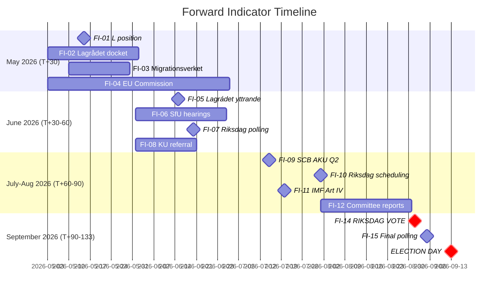

# Forward Indicators — Month Ahead 2026-05-03

**Method**: ≥10 dated indicators across ≥4 time horizons  
**Coverage**: Monitoring framework for legislative batch 2026-05-03

## Indicator Registry

### Horizon T+0 to T+30 days (May 2026)

| # | Indicator | Watch For | Trigger Signal | Confidence |
|---|-----------|----------|---------------|------------|
| FI-01 | L parliamentary group position on HD03262 | Johan Pehrson public statement, party group resolution | Any L statement distancing from "detention expansion" = Scenario 3 elevated | HIGH |
| FI-02 | Lagrådet docket update | Lagrådet receives HD03262 referral | Adverse yttrande draft leaked = major event | MEDIUM |
| FI-03 | Migrationsverket capacity planning document | Internal planning memo or press briefing | "Cannot implement by 2027" = implementation failure signal | MEDIUM |
| FI-04 | EU Commission DG HOME informal communication | Brussels procedural contacts | Commission "monitoring closely" statement = HD03262 EU risk elevated | LOW-MEDIUM |

### Horizon T+30 to T+60 days (June 2026)

| # | Indicator | Watch For | Trigger Signal | Confidence |
|---|-----------|----------|---------------|------------|
| FI-05 | Lagrådet yttrande (formal) on HD03262–HD03265 | Published on lagrådet.se | "Allvarliga invändningar" = Scenario 2 confirmed | HIGH |
| FI-06 | SfU (Socialförsäkringsutskottet) committee hearings on migration | Riksdag committee schedule | Expert testimonies from UNHCR/Amnesty = F2 frame amplified | HIGH |
| FI-07 | Riksdag polling (Sifo/Novus June survey) | Party polling June 2026 | L below 5% = coalition credibility threat; S above 30% = S recovery | HIGH |
| FI-08 | KU (Konstitutionsutskottet) referral of HD03258 | Committee assignment | KU signals procedural concerns = HD03258 amended | MEDIUM |

### Horizon T+60 to T+90 days (July–August 2026)

| # | Indicator | Watch For | Trigger Signal | Confidence |
|---|-----------|----------|---------------|------------|
| FI-09 | SCB AKU Q2 2026 employment data | Published July 2026 | Unemployment above 8.8% = S economic narrative activated | HIGH |
| FI-10 | Riksdag autumn session scheduling (talmanskonferens) | September agenda | HD03262 on second reading agenda = vote imminent | HIGH |
| FI-11 | IMF Art. IV Consultation Sweden 2026 | IMF press release | GDP growth downgrade below 1.5% = economic risk R7 activated | MEDIUM |
| FI-12 | Riksdag summer recess committee reports filed | Committee betänkanden on migration | SfU betänkande with major amendments = Scenario 2 | HIGH |
| FI-13 | NATO Baltic/Nordic exercise schedule | FMV/Försvarsmakten | Joint exercises announced = HD03254 operational activation | MEDIUM |

### Horizon T+90 to T+133 days (August–September 13, 2026 ELECTION)

| # | Indicator | Watch For | Trigger Signal | Confidence |
|---|-----------|----------|---------------|------------|
| FI-14 | August 2026 Riksdag vote on HD03262 | Riksdag kammarvoteringen | L vote pattern = definitive Scenario 1/2/3 confirmation | CERTAIN |
| FI-15 | Final pre-election polling (Sifo early September) | Party share August/September | Any party at 4% threshold ± 0.5% = high volatility | HIGH |
| FI-16 | S/opposition pre-election mobilization event | Party congress, rally, major policy announcement | S announces major social reform pledge = S offensive activated | MEDIUM |

## Indicator Dashboard

## Priority Intelligence Requirements (PIR) — Forward Indicators Cross-Reference

| PIR (from intelligence-assessment) | Key Forward Indicators |
|------------------------------------|----------------------|
| PIR-1 (L position) | FI-01, FI-07 |
| PIR-2 (Lagrådet) | FI-02, FI-05 |
| PIR-3 (SCB Q2) | FI-09, FI-11 |
| PIR-4 (EU Commission) | FI-04 |
| PIR-5 (SD Ukraine) | No specific indicator — monitor Riksdag speeches |
| PIR-6 (Migrationsverket) | FI-03, FI-12 |

## Monitoring Instructions for Next Riksdagsmonitor Report

1. **By May 20**: Check L parliamentary group statements on HD03262; update FI-01
2. **By June 15**: Lagrådet yttrande expected; this is the SINGLE MOST IMPORTANT data point for Scenario branching
3. **By July 15**: SCB AKU Q2 employment data; update economic risk assessment
4. **By August 1**: Riksdag committee betänkanden on migration; confirm Scenario 1/2/3 branch
5. **By September 5**: Final pre-election polling; update election-2026-analysis seat projections
