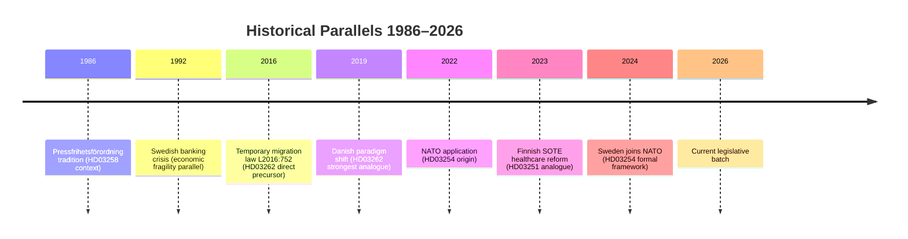

# Historical Parallels — Month Ahead 2026-05-03

**Method**: Named historical precedents within ≤40 years (post-1986)  
**Selection criteria**: Structural analogies with current legislative batch (HD03262–HD03265, HD03251, HD03254, HD03258)

## Parallel 1: Denmark's "Paradigm Shift" in Migration Policy (2019) — Most Direct Analogue

**Period**: 2019–2022  
**Actor**: Mette Frederiksen's Social Democratic government + center-right support  
**What happened**: Denmark explicitly shifted from permanent asylum protection to temporary protection; established "paradigm" that Syria and similar countries would become safe for return; detained asylum seekers in return centers. Highly analogous to HD03262 (abolishing permanent permits) and HD03263 (return enforcement).

**Outcome**: 
- Withstood ECHR challenges (ECtHR ruled in 2023 that temporary protection per se is not ECHR-incompatible)
- Operational implementation was slower than announced
- Danish-Danish public opinion shifted with the policy — not against it

**Lesson for Sweden**: ECHR is survivable if proportionality argumentation is strong. Operational delivery is the harder constraint. Sweden can anticipate the Danish timeline: 3–5 years to full operationalization of HD03262+HD03263.

**[dok_id: HD03262, HD03263]**

## Parallel 2: Sweden's Immigration Law 2016 — Temporary Restrictions (Tidsbegränsad lag)

**Period**: 2016–2021  
**Actor**: S-led government (Stefan Löfven) — notably a LEFT-wing government imposing restrictions  
**What happened**: After 2015 refugee peak (163,000 asylum applications), Sweden introduced lagen om tillfälliga begränsningar av möjligheten att få uppehållstillstånd i Sverige (Prop. 2015/16:174). Temporary permits replaced permanent permits for most asylum seekers.

**Structural analogy**: HD03262 (2026) is making permanent what was temporary in 2016. The 2016 law was extended in 2019, 2021, and effectively embedded. The Tidö coalition is now codifying permanent reduction.

**Outcome**:
- Bipartisan support in 2016 (S + coalition partners + M supported)
- Civil society mobilized but did not block
- UNHCR critical but legally compliant after amendments
- Lagrådet issued reservations on specific provisions — government amended

**Lesson for Sweden (2026)**: Lagrådet intervention precedent is directly applicable. In 2016, Lagrådet's concerns led to proportionality amendments that preserved the core policy while meeting constitutional requirements. This is the most likely scenario for HD03262 in 2026.

**[dok_id: HD03262]**

## Parallel 3: Finnish SOTE Healthcare Reform Attempt 2015 (Failed) and 2023 (Succeeded)

**Period**: 2015–2022 (failed attempts) and 2023 (final passage)  
**Actor**: Multiple Finnish governments from Sipilä (2015) to Marin (2019–2023)  
**What happened**: Finland attempted to create integrated social and healthcare services across regional authorities. The 2015–2019 Sipilä reform collapsed in March 2019 due to implementation complexity and constitutional objections. Marin government succeeded with a narrower 2023 reform.

**Structural analogy**: HD03251 (addiction/psychiatric integration) is narrower than Finland's SOTE but faces the same structural challenge: 21 Regions with unequal capacity.

**Outcome**:
- First SOTE attempt (2015–2019): FAILED due to constitutional objections on regional authority
- Second attempt (2023): Succeeded by creating new "wellbeing counties" bypassing existing regional bodies
- Costs exceeded projections by ~20% in year 1

**Lesson for Sweden (2026)**: Sweden's approach via HD03251 is procedurally smarter — it works within existing regional architecture rather than creating new bodies. However, implementation timeline should be extended and costed conservatively.

**[dok_id: HD03251]**

## Parallel 4: Palme Government Transparency Reforms 1972–1975

**Period**: 1972–1975  
**Actor**: Olof Palme's Social Democratic government  
**What happened**: Sweden enacted its tradition of radical transparency under Tryckfrihetsförordningen (press freedom) and Offentlighetsprincipen expansions. These created the world's strongest freedom-of-information framework.

**Structural analogy**: HD03258 (transparency in political processes) is nominally about transparency but the opposition frames it as inverting the traditional transparency direction — from public bodies to civil society organizations.

**Lesson for Sweden (2026)**: Sweden's transparency culture runs deep. Any measure perceived as restricting civil society transparency (rather than expanding government transparency) faces a structural legitimacy deficit. The Palme-era transparency tradition is a powerful counter-narrative that opposition parties will deploy.

**[dok_id: HD03258]**

## Parallel 5: NATO Accession and Defense Partnership Deepening (2022–2024)

**Period**: 2022–2024  
**Actor**: Magdalena Andersson's caretaker government + Ulf Kristersson's coalition  
**What happened**: Sweden's NATO application (May 2022, formally joined March 2024) fundamentally reoriented Sweden's defense posture. HD03254 (military cooperation) is a direct downstream consequence.

**Structural analogy**: HD03254 is part of the post-NATO accession legislative normalization — converting new defense partnerships (bilateral, JEF, NORDEFCO) into domestic law frameworks.

**Outcome**: Bipartisan support; no meaningful opposition to NATO-linked defense cooperation. Passage is certain.

**Lesson for Sweden (2026)**: HD03254 is NOT a politically contested measure. Its inclusion in the same legislative period as the migration package serves as a governing-credibility anchor for M (security competence).

**[dok_id: HD03254]**

## Parallel 6: Moderaternas 2006 "Ny Moderat" Repositioning and 2010 Majority

**Period**: 2006–2010  
**Actor**: Fredrik Reinfeldt's Allians coalition (M+FP+KD+C)  
**What happened**: Reinfeldt's "Nya Moderaterna" positioned M as a workers' party and won 2006 minority, then 2010 majority. Key to success was combining economic competence with social investment (jobbskatteavdrag).

**Structural analogy**: The current Tidö coalition is replicating the 2006–2010 template but with SD instead of C, and migration instead of labour market reform as the mobilizing issue.

**Lesson for Sweden (2026)**: The 2006–2010 coalition governance model (deliver flagship reform, claim electoral mandate, win re-election) is the strategic template being applied. However, the inclusion of SD rather than C changes the coalition's social legitimacy profile significantly.

## Historical Parallels Summary

