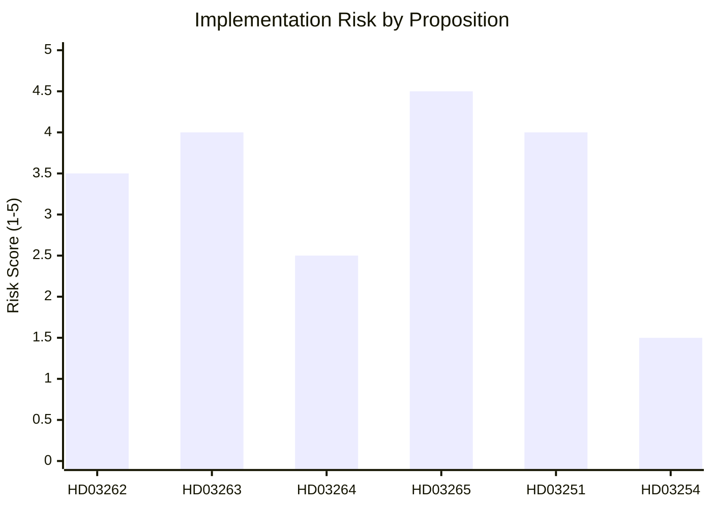

# Implementation Feasibility — Month Ahead 2026-05-03

**Method**: 4-dimensional delivery risk analysis (Budget/IT/Regulatory/Workforce)  
**Coverage**: Primary propositions HD03262–HD03265, HD03251, HD03254

## HD03262 — Utmönstring av permanent uppehållstillstånd + EU asylpakt

| Dimension | Risk Level | Assessment |
|-----------|-----------|-----------|
| **Budget** | MEDIUM | Cost of system changes at Migrationsverket (case processing, permit database); EU pact compliance has additional coordination costs. Estimated SEK 150–250M for system overhaul. |
| **IT** | HIGH | Migrationsverket's IT systems (WILMA, Löpnummersystemet) require significant reprogramming to eliminate permanent permit pathways and implement new temporary permit categories. Multi-year upgrade project. |
| **Regulatory** | CRITICAL | EU Asylum and Migration Pact transposition requirements must be mapped to Swedish law. Lagrådet yttrande (ECHR Art. 8) requires legal analysis before secondary regulations can be issued. |
| **Workforce** | MEDIUM | Legal officers at Migrationsverket must be retrained on new processing frameworks. Limited additional FTEs needed if process is simplified. |

**Overall feasibility**: MEDIUM-HIGH complexity, 18–30 month implementation timeline  
**Key bottleneck**: Regulatory — EU pact transposition mapping and Lagrådet clearance

---

## HD03263 — Stärkt återvändandeverksamhet

| Dimension | Risk Level | Assessment |
|-----------|-----------|-----------|
| **Budget** | HIGH | Return operations are expensive: charter flights, escort officers, diplomatic negotiations. Each forced return costs ~SEK 30,000–80,000. Scale-up requires SEK 200–400M additional annually. |
| **IT** | MEDIUM | Case tracking systems need improvement to follow return compliance; interoperability with Polisen and Kriminalvård. Existing systems can be upgraded incrementally. |
| **Regulatory** | HIGH | Country-of-origin safety assessments for additional return destinations require Utrikesdepartementet cooperation. Diplomatic agreements (readmission agreements) needed with countries without existing coverage. |
| **Workforce** | CRITICAL | Migrationsverket, Polisen, and Kriminalvård all need additional return officers. Police workforce is currently at capacity on crime priorities; inter-agency competition for qualified staff is real. |

**Overall feasibility**: HIGH delivery risk, 24–36 month ramp-up  
**Key bottleneck**: Workforce — police capacity for enforcement operations

---

## HD03264 — Skärpta krav på vandel

| Dimension | Risk Level | Assessment |
|-----------|-----------|-----------|
| **Budget** | LOW | Primarily legal/procedural change; marginal additional legal processing cost |
| **IT** | LOW | Existing criminal record check systems (Belastningsregistret) already integrated; minor adjustment |
| **Regulatory** | HIGH | Definition of "character" grounds must be EU-compatible (Qualification Directive proportionality) and ECHR Art. 8 compliant. Lagrådet will scrutinize. |
| **Workforce** | LOW | Legal determinations by existing Migrationsverket case officers |

**Overall feasibility**: MEDIUM complexity, 12–18 month implementation  
**Key bottleneck**: Regulatory — proportionality standards under EU law

---

## HD03265 — Skärpta regler om uppsikt/förvar

| Dimension | Risk Level | Assessment |
|-----------|-----------|-----------|
| **Budget** | HIGH | Detention (förvar) is expensive: Migrationsverket runs dedicated detention centers. Expansion requires SEK 150–300M for new capacity or contracted facilities. |
| **IT** | MEDIUM | Detention tracking systems, biometric monitoring require upgrade |
| **Regulatory** | CRITICAL | Any deprivation of liberty requires strict legal framework compatible with ECHR Art. 5 (liberty) and Art. 8 (private life). Lagrådet will be extremely attentive. Time limits and judicial oversight are essential. |
| **Workforce** | HIGH | Detention center staff require specialized training; Kriminalvård involvement adds institutional complexity |

**Overall feasibility**: HIGH risk, 18–24 month timeline with regulatory pre-clearance required  
**Key bottleneck**: Regulatory + Budget

---

## HD03251 — Sammanhållen vård beroende/psykiatri

| Dimension | Risk Level | Assessment |
|-----------|-----------|-----------|
| **Budget** | HIGH | Regional implementation requires investment in shared systems, combined facilities, integrated staffing. Regions will request state grants. Estimated SEK 500M–1.5B over 5 years nationally. |
| **IT** | HIGH | Shared patient records between primary care, psychiatry, and addiction treatment require NPÖ (Nationell patientöversikt) expansion. Data governance (GDPR, healthcare secrecy) adds complexity. |
| **Regulatory** | MEDIUM | Secondary regulations from Socialstyrelsen; Hälso- och sjukvårdslagen amendments. EU medical device regulations for digital tools. Well-established regulatory pathway. |
| **Workforce** | CRITICAL | Shortage of psychiatrists and addiction specialists is structural in Sweden. Integrated care requires multidisciplinary teams. 4,000–6,000 additional FTE needed nationally over reform period. |

**Overall feasibility**: MEDIUM-HIGH complexity, realistic 5–7 year implementation (not 2-year government target)  
**Key bottleneck**: Workforce — specialist shortages are structural

---

## HD03254 — Operativt militärt samarbete

| Dimension | Risk Level | Assessment |
|-----------|-----------|-----------|
| **Budget** | MEDIUM | NATO bilateral cooperation frameworks involve mutual agreements on cost-sharing; Sweden bears costs for hosting and Swedish participation |
| **IT** | MEDIUM | NATO interoperability standards (STANAG) require secure comms upgrade; Försvarets Materielverk leads procurement |
| **Regulatory** | LOW | Sweden is already NATO member; HD03254 codifies existing practice. Straightforward legal incorporation. |
| **Workforce** | LOW | Existing military personnel; force structure already planned under 2025 defense bill |

**Overall feasibility**: LOW risk, 6–12 month implementation  
**Key bottleneck**: Budget certainty (minor)

---

## Overall Feasibility Summary

## Implementation Risk Register

| Proposition | Highest risk dimension | Timeline | Mitigation |
|-------------|----------------------|----------|-----------|
| HD03262 | Regulatory (EU pact) | 18–30 months | Pre-clearance with EU Commission |
| HD03263 | Workforce (police) | 24–36 months | Inter-agency task force; additional FTE budget |
| HD03264 | Regulatory (proportionality) | 12–18 months | Lagrådet pre-consultation |
| HD03265 | Regulatory + Budget | 18–24 months | Judicial oversight framework mandatory |
| HD03251 | Workforce (specialists) | 5–7 years | Training pipeline; international recruitment |
| HD03254 | Budget (minor) | 6–12 months | NATO cost-sharing negotiations |
