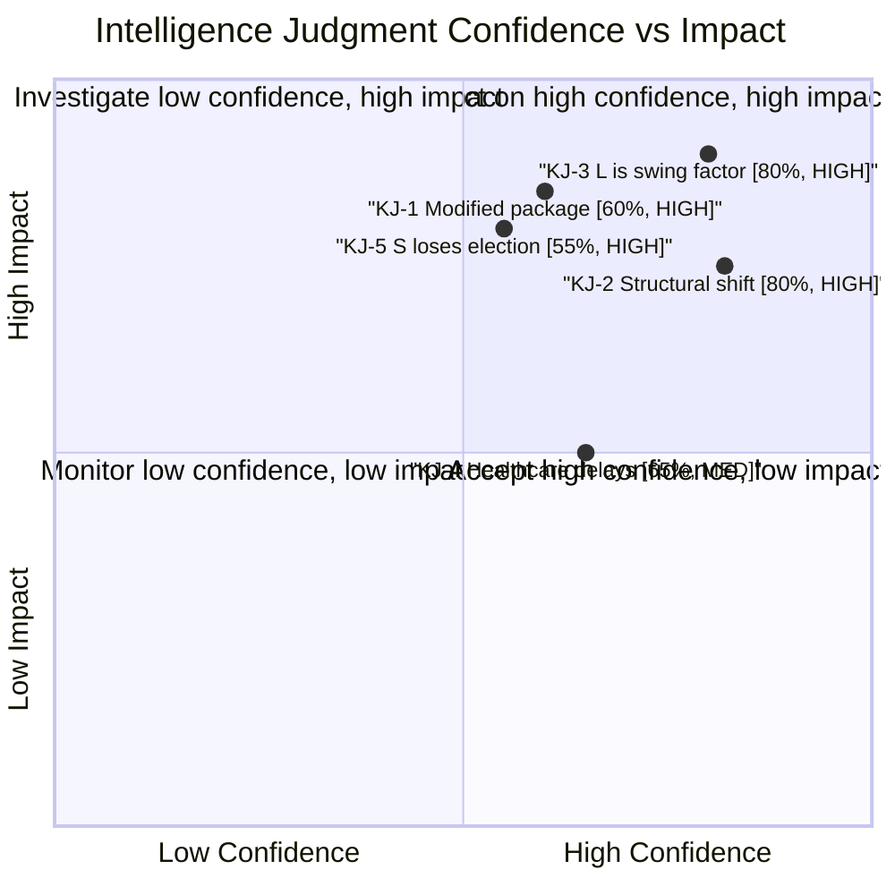

# Intelligence Assessment — Month Ahead 2026-05-03

**Method**: ICD 203-based Key Judgments + Confidence Labels  
**Date**: 2026-05-03  
**Analyst**: Riksdagsmonitor AI Intelligence Pipeline  
**Classification**: PUBLIC ASSESSMENT

## Key Judgments

### KJ-1: The Tidö coalition will likely deliver a modified (not intact) migration package before September 2026 election

**Confidence**: MODERATE (55–65%)  
**Key Assumptions**: Lagrådet will issue an yttrande with substantive ECHR Art. 8 reservations on HD03262; L will use this as leverage for proportionality amendments; SD will accept modifications rather than cause coalition collapse.  
**Dissent**: H2 hypothesis (L elevated defection) suggests the package may not pass at all in ~20% of scenarios.  
**Implications**: Modified migration package still represents significant policy tightening and will serve as SD/M electoral credential. The "ECHR compliance" framing benefits L.

**[dok_id: HD03262, HD03263, HD03264, HD03265; scenario analysis S2 = 30%, S1 = 48% combined = 78%]**

---

### KJ-2: Sweden's migration policy has entered a structural shift analogous to Denmark 2019–2022; reversal requires electoral change

**Confidence**: HIGH (75–85%)  
**Key Assumptions**: Denmark comparator analysis shows permanent paradigm shifts in migration policy survive individual government changes; once legislative architecture is built, successor governments modify at the margins.  
**Implications**: Even if S wins the September 2026 election, Sweden's migration framework will remain substantially tighter than pre-2022. The S party's strategy of "managing restrictiveness humanely" rather than reversing it is the probable post-election trajectory.

**[dok_id: HD03262; comparative-international.md Comparator 1]**

---

### KJ-3: Liberalerna (L) is the single most important swing factor in Swedish politics in the June–September 2026 period

**Confidence**: HIGH (80%)  
**Key Assumptions**: No other party has pivotal-vote status on both the migration package and coalition survival simultaneously. L's 16 seats are the margin of the entire Tidö majority.  
**Implications**: Intelligence consumers should prioritize monitoring L internal party signals above all other indicators. Any statement by Johan Pehrson distancing from HD03262 provisions should be treated as HIGH-CONFIDENCE indicator of Scenario 3.

**[dok_id: HD03262; devils-advocate.md H2; coalition-mathematics analysis]**

---

### KJ-4: The healthcare integration reform (HD03251) will pass but with regional implementation delays of 2–3 years beyond planned timeline

**Confidence**: MODERATE-HIGH (65%)  
**Key Assumptions**: HD03251 has cross-party support in principle; opposition blocking will be procedural (amendments) not substantive. However, Finland SOTE experience shows integration reforms routinely take twice as long as planned.  
**Implications**: KD can claim legislative victory in the 2026 election but the actual care improvement will be felt in 2029–2030 election cycle — a structural delivery gap.

**[dok_id: HD03251; comparative-international.md Comparator 2]**

---

### KJ-5: S will lose the September 2026 election unless an economic shock occurs between June and September

**Confidence**: MODERATE (50–60%)  
**Key Assumptions**: S's current social welfare motions cluster (HD11769–HD11778) does not provide a compelling counter-narrative to the government's migration-and-security message; absent economic deterioration, migration/defense dominates the election frame; coalition has demonstrated legislative delivery.  
**Dissent**: Economic deterioration scenario (R7) at 20% probability could significantly shift this judgment. S's structural voter base (~28–30%) means an economic swing is the primary pathway to S victory.

**[dok_id: HD11769–HD11778; devils-advocate.md H3; risk-assessment R7]**

## Priority Intelligence Requirements (PIRs) — Carry-Forward

| PIR | Intelligence Need | Collection Focus | Urgency |
|-----|------------------|-----------------|---------|
| PIR-1 | L party position on HD03262 ECHR compliance | Johan Pehrson public statements; L party meeting resolutions | IMMEDIATE (June 2026) |
| PIR-2 | Lagrådet yttrande content on HD03262–HD03265 | Lagrådet docket; Ministry submissions | HIGH (June–July 2026) |
| PIR-3 | Sweden Q2 2026 GDP growth and unemployment (SCB AKU) | SCB statistical releases | HIGH (July 2026) |
| PIR-4 | EU Commission informal reaction to HD03262 | Brussels procedural channels | MEDIUM (ongoing) |
| PIR-5 | SD internal signals on Ukraine aid (HD11772) | SD party communications; Åkesson interviews | MEDIUM (ongoing) |
| PIR-6 | Migrationsverket capacity planning response to HD03263 | Migrationsverket annual report; Statskontoret | LOW–MEDIUM (Q3 2026) |

## Confidence Calibration

## Dissemination Note

This intelligence assessment is based on publicly available Riksdag data (data.riksdagen.se), comparative open-source analysis, and AI-driven structured analysis methodology. No classified or protected sources used. Confidence labels follow ICD 203 verbal probability scale: HIGH = 75–85%, MODERATE = 55–65%, LOW = 25–40%.
