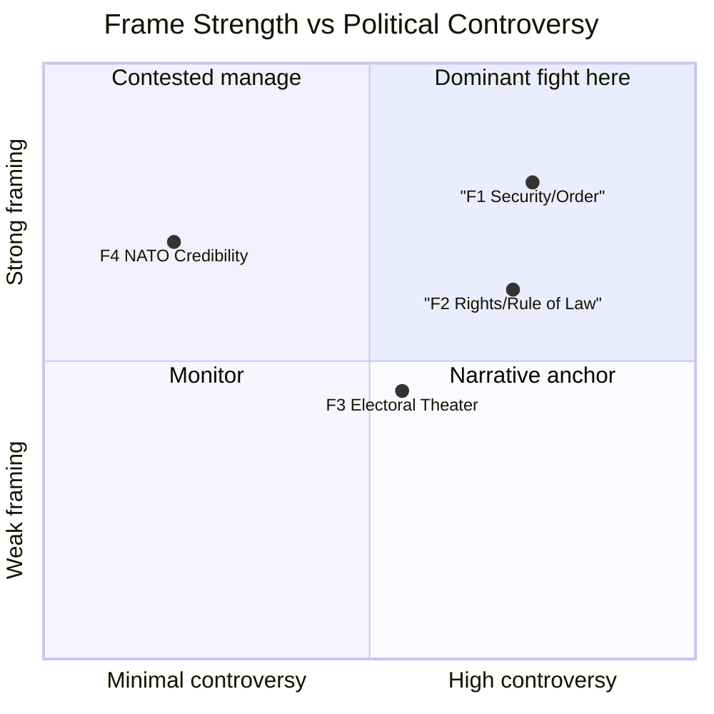

# Media Framing Analysis — Month Ahead 2026-05-03

**Method**: Entman 4-Function framing model (Define problem, Diagnose cause, Make moral judgment, Suggest remedy)  
**Minimum**: ≥3 distinct frame packages

## Frame 1: "Security and Order" (Government/SD/M framing)

### Entman 4-Function Analysis

| Function | Content |
|----------|---------|
| **Define problem** | Sweden faces uncontrolled migration threatening public safety, welfare sustainability, and social cohesion |
| **Diagnose cause** | Previous (Social Democratic) governments created permanent protection pathways that attracted irregular migration; weak enforcement enabled non-compliance with return orders |
| **Moral judgment** | It is morally necessary to protect Swedish citizens and ensure fairness for those who follow the rules; welfare chauvinism reframed as "sustainability" |
| **Suggest remedy** | HD03262–HD03265: Abolish permanent permits, strengthen return enforcement, tighten character requirements, expand detention/supervision |

### Key Frame Advocates
- Ulf Kristersson (M, PM): "This is about upholding the rule of law and protecting the Swedish model"
- Jimmy Åkesson (SD): "Sweden finally delivering on what SD voters were promised"
- Johan Forssell (M, Migration Minister): Technical-legal framing; "EU asylum pact compliance"
- Lotta Edholm (KD): "Sustainable migration with strong integration requirements"

### Likely Media Venues
- Expressen (tabloid, SD-sympathetic editorials)
- Aftonbladet (populist, will cover both frames)
- SVT Nyheter (balanced — must cover all frames)
- Nyhetsmorgon (government minister interviews)

### Frame Strength: HIGH (in possession of legislative agenda; controls news cycle)

---

## Frame 2: "Rights and Rule of Law at Risk" (S/V/MP/civil society framing)

### Entman 4-Function Analysis

| Function | Content |
|----------|---------|
| **Define problem** | The government is dismantling Sweden's human rights framework and EU legal obligations to appeal to SD base voters; the 4% Riksdag threshold is held hostage by SD electoral imperatives |
| **Diagnose cause** | SD electoral logic captured M's migration policy; L's coalition dependency prevents it from exercising its traditional rule-of-law function |
| **Moral judgment** | It is morally wrong to abolish permanent protection for people who have built lives in Sweden (ECHR Art. 8 family life); detention expansion violates human dignity |
| **Suggest remedy** | Vote down HD03262; support judicial review; international pressure via Council of Europe; HD03258 transparency reform reversed |

### Key Frame Advocates
- Magdalena Andersson (S): "This is the most significant regression in Swedish human rights in decades"
- Nooshi Dadgostar (V): "We will fight every article in Riksdag committee"
- Amnesty International Sweden: Press releases, social media, Riksdag hearing testimony
- UNHCR Sweden: Formal statements on HD03262 protection gaps

### Likely Media Venues
- Dagens Nyheter (liberal centrist — will give weight to rule-of-law arguments)
- Svenska Dagbladet (conservative but constitutionalist — may amplify Lagrådet critique)
- SR P1 Ekot (public radio — must balance frames but judicial/legal expertise prominent)
- Juridisk Tidskrift (legal academic discourse)

### Frame Strength: MEDIUM (strong in elite/civil society discourse; less resonant with general public)

---

## Frame 3: "Electoral Theater and Coalition Dysfunction" (Media meta-frame)

### Entman 4-Function Analysis

| Function | Content |
|----------|---------|
| **Define problem** | The government is more focused on election positioning than governing effectively; four simultaneous migration propositions submitted right before election is electoral signaling, not policy |
| **Diagnose cause** | Coalition arithmetic gives SD structural leverage; L's ideological paralysis creates incoherence; the government's agenda is driven by partner management, not national interest |
| **Moral judgment** | Democratic institutions are being instrumentalized for electoral theater; voters deserve honest governance framing |
| **Suggest remedy** | Media calls for independent expert assessment; Riksdag committee scrutiny; Lagrådet transparency |

### Key Frame Advocates
- Political scientists (Statsvetare): SVT/SR expert commentary
- DN editorial board: Occasional meta-critique of migration policy timing
- Foreign correspondents: Deutsche Welle, BBC, Politico Europe all framing Sweden as "following Denmark"

### Likely Media Venues
- SVT Agenda (expert panel discussions)
- Dagens Arena (center-left analysis)
- Politico Europe (international audience)
- Expressen/DN analysis sections

### Frame Strength: MEDIUM-LOW (resonates with politically sophisticated readers; minimal general public impact)

---

## Frame 4: "Swedish NATO Credibility" (Defense frame — HD03254)

### Entman 4-Function Analysis

| Function | Content |
|----------|---------|
| **Define problem** | Sweden needs to translate NATO membership into operational military cooperation frameworks that match allied standards |
| **Diagnose cause** | Historical neutrality created legal gaps in bilateral military cooperation frameworks; NATO accession (2024) requires legislative normalization |
| **Moral judgment** | Sweden has an obligation to its allies; free-riding on NATO deterrence is strategically and morally unacceptable |
| **Suggest remedy** | HD03254: Legislative framework for operational military cooperation; interoperability protocols |

### Frame Strength: HIGH but LOW CONTROVERSY (bipartisan support; minimal counter-frame)

---

## Overall Media Landscape Assessment

## Key Media Battle Spaces

1. **SVT/SR public broadcasting**: Must balance F1 and F2; will amplify Lagrådet critique if adverse yttrande (F2 strength boost)
2. **Expressen/Aftonbladet tabloids**: F1 will dominate; F2 will appear in human interest cases (individuals affected by HD03262)
3. **DN/SvD quality press**: Lagrådet analysis (F2) + meta-critique (F3) expected
4. **Social media**: SD base amplifies F1; S/V/MP base amplifies F2; youth amplifies F3
5. **International press**: F3 and F4 framing (Sweden following Denmark; Sweden NATO ally)

## Framing Implications for Article Generation

The Riksdagsmonitor month-ahead article should:
1. Present F1 and F2 as competing legitimate frames (balance)
2. Note F3 as an analytical observation (electoral timing)
3. Use F4 as a governing-credibility anchor for the coalition
4. Avoid adopting any single frame as authoritative — analytical neutrality is the editorial standard
