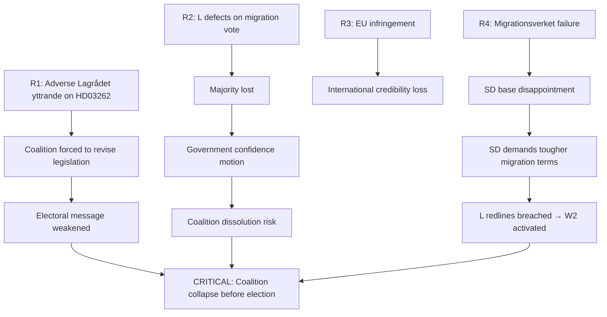

# Risk Assessment — Month Ahead 2026-05-03

**Framework**: 5-dimension register (Political, Legal, Social, Economic, Institutional)  
**Scale**: Likelihood (1–5) × Impact (1–5) → Risk Score  
**Horizon**: June 2026 near-term + 6-month electoral window

## Risk Register

| # | Risk Description | L | I | Score | Tier | Cascading Chains |
|---|-----------------|---|---|-------|------|-----------------|
| R1 | Lagrådet delivers adverse yttrande on HD03262 forcing coalition to withdraw/amend | 3 | 5 | 15 | CRITICAL | → Coalition credibility damage → L voter exodus → election loss |
| R2 | L (Liberalerna) defects on HD03262 migration vote | 2 | 5 | 10 | HIGH | → Majority lost → Government falls or confidence motion → early election |
| R3 | EU Commission triggers infringement on HD03262 implementation | 2 | 4 | 8 | HIGH | → International humiliation → M/L Europhile voter loss → coalition fracture |
| R4 | Migrationsverket implementation failure on HD03263 return enforcement | 3 | 3 | 9 | HIGH | → SD base disappointment → SD tightens migration demands → coalition renegotiation |
| R5 | Opposition exploits HD03258 transparency framing → civil society mobilization | 3 | 3 | 9 | HIGH | → International press coverage → S/MP voter-base activation → polling shift |
| R6 | SD/M divergence on Ukraine aid (HD11772 signal) escalates | 2 | 4 | 8 | HIGH | → Foreign policy incoherence → NATO allies concerned → M electoral cost |
| R7 | Sweden GDP growth stalls pre-election (< 1.5% 2026) | 2 | 4 | 8 | HIGH | → S economic narrative gains traction → opposition polling surge |
| R8 | KD healthcare reform (HD03251) blocked in Riksdag committee | 2 | 3 | 6 | MODERATE | → KD disappointed → KD voters consider not turning out |
| R9 | Nordic/NATO military cooperation (HD03254) delayed | 1 | 3 | 3 | LOW | → Defense credibility slightly dented |
| R10 | MP animal-welfare motion (HD11768) attracts disproportionate media attention | 2 | 1 | 2 | LOW | → Media distraction; minimal policy impact |

## 5-Dimension Analysis

### 1. Political Risks
- **Coalition cohesion**: L's ECHR-sensitivity is the highest political risk (R1, R2). The four-migration propositions test L's governing-coalition calculus against core liberal values.
- **Electoral timing**: 133 days to election with major contested legislation increases governance risk.

### 2. Legal / Constitutional Risks
- **ECHR Art. 8**: HD03262 abolition of permanent permits + HD03265 enhanced detention require proportionality tests under ECHR. Sweden's own Lagrådet (HD03262–HD03265 all require yttrande) has standing to flag constitutional issues.
- **EU law**: EU asylum pact transposition (HD03262) must comply with Directive minimum standards.

### 3. Social Risks
- **Societal cohesion**: Cumulative migration tightening increases exclusion risk for long-term residents. Civil society (UNHCR, Amnesty Sweden) will mobilize visibility campaigns.
- **Care reform delivery**: HD03251's integration of addiction/psychiatric care requires Regions to implement — uneven regional capacity is a social-equity risk.

### 4. Economic Risks
- **Macro deterioration**: Sweden's economy is recovering but fragile. A weaker-than-expected employment figure (SCB AKU Q2 2026) could shift electoral momentum before September. **[IMF WEO Apr-2026, NGDP_RPCH, SWE]**
- **Defense expenditure**: HD03254 military cooperation will carry fiscal costs beyond NATO's 2% GDP commitment; spending trajectory is budgetarily constrained.

### 5. Institutional Risks
- **Agency capacity** (R4): Migrationsverket, Kriminalvård, Polisen all required for HD03263 deportation enforcement. Previous Riksrevisionen findings noted capacity gaps in return operations.
- **Regional implementation** (HD03251): 21 Regions have heterogeneous readiness for integrated addiction/psychiatric care.

## Risk Cascade Chains

## Mitigation Recommendations

1. **Pre-emptive Lagrådet engagement** on HD03262: Justitiedepartementet should pre-screen ECHR Art. 8 proportionality with Ministry legal counsels before Riksdag referral.
2. **Statskontoret agency-readiness study** for HD03263 return enforcement: Commission within 30 days.
3. **L parliamentary dialogue**: Establish explicit L/M/KD agreement on HD03262 ECHR floor before second reading.
4. **EU coordination**: Brief Commission informally on HD03262 transposition approach to reduce surprise factor.
