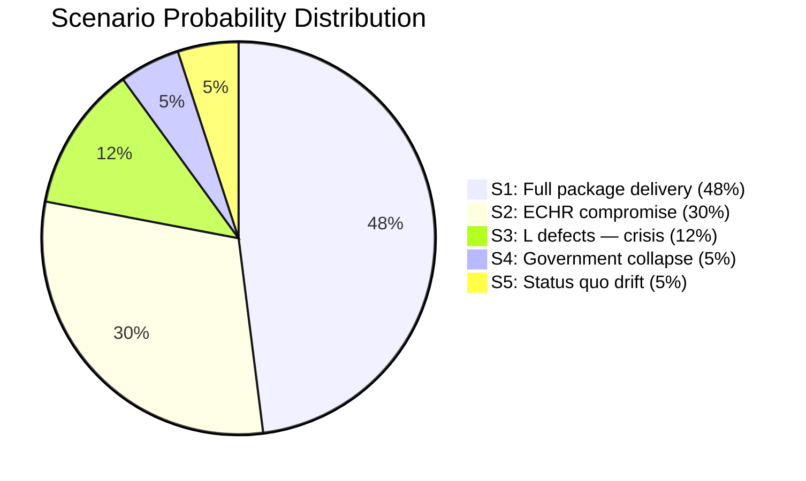

# Scenario Analysis — Month Ahead 2026-05-03

**Method**: Scenario planning with probability-weighted outcomes  
**Horizon**: September 13, 2026 election  
**Total probability must sum to 100%**

## Scenario Tree

### Scenario 1: Coalition Delivers Full Migration Package (BASELINE) — 48%

**Trigger**: L votes in favor of HD03262–HD03265; Lagrådet issues yttrande without fatal objections; EU Commission silent.

**Narrative**: The Tidö coalition passes all four migration propositions intact by late summer 2026. SD base activation peaks; M election message centers on "law and security." L explains its yes-vote as "ECHR-compliant tightening." Healthcare reform (HD03251) passes in committee with minor amendments. Defense cooperation (HD03254) ratified bipartisan.

**Consequences**:
- SD: +2–4% polling, M: stable or slight gain, L: stress-tested but holding
- S: shifts to social-economic counter-attack (HD11775–HD11778 as platform)
- Election outcome: Tidö coalition re-elected with similar or slightly expanded majority

**Indicators**:
- L parliamentary group chair endorses HD03262 in June 2026
- Lagrådet yttrande flagged as "minor reservations" only
- No EU Commission formal letter by August 2026

### Scenario 2: Migration Package Partially Modified — ECHR Compromise (MODERATE) — 30%

**Trigger**: Lagrådet issues adverse yttrande on HD03265 detention (deprivation of liberty) and HD03262 (permanent permit abolition scope); L demands amendments; coalition negotiates limited modifications.

**Narrative**: The coalition amends HD03265 to add time limits on supervision and reduce detention scope. HD03262 is modified to preserve a humanitarian protection pathway. SD publicly complains but does not withdraw coalition support. L claims victory for rule-of-law principle. S frames this as "government in retreat."

**Consequences**:
- Modest SD disappointment; small SD base abstentions possible
- L holds its voter base; no defection
- Migration package still passes — less radical than original
- S finds partial vindication; some polling shift

**Indicators**:
- Lagrådet delivers multi-page critique of HD03265 detention provisions
- L parliamentary statement demands amendments before second reading
- Coalition communiqué announcing "adjusted" package
- Justitiedepartementet submits revised text to Riksdag

### Scenario 3: Coalition Crisis — L Defects on HD03262 (LOW) — 12%

**Trigger**: L's internal party meeting votes against HD03262 citing ECHR Art. 8 family reunification violations; Johan Pehrson unable to deliver party support; L announces abstention or no-vote.

**Narrative**: Government cannot secure majority for HD03262 (175/349). Ulf Kristersson tables proposal — or more likely removes HD03262 from spring reading. SD furious; demands coalition recommitment. KD mediates. Government survives with significant credibility damage. No early election but migration package shelved to post-election period.

**Consequences**:
- SD: -3–5% polling (base perceives betrayal)
- L: +2–3% (rule-of-law voters return)
- M: weakened; internal pressure on Kristersson leadership
- S: "chaos government" narrative gains traction
- Election outcome: uncertain — may swing either way

**Indicators**:
- L party congress resolution on ECHR compliance before June
- Johan Pehrson interview distancing from "detention expansion"
- Anonymous L Riksdag member quotes in Expressen/DN
- Justitiedepartementet quiet removal of HD03262 from committee agenda

### Scenario 4: Government Collapse / Early Election (TAIL RISK) — 5%

**Trigger**: Multiple simultaneous defections (L on migration + SD on Ukraine aid) + economic deterioration triggers opposition confidence vote.

**Narrative**: The opposition (S+V+C+MP = 173 seats) plus L (16) = 189. If a confidence motion is triggered and L abstains, the government falls. Speaker Jan Björklund (L, notionally independent) would not block constitutionally. Talmannen appoints government-formation process.

**Consequences**:
- Likely snap election before September 13 or election as scheduled but with interim caretaker
- S+C potential majority (107+24+18+24 = 173 — still minority but possible with specific arrangements)
- Major policy uncertainty

**Indicators**:
- Formal interpellation of misstroendevotum filed
- L public statement "we cannot support this government"
- C announces willingness to govern with S

### Scenario 5: Status Quo Drift (LOW ALTERNATIVE) — 5%

**Trigger**: Summer parliamentary recess delays all major votes; HD03262–HD03265 moved to autumn reading post-election; election dominated by economic and social issues rather than migration.

**Narrative**: Riksdag timetable slips; Talmannen grants extended committee stage. Migration debate becomes abstract because no final votes have occurred. Election focuses on wages, housing, climate. Tidö coalition wins by narrow margin with unfinished migration agenda.

**Consequences**:
- SD disappointed but has no alternative coalition partner
- Post-election government still pursues migration package
- S's social narrative gains limited traction in absence of migration flashpoint

## Probability Summary

## Key Decision Nodes

1. **Lagrådet yttrande** (expected June 2026): Determines S1 vs S2 branching
2. **L internal party vote on ECHR position** (expected May–June 2026): Determines S1/S2 vs S3 branching
3. **EU Commission informal reaction** (ongoing): Determines whether S3 gains EU-level pressure
4. **Q2 2026 unemployment data** (July 2026): Determines whether economic deterioration activates S4 trigger

## Weighted Expected Value

| Outcome | P | Electoral impact |
|---------|---|-----------------|
| Coalition re-elected with migration package | S1+S2 = 78% | Likely |
| Coalition loses election | S3+S4 = 17% | Possible |
| Inconclusive / snap election | S4 = 5% | Tail risk |
