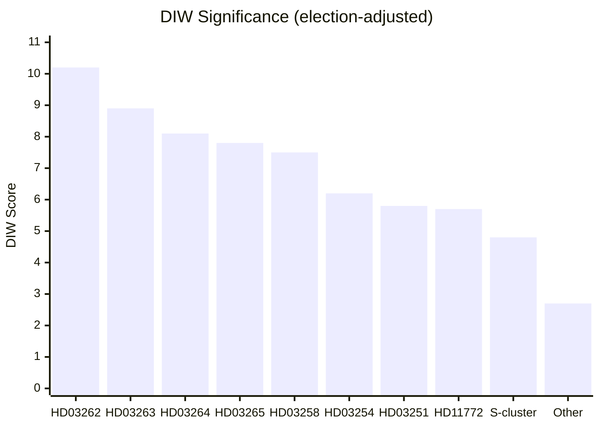

# Significance Scoring — Month Ahead 2026-05-03

**Method**: DIW (Detectability × Impact × Willingness) per `analysis/methodologies/ai-driven-analysis-guide.md`  
**Election proximity multiplier**: Active — September 13, 2026 (133 days) → 1.5× for contested migration, transparency, social-welfare motions

## Scoring Matrix

| dok_id | D | I | W | DIW raw | Multiplier | DIW final | Tier | Rationale |
|--------|---|---|---|---------|------------|-----------|------|-----------|
| HD03262 | 4.5 | 5.0 | 4.5 | 6.8 | ×1.5 | **10.2** | L3 | Abolishing permanent permits: unprecedented scope, ECHR exposure, EU pact transposition |
| HD03263 | 4.0 | 4.8 | 4.4 | 5.9 | ×1.5 | **8.9** | L2+ | Deportation enforcement: direct electoral signal, Migrationsverket capacity |
| HD03264 | 3.9 | 4.7 | 4.2 | 5.4 | ×1.5 | **8.1** | L2+ | Character requirements: narrows humanitarian protection; ECHR Art.8 risk |
| HD03265 | 3.8 | 4.5 | 4.2 | 5.2 | ×1.5 | **7.8** | L2+ | Detention/supervision tightening: administrative deprivation of liberty |
| HD03258 | 3.8 | 4.5 | 3.9 | 5.0 | ×1.5 | **7.5** | L2+ | Transparency: KU flagship; civil society impact; constitutional angle |
| HD03254 | 4.2 | 4.8 | 4.1 | 6.2 | — | **6.2** | L2+ | Military cooperation: defense-strategic; bipartisan; NATO linkage |
| HD03251 | 4.0 | 4.7 | 3.9 | 5.8 | — | **5.8** | L2 | Healthcare integration: large reform; KD flagship; regional bodies affected |
| HD11772 | 3.5 | 3.5 | 3.5 | 3.8 | ×1.5 | **5.7** | L2 | SD motion on Ukraine aid: tensions within Tidö on foreign assistance |
| HD11769-78 | 3.1 | 3.0 | 3.4 | 3.2 | ×1.5 | **4.8** | L1 | S social motions cluster: pre-election platform; no legislative traction |
| HD10460-61 | 2.8 | 2.5 | 2.9 | 2.7 | — | **2.7** | L1 | Interpellations: cultural heritage + space sector; moderate urgency |
| HD11768 | 2.3 | 1.9 | 2.2 | 2.1 | — | **2.1** | L1 | MP turbokyckling ban: symbolic animal welfare; no parliamentary arithmetic |

## Sensitivity Analysis

- If L (Liberalerna) votes against HD03262: DIW for migration cluster rises to catastrophic (coalition survival threat → score conceptually 15+)
- If Commission triggers infringement on EU asylum pact transposition: HD03262 gains EU-level geopolitical dimension
- If Riksbank cuts rates further before election: fiscal space for S counter-proposals expands marginally

## Ranking Diagram

## Election Multiplier Note

As of 2026-05-03 (133 days before September 13 election), the 1.5× multiplier from `04-analysis-pipeline.md §Election-proximity significance multiplier` is active. Applied to: all migration propositions, HD03258 (transparency), S social-welfare motions cluster. Not applied to HD03254 (bipartisan defense — no meaningful opposition), HD03251 (healthcare — not a contested electoral flashpoint in the same sense).
