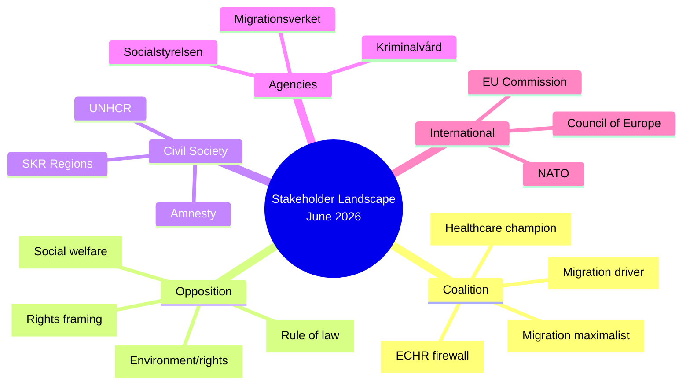

# Stakeholder Perspectives — Month Ahead 2026-05-03

**Framework**: 6-lens stakeholder matrix  
**Coverage**: All major actors affected by legislative batch (dok_id: HD03262–HD03265, HD03254, HD03251, HD03258)

## 6-Lens Matrix

### Lens 1: Government Coalition (M-SD-KD-L)

| Actor | Position | Interests | Red Lines | Key Risk |
|-------|----------|-----------|-----------|----------|
| **M (Moderaterna)** | Drives migration + defense agenda | Electoral delivery of SD/M base promises; NATO credibility | HD03262 must pass intact | L defects → minority government |
| **SD (Sverigedemokraterna)** | Strongest migration supporter | SD base mobilization; HD03262 as proof of governing effect | Any ECHR-forced dilution | Ukraine aid tension (HD11772) |
| **KD (Kristdemokraterna)** | HD03251 champion; cautious on migration | Healthcare flagship; Christian social ethics (proportionality) | HD03265 detention risks crossing KD's human dignity floor | KD voters uncomfortable with detention expansion |
| **L (Liberalerna)** | Swing vote on ECHR-sensitive legislation | Rule of law; individual rights; open Europe | ECHR Art. 8 breach is unacceptable | Party fracture if Johan Pehrson overrides internal voices |

### Lens 2: Opposition Parties

| Actor | Position | Strategy | Expected Action |
|-------|----------|----------|-----------------|
| **S (Socialdemokraterna)** | Oppose migration package; lead social agenda | Judicial review framing; HD11775–HD11778 social welfare | Committee minority reservations; media counter-messaging |
| **V (Vänsterpartiet)** | Strongly oppose HD03262–HD03265 | Amplify ECHR violations; coordinate with civil society | Riksdag interpellation barrage |
| **C (Centerpartiet)** | Oppose migration; potential HD03251 constructive | Rule of law / rural economic concerns | Abstain or support HD03251 |
| **MP (Miljöpartiet)** | Oppose all four migration props; environmental via HD11768 | Build coalition with S/V on rights framing | Full opposition |

### Lens 3: Affected Civil Society / Interest Groups

| Actor | Position | Key Action |
|-------|----------|-----------|
| **UNHCR Sweden** | Critical of HD03262–HD03265 | Public statement; diplomatic representations |
| **Amnesty International Sweden** | Oppose HD03265 (detention) | Campaign + media | 
| **Swedish Red Cross** | Concerned about return procedures (HD03263) | Call for Statskontoret review |
| **Företagarna / Industrifakta** | Support M/SD on regulatory clarity | Silent on migration; supportive of defense (HD03254) |
| **SKR (Regions/Municipalities)** | Mixed on HD03251 — supports integration aim, concerns on funding | Written consultation response to Riksdag |
| **Lagrådet** | Constitutional oversight | Yttrande on HD03262–HD03265 (ECHR Chapter 2 RF review) |

### Lens 4: Institutional / Government Agencies

| Agency | Affected by | Stance | Risk |
|--------|-------------|--------|------|
| **Migrationsverket** | HD03262, HD03263, HD03264, HD03265 | Implementer — cautious about capacity | Return enforcement backlog |
| **Kriminalvård** | HD03265 (detention) | Need additional capacity + legal framework | Overcrowding risk |
| **Polismyndigheten** | HD03263 (enforcement) | Operational demands | Competing priority with crime enforcement |
| **Socialstyrelsen** | HD03251 (healthcare integration) | Technical support; monitoring role | Guidance development burden |
| **Riksrevisionen** | Cross-cutting | Potential future audit mandate | Agency accountability review |

### Lens 5: International / Supranational Actors

| Actor | Affected by | Position |
|-------|-------------|---------|
| **EU Commission (DG HOME)** | HD03262 (asylum pact transposition) | Monitor compliance; potential infringement |
| **Council of Europe** | HD03262, HD03265 | ECHR treaty body; advisory opinions available |
| **NATO HQ** | HD03254 (military cooperation) | Supportive; operational integration goal |
| **Nordic Council** | HD03254 | NORDEFCO context; positive |
| **Ukraine (Government)** | HD11772 (aid tension) | Concerned about SD ambivalence on aid levels |

### Lens 6: Public / Electoral Segments

| Segment | Size (approx.) | Position | Electoral Impact |
|---------|----------------|---------|-----------------|
| **SD core base** | 18–20% | Strongly support HD03262–HD03265 | SD vote share consolidation |
| **M centrists** | 12–16% | Supportive but uncomfortable with HD03265 detention | Potential leakage to C/L |
| **L rule-of-law voters** | 3–5% | Anxious about ECHR exposure | Decisive swing if L loses floor |
| **S working-class** | 25–30% | Oppose migration restrictions; want social protection (HD11775–HD11778) | S base activation |
| **Young urban voters** | ~8–10% | Oppose HD03258 transparency; pro-civil-society | Key swing constituency |
| **KD family-value voters** | 4–6% | Support HD03251; cautious on HD03265 | Retention if KD delivers healthcare |

