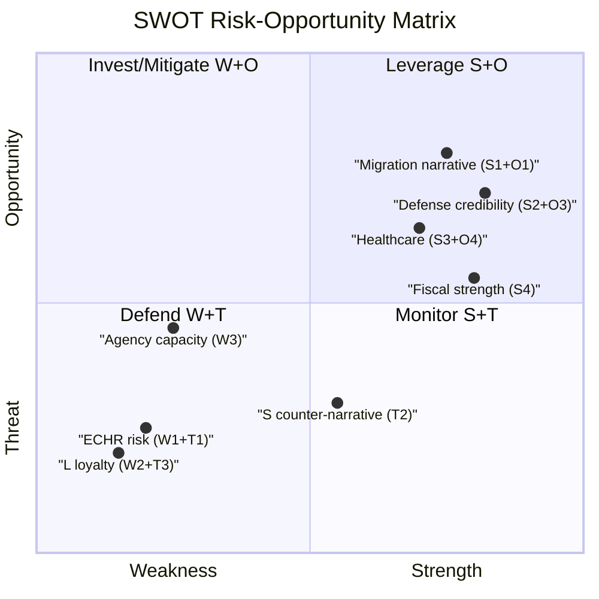

# SWOT Analysis — Sweden Political Landscape: June 2026

**Date**: 2026-05-03 | **Focus**: Tidö coalition + opposition landscape

## Strengths

### S1 — Coalition legislative momentum
The Tidö coalition (M-SD-KD-L) controls 176/349 seats and is delivering on migration reform promises (HD03262–HD03265, data.riksdagen.se). The simultaneous four-proposition migration package demonstrates policy coordination and pre-election delivery capacity. **[A1]**

### S2 — Defense credibility (HD03254)
HD03254 (military cooperation framework, Försvarsdepartementet, 2026-04-30) positions the government as NATO-aligned and defense-competent — a strong electoral asset post-Ukraine invasion. Minister Pål Jonson (M) leads this agenda. **[A1] dok_id: HD03254**

### S3 — KD healthcare anchor (HD03251)
Integrated addiction/psychiatric care reform (HD03251, Socialdepartementet) demonstrates KD-led social-conservative governance credibility. Jakob Forssmed's reform addresses a genuine care gap acknowledged cross-party. **[A1] dok_id: HD03251**

### S4 — Fiscal soundness
Sweden's gross government debt remains among Europe's lowest (~33–35% GDP, WEO Apr-2026 vintage). Fiscal space for electoral promises is real without deficit-alarm concerns. **[IMF WEO Apr-2026, GGXWDG_NGDP, SWE]**

## Weaknesses

### W1 — ECHR exposure on HD03262
Abolishing permanent residence permits (HD03262) risks EU infringement or Swedish constitutional court challenge under ECHR Art. 8 (family life) and RF Ch. 2. A Lagrådet adverse yttrande could force amendments. **[A1] dok_id: HD03262**

### W2 — Liberal loyalty under strain
L (Liberalerna, ~16 seats) has historically defended rule-of-law values. HD03262–HD03265 migration tightening creates internal L tensions between core-voter libertarianism and coalition discipline. L defection on any single measure risks a 175/349 minority. **[B2] coalition arithmetic**

### W3 — Migrationsverket capacity gap
Stärkt återvändandeverksamhet (HD03263) requires Migrationsverket to operationalize enhanced deportation — an agency already under resource strain. Implementation gap between legislative ambition and agency capacity is structural. **[A1] dok_id: HD03263**

### W4 — Transparency measure optics (HD03258)
HD03258 (political transparency) covers civil society funding — opposition frames this as silencing dissent. Optics risk with centrist and younger voters who value civil society independence. **[A1] dok_id: HD03258**

## Opportunities

### O1 — Election narrative consolidation
The four-migration propositions give the coalition a coherent "security and order" electoral message with 133 days to landing. SD base mobilization can deliver a decisive electoral boost if the package passes intact. **[B1] election context**

### O2 — S counter-proposals reveal weakness
S's 11 social-welfare motions (HD11769–HD11778) lack novel policy ideas and are primarily re-surfaced platform elements. The gap between S legislative output and government propositions reinforces coalition governing-competence framing. **[A1] motions cluster**

### O3 — Nordic security window
HD03254 (military cooperation) can be embedded in Nordic/Baltic security cooperation narrative (NORDEFCO, Joint Expeditionary Force) to project alliance reliability. **[A1] dok_id: HD03254**

### O4 — Healthcare reform cross-party resonance
HD03251 addiction/psychiatric care reform has cross-party resonance in principle; S opposition will be procedural (amendments on regionalization), not substantive. Creates a deliverable for KD-constituency voters. **[A1] dok_id: HD03251**

## Threats

### T1 — EU legal backlash on asylum pact transposition
HD03262 transposes the EU migration and asylum pact. If Sweden's implementation is found incompatible with EU Directive requirements, infringement proceedings could undermine the government's EU-solidarity credentials — particularly damaging for M/L Europhile voters. **[A1] dok_id: HD03262 summary + ECHR Art.8**

### T2 — Opposition S-counter-narrative on social poverty
S's motions on poverty among single parents (HD11775), workplace injury reporting (HD11776), housing credits (HD11774), and mammography accessibility (HD11778) collectively build a "government neglects the vulnerable" counter-narrative. Effectiveness depends on media amplification. **[A1] dok_id: HD11775, HD11776, HD11778**

### T3 — SD/government tension on Ukraine aid
SD motion HD11772 (Ukraina och bistånd) signals SD's continued ambivalence toward Ukraine financial aid. Tension with M/KD/L coalition partners who support continued support. This is an intra-coalition fault line the opposition can exploit. **[A1] dok_id: HD11772**

### T4 — Economic softening pre-election
Sweden's GDP growth recovery is modest (~2.1–2.3% 2026). If unemployment rises before September 13, S's social welfare narrative gains traction against the migration-and-defense-focused coalition message. **[IMF WEO Apr-2026, NGDP_RPCH, SWE; SCB AKU]**

## TOWS Matrix

| | Opportunities (O1–O4) | Threats (T1–T4) |
|---|---|---|
| **Strengths (S1–S4)** | SO: Use S1+O1 to consolidate migration narrative; S2+O3 for NATO credibility | ST: Use S4 (fiscal) to counter T4 economic risk; S3+O4 to neutralize T2 |
| **Weaknesses (W1–W4)** | WO: Address W1 via pre-emptive Lagrådet engagement; W3 via Statskontoret agency-capacity plan | WT: W2×T3 = highest systemic risk (L defects + SD on Ukraine) — coalition crisis scenario |

