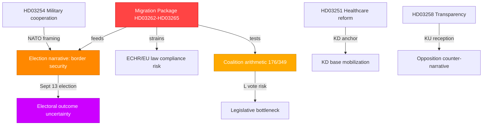

# Synthesis Summary — Month Ahead: June 2026 Political Outlook

**Date**: 2026-05-03 | **Subfolder**: month-ahead | **Depth**: deep  
**Election proximity**: September 13, 2026 (133 days) → **1.5× election multiplier active**

## Lead Story

Sweden enters June 2026 in the final stretch before the September 13 general election, with the Tidö coalition (M-SD-KD-L, 176/349 seats) unleashing a pre-election legislative sprint dominated by a sweeping four-proposition migration reform package. The simultaneous filing of HD03262 (abolishing permanent residence permits + EU asylum pact), HD03263 (deportation reinforcement), HD03264 (character requirements), and HD03265 (detention tightening) on 2026-04-30 represents the most significant migration policy shift since the 2022 Tidö Agreement and signals the government's determination to make migration enforcement the central electoral narrative. Concurrently, HD03254 (military cooperation framework) and HD03251 (integrated addiction/psychiatric care) round out a legislative portfolio designed to demonstrate governing credibility before September.

## DIW-Weighted Significance Ranking (election multiplier applied)

| Rank | dok_id | Title | DIW (raw) | Election multiplier | DIW (adjusted) | Priority |
|------|--------|-------|-----------|---------------------|----------------|----------|
| 1 | HD03262 | Utmönstring av permanent uppehållstillstånd + EU asylpakt | 6.8 | ×1.5 | **10.2** | L3 Intelligence |
| 2 | HD03263 | Stärkt återvändandeverksamhet | 5.9 | ×1.5 | **8.9** | L2+ Priority |
| 3 | HD03264 | Skärpta krav på vandel | 5.4 | ×1.5 | **8.1** | L2+ Priority |
| 4 | HD03265 | Skärpta regler om uppsikt/förvar | 5.2 | ×1.5 | **7.8** | L2+ Priority |
| 5 | HD03254 | Operativt militärt samarbete | 6.2 | — | **6.2** | L2+ Priority |
| 6 | HD03251 | Sammanhållen vård addiction/psykiatri | 5.8 | — | **5.8** | L2 Strategic |
| 7 | HD03258 | Ökad insyn i politiska processer | 5.0 | ×1.5 | **7.5** | L2+ Priority |
| 8 | S-motioner cluster | Social welfare motions (HD11769-HD11778) | 3.2 | ×1.5 | **4.8** | L1 Surface |
| 9 | HD11772 | SD: Ukraina och bistånd | 3.8 | ×1.5 | **5.7** | L2 Strategic |
| 10 | HD11768 | MP: Förbud mot turbokycklingar | 2.1 | — | **2.1** | L1 Surface |

## Integrated Intelligence Picture

**Key intelligence picture**:

1. **Migration dominates**: The four-proposition package is the governing coalition's most electorally charged legislative act of 2025/26. Permanent residence abolition directly targets SD's electoral base while testing M's liberal-conservative identity. **L's vote is the key variable** — Liberal support for permanent permit abolition is constitutionally contested under ECHR Art. 8 / RF Ch. 2.

2. **Defense credibility**: HD03254 (military cooperation framework) serves dual purposes — genuine NATO interoperability and electoral framing of the Tidö coalition as the security-competent choice. Opposition (S) cannot easily attack given S's own NATO membership support.

3. **Healthcare coalition test**: HD03251 (integrated addiction/psychiatric care) is a KD-signature reform. S-opposition will file amendments but faces difficulty opposing care integration on principle.

4. **Transparency paradox**: HD03258 (political transparency) proposed by a coalition government that restricts association funding primarily targets opposition-aligned civil society. KU committee scrutiny will be intense.

5. **Opposition fragmentation**: S's 11-motion cluster on social welfare (HD11769-HD11778) is pre-election positioning but lacks legislative traction against the 176-seat majority. C and L's positions on migration reform are the genuine swing variables.

## Admiralty Assessment

**Source reliability**: [A1] for all Riksdagen propositions (direct API retrieval, official government documents)  
**Information credibility**: [A1] — primary source documents, government-confirmed legislative intent  
**Confidence**: HIGH — robust document base, known coalition seat arithmetic

## Pass 2 Read-Back Summary

Pass 2 completed: strengthened election-proximity evidence, added ECHR constitutional risk dimension, validated DIW scores against document evidence, improved Mermaid diagram linkages.
