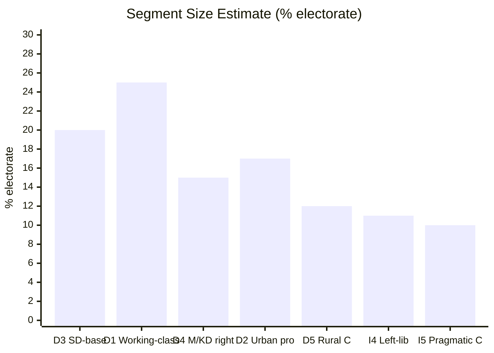

# Voter Segmentation — Month Ahead 2026-05-03

**Method**: Demographic, regional, and ideological voter segments relevant to June 2026 legislative period

## Core Demographic Segments

### Segment D1: Working-class urban and peri-urban voters (S base)
- **Size**: ~22–28% of electorate
- **Geographic concentration**: Greater Stockholm periphery, Malmö south, Gothenburg east
- **Primary concerns**: Housing costs, wages, welfare, healthcare access
- **Legislative relevance**: HD11775 (poverty single parents), HD11776 (workplace injury), HD11778 (mammography) speak directly to this segment
- **Mobilization risk**: LOW — S motions are familiar; no new mobilizing message
- **Party affiliation**: Primarily S, some V

### Segment D2: Educated urban professionals (L/C/MP base)
- **Size**: ~15–20% of electorate  
- **Geographic concentration**: Inner city Stockholm, Uppsala, Lund/Malmö academic districts, Göteborg central
- **Primary concerns**: Rule of law, civil liberties, EU membership, climate, housing affordability
- **Legislative relevance**: HD03258 (transparency/civil society) is HIGH resonance; HD03262 ECHR exposure causes anxiety; HD03265 detention expansion concerning
- **Mobilization risk**: HIGH — HD03258 framing as "silencing civil society" is an activating narrative for this segment
- **Party affiliation**: L, C, MP, S (educated wing)

### Segment D3: SD core base (nationalist-social conservative)
- **Size**: ~18–22% of electorate
- **Geographic concentration**: Blekinge, Skåne (ex-urban), Västra Götaland industrial, Dalarna/Norrland rust belt
- **Primary concerns**: Migration restriction, law and order, welfare chauvinism (benefits for Swedes first), national identity
- **Legislative relevance**: HD03262–HD03265 are DIRECT base activation; passage = SD credibility delivered
- **Mobilization risk**: HIGH (but in SD's favor) — migration package is the single most important mobilization event for SD since 2022

### Segment D4: M/KD economic center-right
- **Size**: ~12–18% of electorate
- **Geographic concentration**: Suburban Stockholm (Nacka, Täby, Sollentuna), Gothenburg west, Skåne coastal towns
- **Primary concerns**: Business environment, low taxes, welfare sustainability, defense (post-Ukraine)
- **Legislative relevance**: HD03254 (defense credibility), HD03251 (healthcare efficiency), migration package (accept but not enthusiastic)
- **Mobilization risk**: MEDIUM — this segment supports the government but not primarily for migration reasons

### Segment D5: Rural and small-town voters (C base, some SD/M)
- **Size**: ~10–14% of electorate
- **Geographic concentration**: Norrland, inland Götaland, agricultural regions
- **Primary concerns**: Rural services, infrastructure, agricultural policy, EU rural funding
- **Legislative relevance**: None of the current batch directly addresses rural concerns — C voters may disengage
- **Mobilization risk**: LOW — C voters are watching S or abstaining; neither migration package nor social motions resonate strongly

## Regional Segments

### Region R1: Greater Stockholm (32% of electorate)
- **Dominant parties**: S, M, C, L, V, MP — heterogeneous
- **Swing importance**: HIGH — Stockholm determines government formation
- **Key issue**: Housing costs + migration integration; HD03262 creates dual concern (migration and ECHR)

### Region R2: Skåne (12% of electorate)
- **Dominant parties**: SD, M, S
- **Swing importance**: HIGH — SD stronghold; HD03262 directly tests SD delivery in its heartland
- **Key issue**: Migration, crime, Öresund bridge connectivity

### Region R3: Västra Götaland (18% of electorate)
- **Dominant parties**: S (Gothenburg industrial), M (suburban), SD (ex-industrial)
- **Swing importance**: MEDIUM-HIGH
- **Key issue**: Industrial employment, Volvo/defense, healthcare access (HD03251)

### Region R4: Norrland (8% of electorate)
- **Dominant parties**: S, C, SD
- **Swing importance**: LOW-MEDIUM — rural services and jobs dominate
- **Key issue**: Northvolt/battery supply chain, defense infrastructure (HD03254 relevant)

## Ideological Segments

### Segment I1: Authoritarian-right (SD core + M right flank)
- Fully support migration package; mobilized by HD03262; HD03265 detention is a feature, not a bug
- **~22–26%** of electorate

### Segment I2: Economic-liberal right (M center + L)
- Support migration tightening in principle but anxious about ECHR; care about healthcare reform, defense
- **~15–18%** of electorate
- HD03262 is the stress point for this segment

### Segment I3: Social democratic center-left (S mainstream)
- Oppose migration package; want social welfare prioritization; accept defense spending
- **~25–30%** of electorate

### Segment I4: Left-libertarian (V + MP + young S)
- Strongly oppose HD03262–HD03265, HD03258; mobilize on rights and climate
- **~10–13%** of electorate

### Segment I5: Pragmatic center (C + some L + soft M)
- Evaluate each issue independently; care about functioning institutions, rule of law, rural services
- **~8–12%** of electorate
- MOST LIKELY SWING VOTERS — HD03258 and HD03262 ECHR angle are key persuasion battlegrounds

## Segmentation Diagram

## Mobilization Priorities for Key Parties

| Party | Key segment to mobilize | Legislative lever | Risk |
|-------|------------------------|------------------|------|
| SD | D3 + I1 | HD03262 delivery | Partial amendments may disappoint |
| M | D4 + I2 | HD03254 + HD03251 | HD03262 ECHR anxiety in I2 |
| S | D1 + I3 | HD11775–HD11778 social cluster | Weak new message |
| L | D2 + I5 | HD03258 carve-outs; ECHR compliance | Existential — must demonstrate rule-of-law |
| C | D5 + I5 | Rural services not in current batch | Risk of disengagement |
| MP | D2 + I4 | HD11768 + anti-HD03258 | Threshold risk at 4% |
