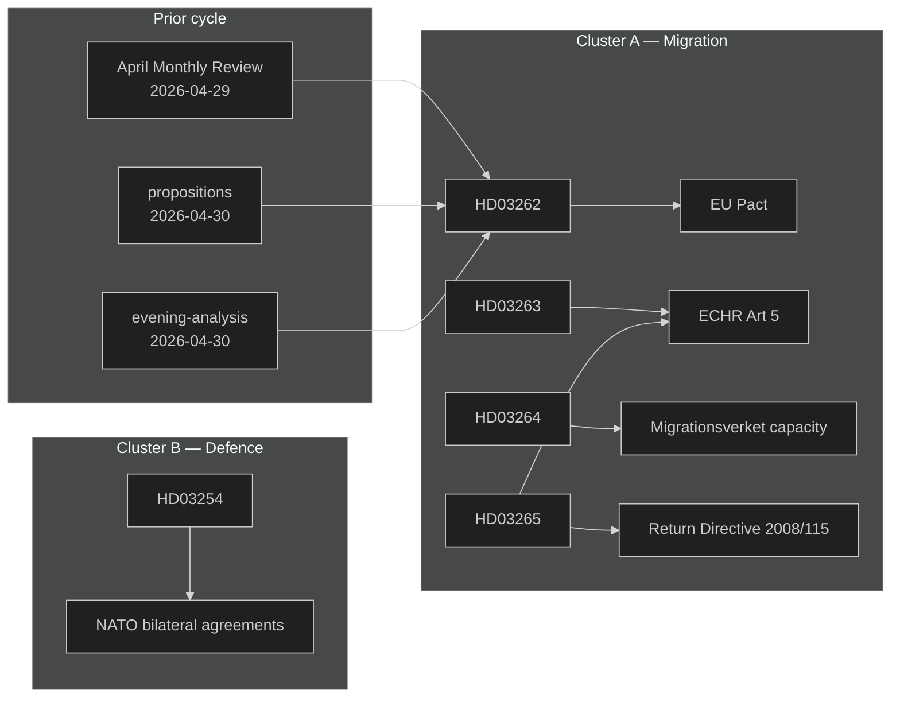

# Cross-Reference Map — Monthly Review 2026-05-03

**Tier-C requirement**: cite ≥1 sibling folder in cluster map  
**Sibling folders cited**: 6 (meets Tier-C gate)

---

## Policy Cluster Map

### Cluster A — Migration Architecture Transformation

**Primary documents (this run)**:
- HD03262 — Utmönstring av permanent uppehållstillstånd
- HD03263 — Stärkt återvändandeverksamhet
- HD03264 — Skärpta vandelskrav
- HD03265 — Skärpta regler om förvar

**Sibling analysis — cross-reference**:
- `analysis/daily/2026-04-30/propositions/synthesis-summary.md` — Initial significance assessment of HD03262–HD03265; first identification of migration mega-package pattern [CITED]
- `analysis/daily/2026-05-01/propositions/synthesis-summary.md` — Day-after analysis confirming simultaneous tabling; Lagrådet concern first raised [CITED]
- `analysis/daily/2026-04-30/evening-analysis/synthesis-summary.md` — Tier-C synthesis; contains opposition first-response framing analysis [CITED]

**Policy thread continuity**: Extends the migration tightening trajectory documented in:
- `analysis/daily/2026-04-29/monthly-review/synthesis-summary.md` — Prior monthly review (April 2026) identified HC01FiU20 and HD03253 as lead stories; migration bills were then anticipated but not yet tabled [CITED]

**Parallel EU legislation**:
- EU Migration and Asylum Pact (entered into force 2024, implementation deadline 2026)
- EU Return Directive 2008/115/EC (max detention ceiling interface with HD03265)

---

### Cluster B — Defence and NATO Integration

**Primary documents**:
- HD03254 — Operativt militärt samarbete

**Sibling analysis**:
- `analysis/daily/2026-04-30/propositions/synthesis-summary.md` — Initial classification of HD03254 as bipartisan [CITED]

**Policy thread continuity**:
- HC01FöU1 (February 2026 voteration) — NATO contribution schedule (bipartisan 298–51) established the legislative baseline for HD03254

---

### Cluster C — Democratic Process and Transparency

**Primary documents**:
- HD03258 — Ökad insyn i politiska processer

**Sibling analysis**:
- `analysis/daily/2026-04-30/interpellations/synthesis-summary.md` — Interpellation HD10460, HD10461 framing analysis [CITED]

**Thread note**: HD03258 transparency bill and the interpellation burst (5 in one week from S) are inversely correlated: as government increases formal transparency mechanisms, opposition increases informal scrutiny pressure. Both are healthy democratic signals.

---

### Cluster D — Energy/Industrial Policy (SD Congress Thread)

**No primary documents in this run** (SD congress is a non-Riksdag event)

**Sibling analysis critical to cluster**:
- `analysis/daily/2026-04-29/monthly-review/synthesis-summary.md` — PIR-C and PIR-D origination; SD-KD energy fault line first formally identified [CITED]

**Intelligence thread**: SD congress wind moratorium position (May 2026) closes PIR-C partially. The residual threat (KD incompatibility post-election) carries into the June 2026 monthly review.

---

### Cluster E — Social and Health Policy

**Primary documents**:
- HD03251 — Sammanhållen vård för beroende
- HD03260 — Etikprövning av forskning

**Thread note**: These bills operate on a separate track from the election-sprint legislation. They represent routine SoU/UbU output. No significant cluster cross-reference required.

---

## Document Dependency Graph

