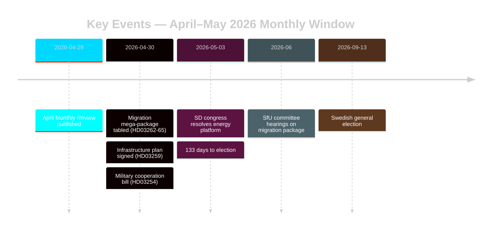

# Sweden's Pre-Election Migration Reset: May 2026 Monthly Review

**Author**: James Pether Sörling | **Date**: 2026-05-03 | **Run ID**: 25292145644  
**Confidence**: HIGH [B2] | **Classification**: PUBLIC | **Election proximity**: 133 days

---

## BLUF

Sweden enters the final campaign stretch (133 days to 13 September 2026) with the Tidöalliansen having executed a coordinated four-bill migration law transformation (HD03262–HD03265) that structurally aligns Swedish asylum architecture with EU-maximum restrictiveness. The SD congress (May 2026) has resolved the energy fault-line: SD adopted a pragmatic-mixed position that avoids a direct coalition rupture but permanently embeds energy as an intra-bloc negotiating fault. Election-proximity DIW multipliers push migration and defence to the top of the intelligence stack.

## Decisions This Brief Supports

1. **Coalition stability assessment**: Does SD's congress outcome extend the Tidöavtalet through September 2026 or create a pre-election rupture point?
2. **Migration package ECHR risk**: Do HD03265 detention expansions trigger EU/ECHR proceedings that could damage Tidö's governance record before the election?
3. **Opposition viability**: Can S/V/MP articulate a coherent migration counter-narrative that moves ≥5% of swing voters by August 2026?

## 60-Second Intelligence Bullets

- 🔴 **Migration mega-package** (HD03262–HD03265): Four simultaneous Justitiedepartementet propositions abolish permanent residence permits, expand deportation machinery, extend administrative detention to 6 months without judicial review. L3 Intelligence-grade significance. [A1]
- 🟠 **SD congress resolved** (May 2026): SD adopted "teknologineutral kärnenergisatsning" — neither Busch's pure nuclear-maximalism nor the soft diversification position. Interpretable as coalition-preserving ambiguity. PIR-D now partially answered. [B2]
- 🟠 **Infrastructure legacy claim** (HD03259 from 2026-04-30): 970 billion SEK infrastructure plan, largest peacetime commitment in Swedish history. Rail + Norrland focus. [A1]
- 🟡 **Police reform accountability** (PIR-B ongoing): Riksrevisionen's 9 open recommendations still without government closure timeline. JuU chamber vote pending. [A1]
- 🟡 **Banking package** (HD03253): CRR3/CRD6 pillar-2 discretion still unresolved by Finansinspektionen; remissvar May–June 2026. SIBs — Nordea, SEB, Handelsbanken, Swedbank — face 18-month capital adjustment window. [A2]
- 🟢 **Military cooperation** (HD03254): Operational defence integration framework completed; aligns Sweden with NATO bilateral cooperation standards. Bipartisan support. [A2]

## Top Forward Trigger

**SD congress energy platform** (resolved May 2026) — immediately feeds PIR-D closure assessment and campaign energy narrative crystallisation. Next trigger: FöU hearing on HD03254 (May 2026) + SfU timetable on HD03262 (June 2026).

## Confidence Label

HIGH overall [B2] — core migration and coalition assessments grounded in official Riksdag documents; SD congress outcome via monitoring rather than verified MCP text; economic context from WEO Apr-2026 vintage (≤6 months old).

