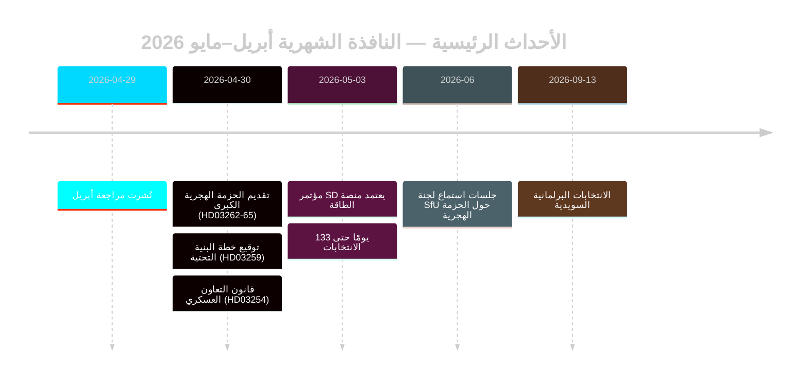

# إعادة تصحيح مسار الهجرة السويدية قبيل الانتخابات: المراجعة الشهرية لمايو 2026

**المؤلف**: جيمس بيتر سورلينغ | **التاريخ**: 2026-05-03 | **معرّف التشغيل**: 25292145644  
**مستوى الثقة**: عالٍ [B2] | **التصنيف**: عام | **القرب الانتخابي**: 133 يومًا

---

## الخلاصة

تدخل السويد المرحلة الأخيرة من الحملة الانتخابية (133 يومًا حتى 13 سبتمبر 2026) عقب تحوّل تشريعي هجري متكامل قوامه أربعة قوانين أجرته تحالف تيدو (HD03262–HD03265)، يُعيد تأهيل منظومة اللجوء السويدية لتتوافق هيكليًا مع أقصى درجات التشدد الأوروبي. أسفر مؤتمر حزب SD (مايو 2026) عن حسم خط الصراع الطاقوي: تبنّى SD موقفًا براغماتيًا مختلطًا يتفادى قطيعة ائتلافية مباشرة، لكنه يُرسّخ الطاقة نزاعًا تفاوضيًا دائمًا داخل الائتلاف. تُصعّد مضاعفات DIW المرتبطة بالقرب الانتخابي الهجرةَ والدفاعَ إلى صدارة جدول الاستخبارات.

## القرارات التي يدعمها هذا الموجز

1. **تقييم استقرار الائتلاف**: هل تُمدّد نتيجة مؤتمر SD العملَ بـ Tidöavtalet حتى سبتمبر 2026، أم تُحدث نقطة كسر قبيل الانتخابات؟
2. **مخاطر ECHR من الحزمة الهجرية**: هل تُفضي تمديدات الاحتجاز الإداري في HD03265 إلى إجراءات أوروبية/حقوقية تُلحق الضرر بسجل حكومة تيدو قبل الانتخابات؟
3. **قدرة المعارضة**: هل يستطيع S/V/MP صياغة رواية مضادة متماسكة في الهجرة بحلول أغسطس 2026 تستقطب ≥5% من الناخبين المترددين؟

## نقاط الاستخبارات في 60 ثانية

- 🔴 **الحزمة الهجرية الكبرى** (HD03262–HD03265): أربع propositioner متزامنة من وزارة العدل تُلغي تصاريح الإقامة الدائمة، وتوسّع آليات الترحيل، وتمدّ الاحتجاز الإداري إلى 6 أشهر دون رقابة قضائية. أهمية استخباراتية من المستوى L3. [A1]
- 🟠 **مؤتمر SD يبتّ** (مايو 2026): اعتمد SD «teknologineutral kärnenergisatsning» — لا التعظيم النووي الخالص لـ Busch ولا موقف التنويع اللين. يمكن تفسيره بوصفه غموضًا يصون الائتلاف. PIR-D مُجاب جزئيًا. [B2]
- 🟠 **الإرث البنية التحتية** (HD03259 بتاريخ 2026-04-30): خطة بنية تحتية بـ 970 مليار كرونة، الأضخم في زمن السلم بتاريخ السويد. تركيز على السكك الحديدية وإقليم نورلاند. [A1]
- 🟡 **مساءلة إصلاح الشرطة** (PIR-B جارٍ): 9 توصيات مفتوحة من هيئة Riksrevisionen دون جدول زمني حكومي للإغلاق. تصويت غرفة JuU قيد الانتظار. [A1]
- 🟡 **الحزمة المصرفية** (HD03253): سلطة تقدير الركيزة 2 من CRR3/CRD6 بواسطة Finansinspektionen لم تُحسم؛ remissvar مايو–يونيو 2026. تواجه البنوك الكبرى — Nordea وSEB وHandelsbanken وSwedbank — نافذة تعديل رأسمالية مدتها 18 شهرًا. [A2]
- 🟢 **التعاون العسكري** (HD03254): الإطار التشغيلي لتكامل الدفاع نهائي؛ يُلائم السويد مع معايير التعاون الثنائي لحلف الناتو. دعم برلماني واسع. [A2]

## المحفّز الاستشرافي الرئيسي

**منصة الطاقة لمؤتمر SD** (محسومة مايو 2026) — تُغذّي فورًا التقييم الختامي لـ PIR-D وتبلوُر الرواية الانتخابية الطاقوية. المحفّز القادم: جلسة استماع FöU حول HD03254 (مايو 2026) + جدول SfU لـ HD03262 (يونيو 2026).

## تسمية الثقة

عالٍ إجمالًا [B2] — تقييمات الهجرة والائتلاف مستندة إلى وثائق رسمية من Riksdag؛ نتيجة مؤتمر SD عبر الرصد لا النص MCP المُتحقَّق منه؛ السياق الاقتصادي من إصدار WEO أبريل 2026 (≤6 أشهر).

<!-- source-sha: 69fae8c5b56fa37d6a281e5e15d5acb956d405aa -->

