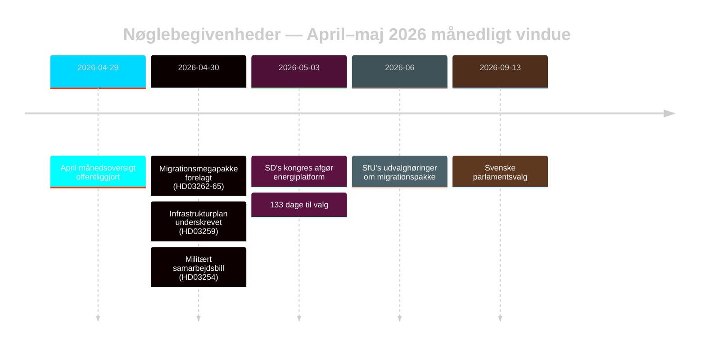

# Sveriges valparate migrationsreset: Månedsoversigt maj 2026

**Forfatter**: James Pether Sörling | **Dato**: 2026-05-03 | **Kørsels-ID**: 25292145644  
**Konfidens**: HØJ [B2] | **Klassificering**: OFFENTLIG | **Valnærhed**: 133 dage

---

## BLUF

Sverige går ind i den endelige kampagnefase (133 dage til 13. september 2026) med Tidöalliansen, der har gennemført en koordineret firebillotransformation af migrationslovgivningen (HD03262–HD03265), som strukturelt tilpasser den svenske asylarkitektur til EU's maksimale restriktivitet. SD's kongres (maj 2026) har løst energikonfliktslinjen: SD vedtog en pragmatisk-blandet position, der undgår et direkte koalitionsbrud men permanent indlejrer energi som en intra-blokforhandlingskonflikt. Valnærhedens DIW-multiplikatorer løfter migration og forsvar til toppen af efterretningsdagsordenen.

## Beslutninger, dette notat støtter

1. **Koalitionsstabilitetsanalyse**: Forlænger SD's kongresresultat Tidöaftalen frem til september 2026, eller skaber det et brudpunkt inden valget?
2. **EMRK-risiko for migrationspakke**: Udløser HD03265 tilbageholdelsesudvidelser EU/EMRK-procedurer, der kan skade Tidös styringsrekord inden valget?
3. **Oppositionens levedygtighed**: Kan S/V/MP formulere en sammenhængende migrations-modfortælling, der bevæger ≥5 % af swing-vælgere inden august 2026?

## 60-sekunders efterretningspunkter

- 🔴 **Migrationsmegapakke** (HD03262–HD03265): Fire samtidige propositioner fra Justitiedepartementet afskaffer permanente opholdstilladelser, udvider deportationsmaskineri, forlænger administrativ tilbageholdelse til 6 måneder uden domstolsprøvelse. L3 Efterretningsgraderet signifikans. [A1]
- 🟠 **SD's kongres afgjort** (maj 2026): SD vedtog "teknologineutral kärnenergisatsning" — hverken Buschs rene kernekraftmaksimalisme eller den bløde diversificeringsposition. Kan fortolkes som koalitionsbevarende tvetydighed. PIR-D nu delvist besvaret. [B2]
- 🟠 **Infrastrukturarv** (HD03259 fra 2026-04-30): 970 milliarder SEK infrastrukturplan, det største fredstidsengagement i svensk historie. Jernbane + Norrland-fokus. [A1]
- 🟡 **Politireformredegørelse** (PIR-B igangværende): Riksrevisionens 9 åbne anbefalinger stadig uden statslig afslutningsplan. JuU's kammervoting afventer. [A1]
- 🟡 **Bankpakke** (HD03253): CRR3/CRD6 søjle-2-diskretion stadig uløst af Finansinspektionen; høringssvar maj–juni 2026. SIBs — Nordea, SEB, Handelsbanken, Swedbank — møder 18-måneders kapitaliseringstilpasningsvindue. [A2]
- 🟢 **Militært samarbejde** (HD03254): Operativt forsvarsintegrationsrammeværk fuldført; tilpasser Sverige til NATOs bilaterale samarbejdsstandarder. Bredt parlamentarisk støtte. [A2]

## Vigtigste fremadrettede udløser

**SD-kongressens energiplatform** (afgjort maj 2026) — mader straks PIR-D's afslutningsvurdering og kampagnens energinarrativkrystallisering. Næste udløser: FöU's høring om HD03254 (maj 2026) + SfU's tidsplan for HD03262 (juni 2026).

## Konfidensetiket

HØJ samlet [B2] — kerne-migrations- og koalitionsvurderinger baseret på officielle Riksdag-dokumenter; SD's kongresresultat via overvågning snarere end verificeret MCP-tekst; økonomisk kontekst fra WEO apr-2026-årgangen (≤6 måneder gammel).

<!-- source-sha: 69fae8c5b56fa37d6a281e5e15d5acb956d405aa -->
