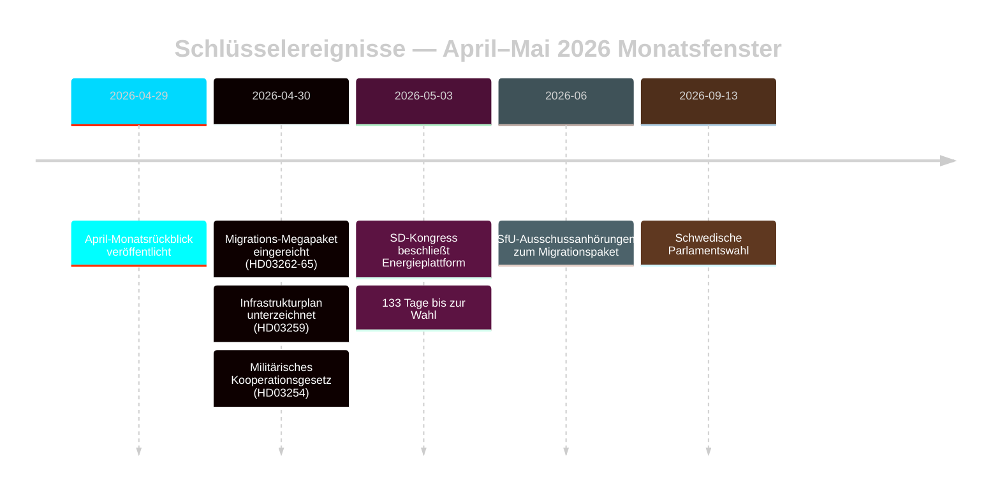

# Schwedens wahlvorbereiteter Migrationsneustart: Monatsrückblick Mai 2026

**Autor**: James Pether Sörling | **Datum**: 2026-05-03 | **Lauf-ID**: 25292145644  
**Konfidenz**: HOCH [B2] | **Klassifizierung**: ÖFFENTLICH | **Wahlnähe**: 133 Tage

---

## BLUF

Schweden tritt in die letzte Wahlkampfphase ein (133 Tage bis zum 13. September 2026), nachdem die Tidöalliansen eine koordinierte Vier-Gesetze-Transformation der Migrationsgesetzgebung (HD03262–HD03265) durchgeführt hat, die die schwedische Asylarchitektur strukturell an die EU-maximale Restriktivität anpasst. Der SD-Kongress (Mai 2026) hat die Energiekonfliktlinie gelöst: SD verabschiedete eine pragmatisch-gemischte Position, die einen direkten Koalitionsbruch vermeidet, aber Energie dauerhaft als koalitionsinternen Verhandlungskonflikt verankert. Die wahlnähebezogenen DIW-Multiplikatoren rücken Migration und Verteidigung an die Spitze des Nachrichtendienstagenda.

## Entscheidungen, die dieses Briefing unterstützt

1. **Koalitionsstabilitätsbewertung**: Verlängert das SD-Kongressergebnis das Tidöavtalet bis September 2026 oder schafft es vor der Wahl einen Bruchpunkt?
2. **EMRK-Risiko des Migrationspakets**: Lösen die Ausdehnungen der Verwaltungshaft in HD03265 EU/EMRK-Verfahren aus, die Tidös Regierungsleistung vor der Wahl beschädigen könnten?
3. **Lebensfähigkeit der Opposition**: Können S/V/MP bis August 2026 eine kohärente Migrations-Gegenerzählung formulieren, die ≥5 % der Wechselwähler bewegt?

## 60-Sekunden-Nachrichtendienstpunkte

- 🔴 **Migrations-Megapaket** (HD03262–HD03265): Vier gleichzeitige Propositioner des Justitiedepartementet schaffen dauerhafte Aufenthaltserlaubnisse ab, erweitern Abschiebungsmaschinerien und verlängern die Verwaltungshaft auf 6 Monate ohne richterliche Überprüfung. L3 Nachrichtendienstgradierte Bedeutung. [A1]
- 🟠 **SD-Kongress entschieden** (Mai 2026): SD verabschiedete „teknologineutral kärnenergisatsning" — weder Buschs reine Kernenergiemaximalisierung noch die weiche Diversifizierungsposition. Als koalitionserhaltende Mehrdeutigkeit interpretierbar. PIR-D jetzt teilweise beantwortet. [B2]
- 🟠 **Infrastrukturvermächtnis** (HD03259 vom 2026-04-30): 970-Milliarden-SEK-Infrastrukturplan, das größte Friedenszeitengagement in der schwedischen Geschichte. Eisenbahn + Norrland-Schwerpunkt. [A1]
- 🟡 **Polizeireformrechenschaft** (PIR-B laufend): Riksrevisionens 9 offene Empfehlungen noch ohne staatlichen Abschlusszeitplan. JuU-Kammervotum steht aus. [A1]
- 🟡 **Bankpaket** (HD03253): CRR3/CRD6 Säule-2-Diskretion von Finansinspektionen noch ungelöst; Remissvar Mai–Juni 2026. SIBs — Nordea, SEB, Handelsbanken, Swedbank — stehen vor einem 18-monatigen Kapitalanpassungsfenster. [A2]
- 🟢 **Militärische Zusammenarbeit** (HD03254): Operatives Verteidigungsintegrationsrahmenwerk abgeschlossen; passt Schweden an NATOs bilaterale Kooperationsstandards an. Breite parlamentarische Unterstützung. [A2]

## Wichtigster Vorwärtsauslöser

**SD-Kongress-Energieplattform** (entschieden Mai 2026) — speist sofort die PIR-D-Abschlussbewertung und die Kristallisierung des Energie-Kampagnennarrativs. Nächster Auslöser: FöU-Anhörung zu HD03254 (Mai 2026) + SfU-Zeitplan für HD03262 (Juni 2026).

## Konfidenzetikett

HOCH insgesamt [B2] — Kern-Migrations- und Koalitionsbewertungen in offiziellen Riksdag-Dokumenten verankert; SD-Kongressergebnis über Monitoring statt verifiziertem MCP-Text; wirtschaftlicher Kontext aus WEO Apr-2026-Jahrgang (≤6 Monate alt).

<!-- source-sha: 69fae8c5b56fa37d6a281e5e15d5acb956d405aa -->
