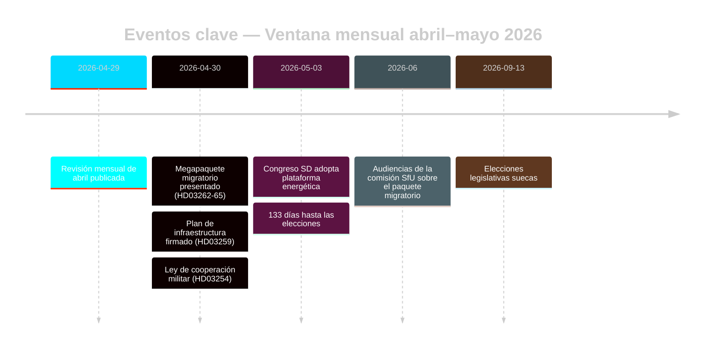

# El Reinicio Migratorio Preelectoral de Suecia: Revisión Mensual de Mayo 2026

**Autor**: James Pether Sörling | **Fecha**: 2026-05-03 | **ID de ejecución**: 25292145644  
**Confianza**: ALTA [B2] | **Clasificación**: PÚBLICO | **Proximidad electoral**: 133 días

---

## BLUF

Suecia entra en la fase final de campaña electoral (133 días hasta el 13 de septiembre de 2026) tras la transformación legislativa migratoria coordinada en cuatro leyes de la Tidöalliansen (HD03262–HD03265), que alinea estructuralmente la arquitectura de asilo sueca con la máxima restrictividad de la UE. El congreso del SD (mayo 2026) resolvió la línea de conflicto energético: el SD adoptó una posición pragmática mixta que evita una ruptura directa de la coalición, pero ancla permanentemente la energía como conflicto de negociación interno de la coalición. Los multiplicadores DIW vinculados a la proximidad electoral sitúan la migración y la defensa al frente de la agenda de inteligencia.

## Decisiones que apoya este informe

1. **Evaluación de estabilidad de la coalición**: ¿El resultado del congreso del SD prolonga el Tidöavtalet hasta septiembre de 2026 o crea un punto de ruptura antes de las elecciones?
2. **Riesgo CEDH del paquete migratorio**: ¿Las extensiones de detención administrativa en HD03265 desencadenan procedimientos de la UE/CEDH que podrían dañar el historial de gobierno de Tidö antes de las elecciones?
3. **Viabilidad de la oposición**: ¿Pueden S/V/MP formular para agosto de 2026 un contrarelato migratorio coherente que movilice a ≥5% de los votantes indecisos?

## Puntos de inteligencia en 60 segundos

- 🔴 **Megapaquete migratorio** (HD03262–HD03265): Cuatro propositioner simultáneas del Justitiedepartementet eliminan los permisos de residencia permanente, amplían la maquinaria de expulsión y extienden la detención administrativa a 6 meses sin control judicial. Importancia de inteligencia de nivel L3. [A1]
- 🟠 **Congreso SD decidido** (mayo 2026): El SD adoptó una «teknologineutral kärnenergisatsning» — ni la maximización nuclear pura de Busch ni la posición de diversificación suave. Interpretable como ambigüedad de preservación de la coalición. PIR-D ahora parcialmente respondido. [B2]
- 🟠 **Legado infraestructural** (HD03259 del 2026-04-30): Plan de infraestructura de 970 mil millones SEK, el mayor compromiso en tiempo de paz de la historia sueca. Énfasis en ferroviaria y Norrland. [A1]
- 🟡 **Rendición de cuentas de reforma policial** (PIR-B en curso): 9 recomendaciones abiertas del Riksrevisionen sin calendario de cierre gubernamental. Voto de la cámara JuU pendiente. [A1]
- 🟡 **Paquete bancario** (HD03253): Discreción del Pilar 2 CRR3/CRD6 por Finansinspektionen sin resolver; remissvar mayo–junio 2026. Las GSIBs — Nordea, SEB, Handelsbanken, Swedbank — enfrentan una ventana de ajuste de capital de 18 meses. [A2]
- 🟢 **Cooperación militar** (HD03254): Marco de integración de defensa operativa finalizado; alinea a Suecia con los estándares de cooperación bilateral de la OTAN. Amplio apoyo parlamentario. [A2]

## Desencadenante prospectivo principal

**Plataforma energética del congreso SD** (decidida mayo 2026) — alimenta inmediatamente la evaluación final PIR-D y la cristalización del narrativo de campaña energética. Próximo desencadenante: audiencia FöU sobre HD03254 (mayo 2026) + calendario SfU para HD03262 (junio 2026).

## Etiqueta de confianza

ALTA general [B2] — evaluaciones migratorias y de coalición ancladas en documentos oficiales del Riksdag; resultado del congreso SD por monitoreo en lugar de texto MCP verificado; contexto económico del vintage WEO abr-2026 (≤6 meses).

<!-- source-sha: 69fae8c5b56fa37d6a281e5e15d5acb956d405aa -->
