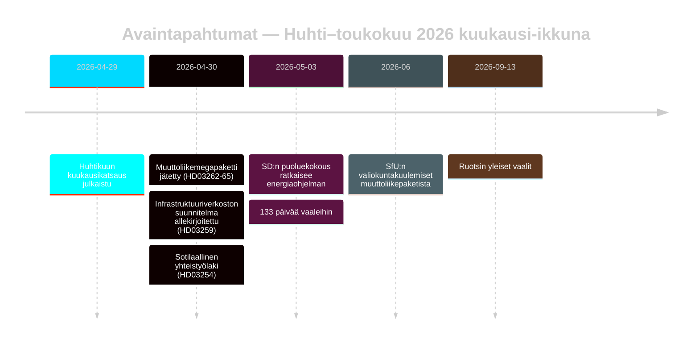

# Ruotsin vaaleja edeltävä muuttoliikepolitiikan uudelleenasettelu: Kuukausikatsaus toukokuu 2026

**Tekijä**: James Pether Sörling | **Päivämäärä**: 2026-05-03 | **Ajotyön ID**: 25292145644  
**Luottamus**: KORKEA [B2] | **Luokittelu**: JULKINEN | **Vaaliläheisyys**: 133 päivää

---

## BLUF

Ruotsi astuu viimeiseen kampanjavaiheeseen (133 päivää 13. syyskuuta 2026) Tidöallianssin toteutettua koordinoidun neljän lain muuttoliikepolitiikan muutoksen (HD03262–HD03265), joka rakenteellisesti yhdenmukaistaa ruotsalaisen turvapaikkajärjestelmän EU:n maksimaalisimman rajoittavuuden kanssa. SD:n puoluekokous (toukokuu 2026) on ratkaissut energiakiistan: SD omaksui pragmaattis-sekaisen kannan, joka välttää suoran koaliotiohajoamisen mutta juurruttaa pysyvästi energian blokinsisäiseksi neuvottelukiistaksi. Vaaliläheisyyden DIW-kertoimet nostavat muuttoliikkeen ja puolustuksen tiedusteluagendan kärkeen.

## Tämän tiedotteen tukemat päätökset

1. **Koalitiostabiliteetin arviointi**: Jatkaako SD:n puoluekokouksen tulos Tidöavtaletia syyskuuhun 2026 saakka vai luoko se murtokohdan ennen vaaleja?
2. **HD03265:n ECHR-riski**: Käynnistävätkö säilöönpidon laajennukset EU/ECHR-menettelyjä, jotka voivat vahingoittaa Tidön hallintotapasuoritusta ennen vaaleja?
3. **Opposition elinvoimaisuus**: Pystyykö S/V/MP muotoilemaan yhtenäisen muuttoliikekertomuksen vaihtoehdon, joka muuttaa ≥5 % heiluriäänestäjistä elokuuhun 2026 mennessä?

## 60 sekunnin tiedustelupisteet

- 🔴 **Muuttoliikemegapaketti** (HD03262–HD03265): Neljä samanaikaista Justitiedepartementetin esitystä lakkauttavat pysyvät oleskeluluvat, laajentavat karkotusmekanismeja ja pidentävät hallinnollista säilöönpitoa 6 kuukauteen ilman tuomioistuinvalvontaa. L3 Tiedustelutason merkitys. [A1]
- 🟠 **SD:n puoluekokous ratkaistu** (toukokuu 2026): SD omaksui "teknologineutral kärnenergisatsning" — ei Buschin puhdasta ydinvoimamaksimalismia eikä pehmeää monimuotoistumisasentoa. Tulkittavissa koalitioita säilyttäväksi epäselvyydeksi. PIR-D nyt osittain vastattu. [B2]
- 🟠 **Infrastruktuuriperintö** (HD03259, 2026-04-30): 970 miljardin SEK:n infrastruktuuriverkoston suunnitelma, Ruotsin historian suurin rauhanajan sitoumus. Rautatie + Pohjois-Ruotsin painotus. [A1]
- 🟡 **Poliisiuudistuksen tilivelvollisuus** (PIR-B käynnissä): Riksrevisionenin 9 avointa suositusta ilman hallituksen sulkemisaikataulua. JuU:n täysistuntoäänestys odottaa. [A1]
- 🟡 **Pankkipaketti** (HD03253): CRR3/CRD6 pilari-2 harkinnanvara yhä ratkaisematta Finansinspektionenin toimesta; lausuntoajat touko–kesäkuu 2026. SIBs — Nordea, SEB, Handelsbanken, Swedbank — kohtaavat 18 kuukauden pääomamuutosikkunan. [A2]
- 🟢 **Sotilaallinen yhteistyö** (HD03254): Operatiivinen puolustusintegraatiokehys valmistui; yhdenmukaistaa Ruotsin NATOn kahdenvälisten yhteistyöstandardien kanssa. Laajapohjainen parlamentaarinen tuki. [A2]

## Tärkein eteenpäin katsova laukaisin

**SD:n puoluekokouksen energiaohjelma** (ratkaistu toukokuu 2026) — syöttää välittömästi PIR-D:n sulkemisarviointiin ja kampanjan energianarratiivin kiteytymiseen. Seuraava laukaisin: FöU:n kuuleminen HD03254:stä (toukokuu 2026) + SfU:n aikataulu HD03262:lle (kesäkuu 2026).

## Luottamusmerkintä

KORKEA yhteensä [B2] — ydinmuuttoliike- ja koalitioarvioinnit perustuvat virallisiin Riksdag-asiakirjoihin; SD:n puoluekokouksen tulos seurannan kautta eikä todennettuna MCP-tekstinä; taloudellinen konteksti WEO huhtikuu 2026 -vuosikerrasta (≤6 kuukautta vanha).

<!-- source-sha: 69fae8c5b56fa37d6a281e5e15d5acb956d405aa -->
