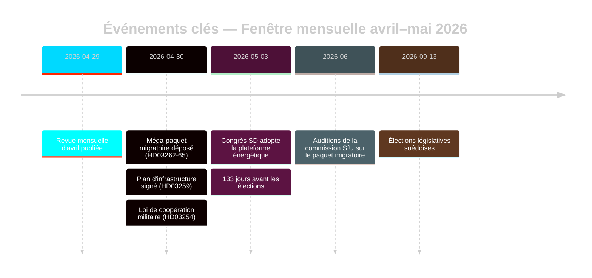

# La Réinitialisation Migratoire Pré-Électorale de la Suède : Revue Mensuelle de Mai 2026

**Auteur** : James Pether Sörling | **Date** : 2026-05-03 | **ID de run** : 25292145644  
**Confiance** : ÉLEVÉE [B2] | **Classification** : PUBLIC | **Proximité électorale** : 133 jours

---

## BLUF

La Suède entre dans la phase finale de campagne électorale (133 jours avant le 13 septembre 2026) après que la Tidöalliansen a réalisé une transformation législative migratoire coordonnée en quatre lois (HD03262–HD03265), alignant structurellement l'architecture d'asile suédoise sur la restrictivité maximale de l'UE. Le congrès SD (mai 2026) a résolu la ligne de conflit énergétique : SD a adopté une position pragmatique mixte évitant une rupture de coalition directe, mais ancrant définitivement l'énergie comme conflit de négociation interne à la coalition. Les multiplicateurs DIW liés à la proximité électorale placent la migration et la défense en tête de l'agenda des renseignements.

## Décisions que ce bulletin soutient

1. **Évaluation de la stabilité de la coalition** : Le résultat du congrès SD prolonge-t-il le Tidöavtalet jusqu'en septembre 2026 ou crée-t-il un point de rupture avant le scrutin ?
2. **Risque CEDH du paquet migratoire** : Les extensions de détention administrative dans HD03265 déclenchent-elles des procédures UE/CEDH susceptibles d'endommager le bilan gouvernemental de Tidö avant les élections ?
3. **Viabilité de l'opposition** : S/V/MP peuvent-ils formuler d'ici août 2026 un contre-récit migratoire cohérent susceptible de mobiliser ≥5 % des électeurs indécis ?

## Points de renseignement en 60 secondes

- 🔴 **Méga-paquet migratoire** (HD03262–HD03265) : Quatre propositioner simultanées du Justitiedepartementet suppriment les permis de séjour permanents, étendent les mécanismes d'expulsion et prolongent la détention administrative à 6 mois sans contrôle judiciaire. Importance de renseignements de niveau L3. [A1]
- 🟠 **Congrès SD tranché** (mai 2026) : SD a adopté une « teknologineutral kärnenergisatsning » — ni la maximisation nucléaire pure de Busch ni la position de diversification douce. Interprétable comme une ambiguïté de préservation de la coalition. PIR-D maintenant partiellement répondu. [B2]
- 🟠 **Héritage infrastructurel** (HD03259 du 2026-04-30) : Plan d'infrastructure de 970 milliards SEK, le plus grand engagement en temps de paix de l'histoire suédoise. Accent sur le ferroviaire et le Norrland. [A1]
- 🟡 **Responsabilité de la réforme policière** (PIR-B en cours) : 9 recommandations ouvertes du Riksrevisionen sans calendrier de clôture gouvernemental. Vote de la chambre JuU en attente. [A1]
- 🟡 **Paquet bancaire** (HD03253) : Discrétion du pilier 2 CRR3/CRD6 par Finansinspektionen non résolue ; remissvar mai–juin 2026. Les GSIBs — Nordea, SEB, Handelsbanken, Swedbank — font face à une fenêtre d'ajustement de capital de 18 mois. [A2]
- 🟢 **Coopération militaire** (HD03254) : Cadre d'intégration de défense opérationnelle finalisé ; aligne la Suède sur les normes de coopération bilatérale de l'OTAN. Large soutien parlementaire. [A2]

## Principal déclencheur prospectif

**Plateforme énergétique du congrès SD** (décidée en mai 2026) — alimente immédiatement l'évaluation finale PIR-D et la cristallisation du récit de campagne énergétique. Prochain déclencheur : audition FöU sur HD03254 (mai 2026) + calendrier SfU pour HD03262 (juin 2026).

## Label de confiance

ÉLEVÉE globale [B2] — évaluations migratoires et de coalition ancrées dans les documents officiels du Riksdag ; résultat du congrès SD via monitoring plutôt que texte MCP vérifié ; contexte économique du millésime WEO avr-2026 (≤6 mois).

<!-- source-sha: 69fae8c5b56fa37d6a281e5e15d5acb956d405aa -->
