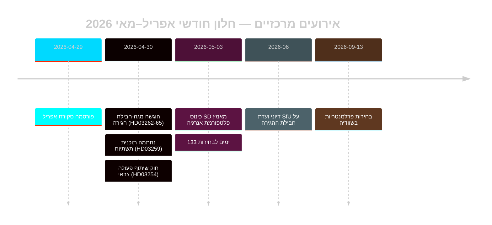

# איפוס מדיניות ההגירה של שוודיה לקראת הבחירות: סקירה חודשית מאי 2026

**מחבר**: ג'יימס פיטר סורלינג | **תאריך**: 2026-05-03 | **מזהה ריצה**: 25292145644  
**אמינות**: גבוהה [B2] | **סיווג**: ציבורי | **קרבה לבחירות**: 133 ימים

---

## תמצית

שוודיה נכנסת לשלב הסופי של מסע הבחירות (133 ימים עד 13 בספטמבר 2026) לאחר שה-Tidöalliansen ביצע שינוי חקיקתי הגירתי מתואם של ארבעה חוקים (HD03262–HD03265), המיישר את ארכיטקטורת המקלט השוודית באופן מבני עם מקסימום ההגבלה האירופאית. כינוס ה-SD (מאי 2026) יישב את קו המחלוקת האנרגטי: SD אימץ עמדה פרגמטית מעורבת הנמנעת מפירוק ישיר של הקואליציה, אך עוגנת את האנרגיה כסכסוך משא ומתן פנימי-קואליציוני קבוע. המכפילים של DIW הקשורים לקרבה לבחירות מעלים את ההגירה והביטחון לראש סדר יום המודיעין.

## החלטות שמסמך זה תומך בהן

1. **הערכת יציבות הקואליציה**: האם תוצאת הכינוס של SD מאריכה את ה-Tidöavtalet עד ספטמבר 2026 או יוצרת נקודת שבירה לפני הבחירות?
2. **סיכון ECHR של חבילת ההגירה**: האם הארכות המעצר המנהלי ב-HD03265 מפעילות הליכים אירופאיים/ECHR שעלולים לפגוע בשיא הממשל של Tidö לפני הבחירות?
3. **כדאיות האופוזיציה**: האם S/V/MP יכולים לגבש עד אוגוסט 2026 נרטיב-נגד הגירתי קוהרנטי שיניע ≥5% מהמצביעים המתנדנדים?

## נקודות מודיעין ב-60 שניות

- 🔴 **מגה-חבילת הגירה** (HD03262–HD03265): ארבע propositioner מקבילות של משרד המשפטים מבטלות אשרות שהייה קבועות, מרחיבות את מנגנוני הגירוש ומאריכות את המעצר המנהלי ל-6 חודשים ללא ביקורת שיפוטית. חשיבות מודיעינית ברמה L3. [A1]
- 🟠 **כינוס SD הוכרע** (מאי 2026): SD אימץ «teknologineutral kärnenergisatsning» — לא מיקסום גרעיני טהור של Busch ולא עמדת הגיוון המתונה. ניתן לפרש כדו-משמעות משמרת-קואליציה. PIR-D נענה חלקית. [B2]
- 🟠 **מורשת תשתיות** (HD03259 מ-2026-04-30): תוכנית תשתיות של 970 מיליארד SEK, ההתחייבות הגדולה ביותר בזמן שלום בהיסטוריה השוודית. דגש על רכבות ו-Norrland. [A1]
- 🟡 **אחריות רפורמת המשטרה** (PIR-B מתמשך): 9 המלצות פתוחות של Riksrevisionen ללא לוח זמנים ממשלתי לסגירה. הצבעת אולם JuU ממתינה. [A1]
- 🟡 **חבילה בנקאית** (HD03253): שיקול דעת עמוד 2 CRR3/CRD6 על ידי Finansinspektionen לא הוכרע; remissvar מאי–יוני 2026. הבנקים הגדולים — Nordea, SEB, Handelsbanken, Swedbank — עומדים בפני חלון התאמת הון של 18 חודשים. [A2]
- 🟢 **שיתוף פעולה צבאי** (HD03254): מסגרת שילוב הגנה מבצעית הושלמה; מיישרת את שוודיה עם תקני שיתוף הפעולה הדו-צדדי של נאט"ו. תמיכה פרלמנטרית רחבה. [A2]

## הטריגר המעשי העיקרי

**פלטפורמת האנרגיה של כינוס SD** (הוחלט מאי 2026) — מזין מיידית את הערכת הסיום של PIR-D ואת התגבשות נרטיב הקמפיין האנרגטי. הטריגר הבא: דיון FöU על HD03254 (מאי 2026) + לוח זמנים SfU עבור HD03262 (יוני 2026).

## תווית אמינות

גבוהה כוללת [B2] — הערכות הגירה וקואליציה מעוגנות במסמכים רשמיים של Riksdag; תוצאת כינוס SD דרך מעקב ולא טקסט MCP מאומת; הקשר כלכלי מגרסת WEO אפריל 2026 (≤6 חודשים).

<!-- source-sha: 69fae8c5b56fa37d6a281e5e15d5acb956d405aa -->

