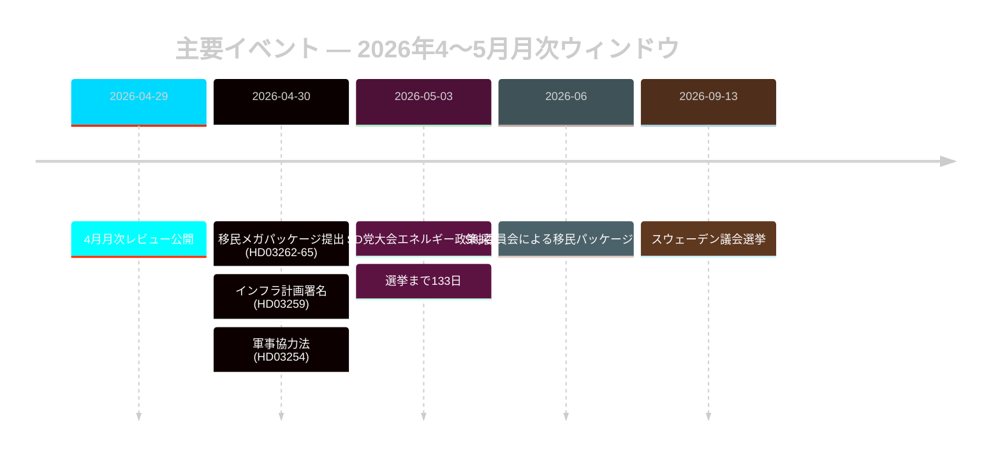

# スウェーデンの選挙前移民政策リセット：2026年5月月次レビュー

**著者**: ジェームズ・ピーター・ソーリング | **日付**: 2026-05-03 | **実行ID**: 25292145644  
**信頼度**: 高 [B2] | **分類**: 公開 | **選挙まで**: 133日

---

## 要約

スウェーデンは選挙運動の最終段階に入った（2026年9月13日まで133日）。Tidöalliansen が4法令による移民法制の協調変革（HD03262–HD03265）を実施し、スウェーデンの難民受け入れ制度をEUの最大制限水準に構造的に整合させた。SD党大会（2026年5月）がエネルギー対立軸を解決した：SDは直接的な連立分裂を回避しつつも、エネルギーを連立内交渉紛争として永続的に固定する実用的折衷立場を採択した。選挙接近に連動したDIW乗数が移民と防衛を情報分析アジェンダの最上位に押し上げている。

## このブリーフィングが支援する政策判断

1. **連立安定性評価**: SD党大会の結果は Tidöavtalet を2026年9月まで延長させるか、それとも選挙前の決裂点を生むか？
2. **移民パッケージのECHRリスク**: HD03265の行政拘禁延長がEU/ECHR手続きを誘発し、Tidö政権の選挙前実績を毀損するか？
3. **野党の実行可能性**: S/V/MPは2026年8月までに、浮動票層の≥5%を動かせる一貫した移民対抗物語を形成できるか？

## 60秒情報ポイント

- 🔴 **移民メガパッケージ** (HD03262–HD03265): 法務省が4本のpropositioner を同時提出し、永住許可証を廃止、送還機構を拡大、行政拘禁を司法審査なしで最長6ヶ月に延長。L3情報重要度。[A1]
- 🟠 **SD党大会決定** (2026年5月): SDは「teknologineutral kärnenergisatsning」を採択――Buschの純粋核エネルギー最大化でも穏健多様化でもない。連立温存のための戦略的曖昧性と解釈可能。PIR-D は部分的に回答済み。[B2]
- 🟠 **インフラ遺産** (HD03259, 2026-04-30): 9,700億SEKのインフラ計画――スウェーデン史上最大の平時コミットメント。鉄道とノルランドに重点。[A1]
- 🟡 **警察改革の説明責任** (PIR-B 進行中): Riksrevisionen の9件の勧告が未決。JuU 本会議投票待ち。[A1]
- 🟡 **銀行パッケージ** (HD03253): Finansinspektionen によるCRR3/CRD6第2の柱裁量が未解決；remissvar 2026年5〜6月。大手行（Nordea, SEB, Handelsbanken, Swedbank）は18ヶ月の資本調整期間に直面。[A2]
- 🟢 **軍事協力** (HD03254): 防衛統合運用枠組みが完成；スウェーデンをNATO二国間協力基準に整合。広範な議会支持。[A2]

## 主要フォワードトリガー

**SD党大会エネルギー政策** (2026年5月決定) ―― PIR-D 最終評価とエネルギー選挙物語の結晶化に即座に反映。次のトリガー：HD03254に関するFöU委員会公聴会（2026年5月）＋ HD03262のSfUスケジュール（2026年6月）。

## 信頼度ラベル

高 総合 [B2] ―― 中核的な移民・連立評価は公式Riksdag文書に基づく；SD党大会結果はMCP本文検証ではなくモニタリング経由；経済コンテキストはWEO 2026年4月版（≤6ヶ月）。

<!-- source-sha: 69fae8c5b56fa37d6a281e5e15d5acb956d405aa -->
