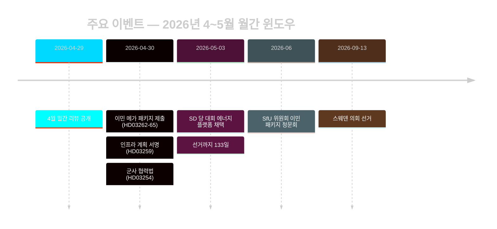

# 스웨덴의 선거 전 이민 정책 리셋: 2026년 5월 월간 리뷰

**저자**: 제임스 피터 소를링 | **날짜**: 2026-05-03 | **실행 ID**: 25292145644  
**신뢰도**: 높음 [B2] | **분류**: 공개 | **선거까지**: 133일

---

## 요약

스웨덴은 선거 운동 최종 단계에 접어들었다(2026년 9월 13일까지 133일). Tidöalliansen이 4개 법률로 이민 법제를 협조적으로 변환(HD03262–HD03265)하여 스웨덴 망명 체계를 EU 최대 제한 수준에 구조적으로 정렬시켰다. SD 당 대회(2026년 5월)가 에너지 갈등 노선을 해소했다: SD는 직접적인 연립 붕괴를 피하면서도 에너지를 연립 내부 협상 갈등으로 영구 고착시키는 실용적 혼합 입장을 채택했다. 선거 근접에 연동된 DIW 승수가 이민과 국방을 정보 분석 의제 최상위로 끌어올렸다.

## 이 브리핑이 지원하는 정책 결정

1. **연립 안정성 평가**: SD 당 대회 결과가 Tidöavtalet을 2026년 9월까지 연장하는가, 아니면 선거 전 균열 지점을 만드는가?
2. **이민 패키지의 ECHR 위험**: HD03265의 행정 구금 연장이 EU/ECHR 절차를 촉발하여 선거 전 Tidö 정부 실적을 훼손할 수 있는가?
3. **야당의 실행 가능성**: S/V/MP가 2026년 8월까지 부동층의 ≥5%를 움직일 일관된 이민 대항 서사를 형성할 수 있는가?

## 60초 정보 포인트

- 🔴 **이민 메가 패키지** (HD03262–HD03265): 법무부의 4개 propositioner 동시 제출로 영주 허가 폐지, 추방 기제 확대, 사법 심사 없이 행정 구금 최장 6개월 연장. L3 정보 중요도. [A1]
- 🟠 **SD 당 대회 결정** (2026년 5월): SD가 「teknologineutral kärnenergisatsning」 채택 — Busch의 순수 핵에너지 극대화도 아니고 온건 다양화 입장도 아님. 연립 보존을 위한 전략적 모호성으로 해석 가능. PIR-D 부분적으로 답변됨. [B2]
- 🟠 **인프라 유산** (HD03259, 2026-04-30): 9,700억 SEK 인프라 계획 — 스웨덴 역사상 최대 평시 공약. 철도와 노르란드 중심. [A1]
- 🟡 **경찰 개혁 책임** (PIR-B 진행 중): Riksrevisionen의 9개 미결 권고안, 정부 마감 일정 없음. JuU 본회의 투표 대기. [A1]
- 🟡 **은행 패키지** (HD03253): Finansinspektionen의 CRR3/CRD6 제2기둥 재량 미해결; remissvar 2026년 5~6월. 대형 은행(Nordea, SEB, Handelsbanken, Swedbank)은 18개월 자본 조정 기간 직면. [A2]
- 🟢 **군사 협력** (HD03254): 방어 통합 운용 체계 완성; 스웨덴을 NATO 양자 협력 기준에 정렬. 광범한 의회 지지. [A2]

## 주요 선행 트리거

**SD 당 대회 에너지 플랫폼** (2026년 5월 결정) — PIR-D 최종 평가와 에너지 선거 서사 결정화에 즉각 반영. 다음 트리거: HD03254에 관한 FöU 위원회 청문회 (2026년 5월) + HD03262의 SfU 일정 (2026년 6월).

## 신뢰도 레이블

높음 종합 [B2] — 핵심 이민·연립 평가는 공식 Riksdag 문서에 근거; SD 당 대회 결과는 MCP 텍스트 검증이 아닌 모니터링 경유; 경제 맥락은 WEO 2026년 4월판(≤6개월).

<!-- source-sha: 69fae8c5b56fa37d6a281e5e15d5acb956d405aa -->
