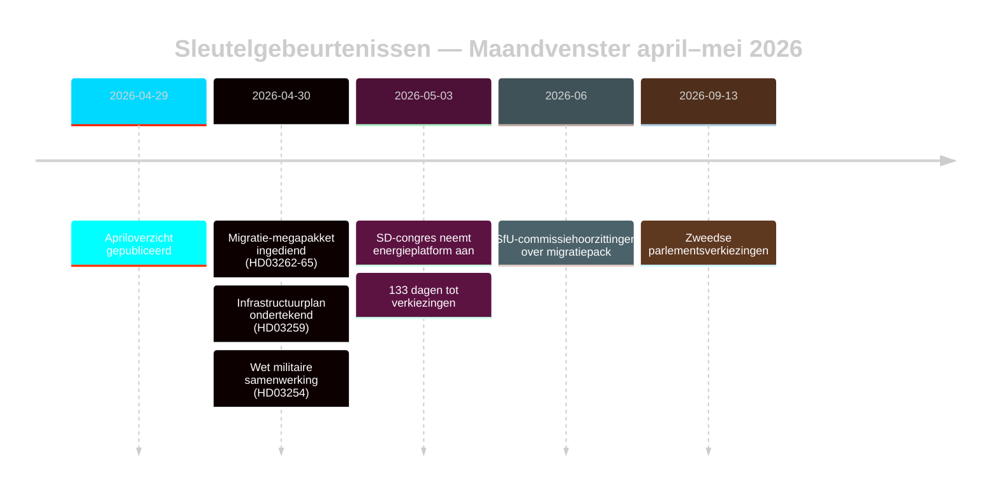

# Zwedens Pre-Electorale Migratiereset: Maandoverzicht Mei 2026

**Auteur**: James Pether Sörling | **Datum**: 2026-05-03 | **Run-ID**: 25292145644  
**Vertrouwen**: HOOG [B2] | **Classificatie**: OPENBAAR | **Verkiezingsnabijheid**: 133 dagen

---

## BLUF

Zweden betreedt de laatste verkiezingscampagnefase (133 dagen tot 13 september 2026) na de gecoördineerde vier-wetgevende migratiehervormingen van de Tidöalliansen (HD03262–HD03265), die de Zweedse asielarchitectuur structureel afstemmen op de maximale EU-restrictiviteit. Het SD-congres (mei 2026) heeft de energieconflictlijn opgelost: SD heeft een pragmatisch gemengde positie aangenomen die een directe coalitiebreuk vermijdt, maar energie permanent verankert als intern coalitieonderhandelingsconflict. De DIW-vermenigvuldigers gekoppeld aan verkiezingsnabijheid plaatsen migratie en defensie bovenaan de inlichtingenagenda.

## Besluiten die dit briefing ondersteunt

1. **Beoordeling coalitionsstabiliteit**: Verlengt de SD-congresuikomst het Tidöavtalet tot september 2026 of creëert het voor de verkiezingen een breekpunt?
2. **EVRM-risico migratiepack**: Triggeren de uitbreidingen van administratieve detentie in HD03265 EU/EVRM-procedures die het regeringsrecord van Tidö voor de verkiezingen kunnen beschadigen?
3. **Levensvatbaarheid oppositie**: Kunnen S/V/MP voor augustus 2026 een coherent migratie-tegennarratief formuleren dat ≥5% van de wisselstemgevers beweegt?

## Inlichtingenpunten in 60 seconden

- 🔴 **Migratie-megapakket** (HD03262–HD03265): Vier gelijktijdige propositioner van het Justitiedepartementet schaffen permanente verblijfsvergunningen af, breiden uitzetmechanismen uit en verlengen administratieve detentie tot 6 maanden zonder rechterlijke toetsing. Inlichtingsbelang niveau L3. [A1]
- 🟠 **SD-congres besloten** (mei 2026): SD nam een «teknologineutral kärnenergisatsning» aan — noch Buschs pure kernenergiemaximalisering, noch de zachte diversificatiepositie. Interpreteerbaar als coalitiebesparende ambiguïteit. PIR-D nu gedeeltelijk beantwoord. [B2]
- 🟠 **Infrastructuurerfenis** (HD03259 van 2026-04-30): Infrastructuurplan van 970 miljard SEK, de grootste vredestijdse verbintenis in de Zweedse geschiedenis. Nadruk op spoorwegen en Norrland. [A1]
- 🟡 **Politiehervormingsverantwoording** (PIR-B lopend): 9 open aanbevelingen van Riksrevisionen zonder gouvernementele afsluitingstijdlijn. JuU-kamervotum in afwachting. [A1]
- 🟡 **Bankenpakket** (HD03253): CRR3/CRD6 Pijler-2-discretie door Finansinspektionen nog onopgelost; remissvar mei–juni 2026. SIBs — Nordea, SEB, Handelsbanken, Swedbank — staan voor een 18-maands kapitaalaanpassingsvenster. [A2]
- 🟢 **Militaire samenwerking** (HD03254): Operationeel defensie-integratiekader afgerond; stemt Zweden af op NAVO's bilaterale samenwerkingsnormen. Breed parlementair draagvlak. [A2]

## Belangrijkste voorwaartse trigger

**SD-congres energieplatform** (besloten mei 2026) — voedt onmiddellijk de PIR-D-eindbeoordeling en de kristallisering van het energie-campagnenarratief. Volgende trigger: FöU-hoorzitting over HD03254 (mei 2026) + SfU-tijdlijn voor HD03262 (juni 2026).

## Vertrouwenslabel

HOOG algemeen [B2] — kern-migratie- en coalitiebeoordeling verankerd in officiële Riksdag-documenten; SD-congresuikomst via monitoring in plaats van geverifieerde MCP-tekst; economische context uit WEO apr-2026-vintage (≤6 maanden oud).

<!-- source-sha: 69fae8c5b56fa37d6a281e5e15d5acb956d405aa -->
