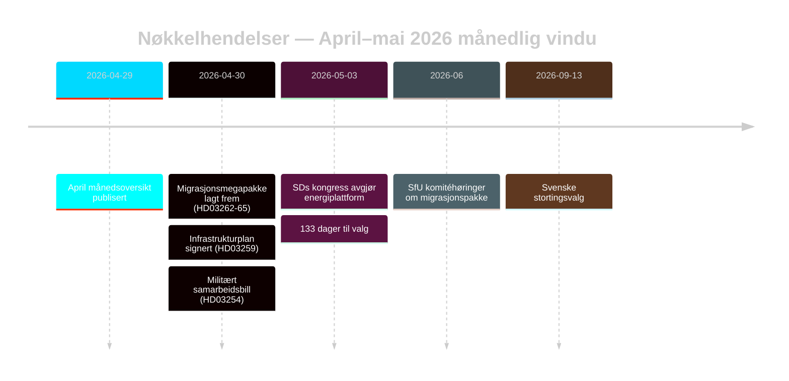

# Sveriges valgforberedte migrasjonsreset: Månedsoversikt mai 2026

**Forfatter**: James Pether Sörling | **Dato**: 2026-05-03 | **Kjørings-ID**: 25292145644  
**Konfidens**: HØY [B2] | **Klassifisering**: OFFENTLIG | **Valnærhet**: 133 dager

---

## BLUF

Sverige går inn i den siste kampanjefasen (133 dager til 13. september 2026) med at Tidöalliansen har gjennomført en koordinert firebillotransformasjon av migrasjonslovgivningen (HD03262–HD03265) som strukturelt tilpasser den svenske asylarkitekturen til EUs maksimale restriktivitet. SDs kongress (mai 2026) har løst energikonfliktlinjen: SD vedtok en pragmatisk-blandet posisjon som unngår et direkte koalisjonsbrudd, men permanent innbakt energi som en intra-blokforhandlingskonflikt. Valnærhetens DIW-multiplikatorer løfter migrasjon og forsvar til toppen av etterretningsagendaen.

## Beslutninger dette notatet støtter

1. **Koalisjonsstabilitetsanalyse**: Forlenger SDs kongresresultat Tidöavtalen frem til september 2026, eller skaper det et brudpunkt før valget?
2. **EMK-risiko for migrasjonspakke**: Utløser HD03265 forvarsutvidelser EU/EMK-prosedyrer som kan skade Tidös styringsrekord før valget?
3. **Opposisjonens levedyktighet**: Kan S/V/MP formulere en sammenhengende migrasjons-motfortelling som beveger ≥5 % av svingvelgere innen august 2026?

## 60-sekunders etterretningspunkter

- 🔴 **Migrasjonsmegapakke** (HD03262–HD03265): Fire samtidige proposisjoner fra Justitiedepartementet avskaffet permanente oppholdstillatelser, utvider deportasjonsmaskineri, forlenger administrativ forvaring til 6 måneder uten domstolsprøving. L3 Etterretningsgradert signifikans. [A1]
- 🟠 **SDs kongress avgjort** (mai 2026): SD vedtok "teknologineutral kärnenergisatsning" — verken Buschs rene kjernekraftmaksimalisme eller den myke diversifiseringsposisjonen. Tolkbar som koalisjonsbevarende tvetydighet. PIR-D nå delvis besvart. [B2]
- 🟠 **Infrastrukturarv** (HD03259 fra 2026-04-30): 970 milliarder SEK infrastrukturplan, den største fredstidsforpliktelsen i svensk historie. Jernbane + Norrland-fokus. [A1]
- 🟡 **Politireformredegjørelse** (PIR-B pågående): Riksrevisjonens 9 åpne anbefalinger fortsatt uten statlig avslutningsplan. JuU kammervotering avventer. [A1]
- 🟡 **Bankpakke** (HD03253): CRR3/CRD6 søyle-2-diskretion fortsatt uløst av Finansinspektionen; høringssvar mai–juni 2026. SIBs — Nordea, SEB, Handelsbanken, Swedbank — møter 18-måneders kapitaliseringstilpasningsvindu. [A2]
- 🟢 **Militært samarbeid** (HD03254): Operativt forsvarsintegrasjonsrammeverk fullført; tilpasser Sverige til NATOs bilaterale samarbeidsstandarder. Bredt parlamentarisk støtte. [A2]

## Viktigste fremadrettede utløser

**SDs kongress-energiplattform** (avgjort mai 2026) — mater straks PIR-Ds avslutningsvurdering og kampanjens energinarrativkrystallisering. Neste utløser: FöUs høring om HD03254 (mai 2026) + SfUs tidsplan for HD03262 (juni 2026).

## Konfidensetiketten

HØY totalt [B2] — kjernemigrasjon og koalisjonsvurderinger forankret i offisielle Riksdag-dokumenter; SDs kongresresultat via overvåking snarere enn verifisert MCP-tekst; økonomisk kontekst fra WEO apr-2026-årgangen (≤6 måneder gammel).

<!-- source-sha: 69fae8c5b56fa37d6a281e5e15d5acb956d405aa -->
