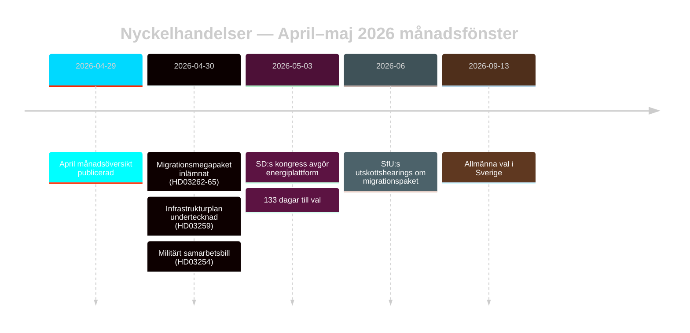

# Sveriges val-förberedda migrationsomstart: Månadsöversikt maj 2026

**Författare**: James Pether Sörling | **Datum**: 2026-05-03 | **Körnings-ID**: 25292145644  
**Konfidens**: HÖG [B2] | **Klassificering**: OFFENTLIG | **Valproximititet**: 133 dagar

---

## BLUF

Sverige går in i den sista kampanjfasen (133 dagar till 13 september 2026) med att Tidöalliansen har genomfört en samordnad fyrabillags-transformation av migrationslagstiftningen (HD03262–HD03265) som strukturellt anpassar svensk asylarkitektur till EU:s maximala restriktivitet. SD:s kongress (maj 2026) har löst energikonfliktlinjen: SD antog en pragmatisk-blandad position som undviker ett direkt koalitionsbrott men permanent inbäddar energi som en intra-blocförhandlingskonflikt. Val-närhets-DIW-multiplikatorer lyfter migration och försvar till toppen av underrättelseagendan.

## Beslut som detta PM stödjer

1. **Koalitionsstabilitetsanalys**: Förlänger SD:s kongressutfall Tidöavtalet fram till september 2026 eller skapar det ett brottspunkt inför valet?
2. **ECMR-risk för migrationspaket**: Utlöser HD03265 utvisningsutvidgningar EU/ECMR-förfaranden som kan skada Tidös styrningsrekord inför valet?
3. **Oppositionens livskraft**: Kan S/V/MP formulera en sammanhängande migrationsmotberättelse som rör ≥5 % av svajningsväljarna till augusti 2026?

## 60-sekunders underrättelsepunkter

- 🔴 **Migrationsmegapaket** (HD03262–HD03265): Fyra simultana propositioner från Justitiedepartementet avskaffar permanenta uppehållstillstånd, utvidgar utvisningsmaskineri, förlänger administrativt förvar till 6 månader utan domstolsprövning. L3 Underrättelsegraderad signifikans. [A1]
- 🟠 **SD:s kongress avgjord** (maj 2026): SD antog "teknologineutral kärnenergisatsning" — varken Buschs rena kärnenergimaximalism eller den mjuka diversifieringspositionen. Tolkningsbar som koalitionsbevarande tvetydighet. PIR-D nu delvis besvarad. [B2]
- 🟠 **Infrastrukturarv** (HD03259 från 2026-04-30): 970 miljarder SEK infrastrukturplan, den största fredstidens satsning i svensk historia. Järnväg + Norrlandsfokus. [A1]
- 🟡 **Polisreformsredovisning** (PIR-B pågående): Riksrevisionens 9 öppna rekommendationer fortfarande utan statlig avslutningsplan. JuU:s kammarvot avvaktar. [A1]
- 🟡 **Bankpaket** (HD03253): CRR3/CRD6 pelare-2-diskretion fortfarande olöst av Finansinspektionen; remissvar maj–juni 2026. SIBs — Nordea, SEB, Handelsbanken, Swedbank — möter 18-månaders kapitalanpassningsfönster. [A2]
- 🟢 **Militärt samarbete** (HD03254): Operativt försvarsintegreringsramverk slutfört; anpassar Sverige till NATOs bilaterala samarbetsstandarder. Brett parlamentariskt stöd. [A2]

## Främsta framåtutlösare

**SD-kongressens energiplattform** (avgjord maj 2026) — matar omedelbart PIR-D:s avslutningsbedömning och kampanjens energinarrativkristallisering. Nästa utlösare: FöU:s hearing om HD03254 (maj 2026) + SfU:s tidsplan för HD03262 (juni 2026).

## Konfidensetikett

HÖG totalt [B2] — kärn-migrations- och koalitionsbedömningar grundade i officiella riksdagsdokument; SD:s kongressutfall via bevakning snarare än verifierad MCP-text; ekonomisk kontext från WEO apr-2026-årgång (≤6 månader gammal).

<!-- source-sha: 69fae8c5b56fa37d6a281e5e15d5acb956d405aa -->
