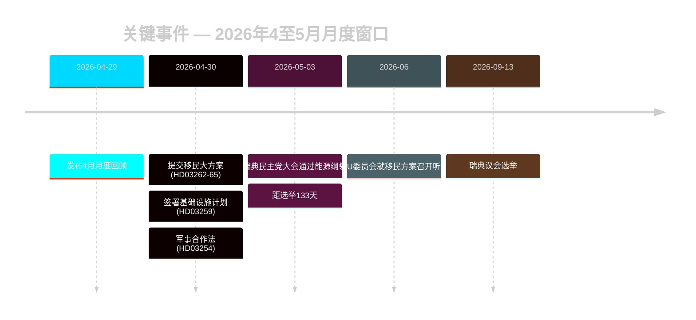

# 瑞典选举前移民政策重置：2026年5月月度回顾

**作者**：詹姆斯·彼得·索尔林 | **日期**：2026-05-03 | **运行ID**：25292145644  
**置信度**：高 [B2] | **分类**：公开 | **距选举**：133天

---

## 摘要

瑞典进入选举竞选最后阶段（距2026年9月13日还有133天），此前Tidöalliansen完成了由四部法律构成的协调移民立法变革（HD03262–HD03265），将瑞典庇护架构在结构上与欧盟最严格限制水平对齐。瑞典民主党全国代表大会（2026年5月）解决了能源冲突路线：瑞典民主党采取了务实的混合立场，既避免联合政府直接破裂，又将能源永久锁定为联合政府内部谈判冲突。与选举临近挂钩的DIW乘数将移民和国防推至情报议程首位。

## 本简报所支持的政策决定

1. **联合政府稳定性评估**：瑞典民主党大会结果能否将Tidöavtalet延续至2026年9月，还是会在选举前形成破裂点？
2. **移民方案的《欧洲人权公约》风险**：HD03265中的行政羁押延期是否会引发欧盟/《欧洲人权公约》程序，从而在选举前损害Tidö执政记录？
3. **反对派可行性**：S/V/MP能否在2026年8月前形成一套连贯的移民反叙事，足以撬动≥5%的摇摆选民？

## 60秒情报要点

- 🔴 **移民大方案**（HD03262–HD03265）：法务部四份propositioner同步提交，废除永久居留许可、扩大驱逐机制、将行政羁押延长至6个月且无需司法审查。L3级情报重要性。[A1]
- 🟠 **瑞典民主党大会决议**（2026年5月）：瑞典民主党通过"teknologineutral kärnenergisatsning"——既非布希的纯核能最大化，也非温和多元化立场。可解读为维护联合政府的战略模糊性。PIR-D已部分得到回答。[B2]
- 🟠 **基础设施遗产**（HD03259，2026-04-30）：9700亿瑞典克朗基础设施计划——瑞典历史上规模最大的和平时期承诺。重点发展铁路与北部地区。[A1]
- 🟡 **警察改革问责**（PIR-B 进行中）：国家审计局9项未决建议迄无政府关闭时间表。JuU议院投票待定。[A1]
- 🟡 **银行业方案**（HD03253）：金融监督局对CRR3/CRD6第二支柱的自由裁量权尚未厘清；remissvar 2026年5至6月。大型银行（Nordea、SEB、Handelsbanken、Swedbank）面临18个月的资本调整期。[A2]
- 🟢 **军事合作**（HD03254）：国防整合运作框架敲定；使瑞典与北约双边合作标准接轨。获议会广泛支持。[A2]

## 主要前瞻触发因素

**瑞典民主党大会能源纲领**（2026年5月决定）——立即推动PIR-D最终评估及能源竞选叙事的成形。下一触发：FöU委员会就HD03254召开听证（2026年5月）＋ SfU就HD03262排定日程（2026年6月）。

## 置信度标注

高 综合 [B2] ——核心移民与联合政府评估立基于Riksdag官方文件；瑞典民主党大会结果来自监测而非经MCP核实文本；经济背景援引WEO 2026年4月版本（≤6个月）。

<!-- source-sha: 69fae8c5b56fa37d6a281e5e15d5acb956d405aa -->
